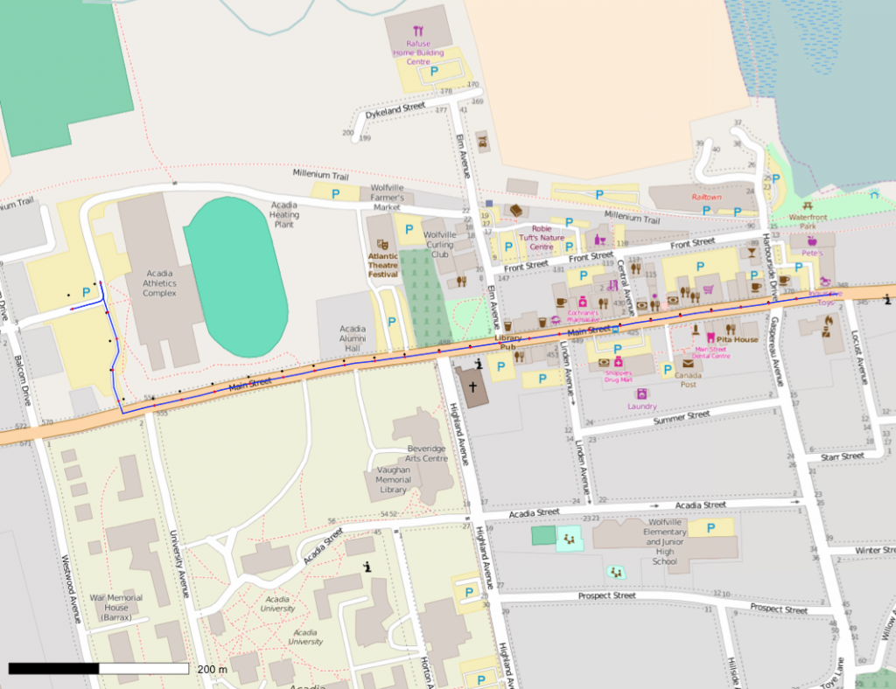
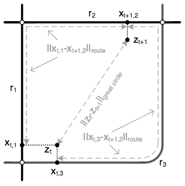

The problem of matching GPS points collected from a phone or dedicated GPS device to actual defined roadways is becoming more prevalent as insurance companies move to sensor-based platforms for risk management. In a recent Upwork contract, I was tasked with this problem for an insurance company providing sensor-based risk management for insurance providers in China. Based on a <a href="http://research.microsoft.com/en-us/um/people/jckrumm/Publications%202009/map%20matching%20ACM%20GIS%20camera%20ready.pdf">research paper produced by programmers at Microsoft</a>, we used a Hidden Markov Model-like structure to assess the most likely path along road segments. The simple concept of emission probabilities based on distance from the segment and transition probabilities based on a comparison of driving distance and great-circle distance is easy in principle but difficult in practice given noisy GPS data and inconsistent road network data. After several weeks of full-time equivalent work, the project is now mostly completed with only a few outstanding issues. Overall the experience of working with a trans-continental team of programmers though Upwork was positive, although it has reminded me how much I value somebody sitting down in my office explaining what it is they're trying to accomplish.

<figure><figcaption>A sample map matching result for a GPS track near Wolfville, Nova Scotia.</figcaption></figure>

<figure><figcaption>The three distances forming the basis for emission and transition probabilities: great circle distance, distance to the segment, and driving distance.</figcaption></figure>