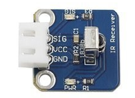
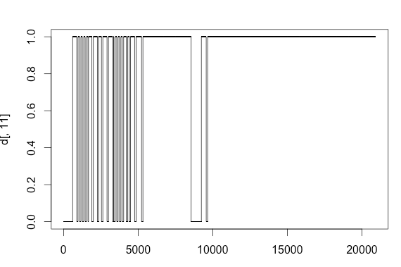
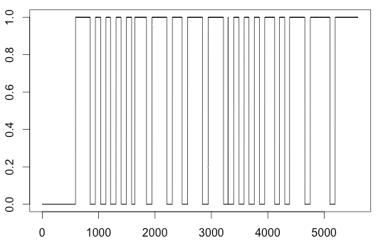

Inspired by the ability to create scientific tech gadgets, I have two new toys on my desk these days: a Raspberry Pi and an Arduino. The simplicity of the Arduino is quite nice, but the ability to code the Raspberry Pi in Python (not to mention built-in Wi-Fi capability) drew me to do some experimenting with the infrared sensor. The problem I ran into almost immediately is that the out-of-the box solution to infrared remotes is lirc, which requires compilation and dedicating a pin specifically for the IR sensor for all time. I thought there must be a pure Python solution on the internets somewhere, but it appears nobody has tackled this one until now.

## The wiring setup

The wiring setup for this project used the [Sunfounder Raspberry Pi Sensor Kit](https://www.sunfounder.com/37-modules-sensor-kit-v2-0-for-arduino-1829.html), which has a few resistors built in. Based on some other posts involving an IR sensor and an Arduino, I think most IR sensors will function in a similar way. The IR Sensor has 3 pins: +3.3V, Signal, and Ground. The +3.3V pin gets attached to the +3.3V pin on the GPIO header, the Ground gets attached to one of the ground pins, and the Signal pin gets attached to one of the GPIO pins (in this example I use GPIO 18, or pin 11 on the header). The picture here is a bit fuzzy but my setup looked like this:




## How IR Remotes Work

If you're not going to use the out-of-the-box solution (lirc), you're going to need to delve into the world of raw IR data transfer. Between an [Arduino-related post](https://learn.adafruit.com/ir-sensor/ir-remote-signals) and [this YouTube Video](https://www.youtube.com/watch?v=aoPSX3wYSXo), it appears that IR remotes are basically using Morse code to transfer information between the remote and the receiver, with 0 indicated by a short pulse, and 1 indicated by a long pulse. How long are these pulses? It appears they are between 0.5 ms and 2 ms based on the [adafruit article](https://learn.adafruit.com/ir-sensor/ir-remote-signals), but is Python fast enough to measure this? It's time to find out:

```Python
import RPi.GPIO as GPIO
from time import time

# Numbers GPIOs by physical location
GPIO.setmode(GPIO.BOARD)
# set pin 11 as an input pin with default as LOW v
GPIO.setup(11, GPIO.IN, pull_up_down=GPIO.PUD_DOWN)

# define a function to acquire data
def binary_acquire(pin, duration):
    # acquires data as quickly as possible
    t0 = time() # time is in seconds here
    results = []
    while (time() - t0) < duration:
        results.append(GPIO.input(pin))
    return results

print("Acquiring data for 1 second")
# acquire data for 1 second
results = binary_acquire(11, 1.0)
print("Done!")
print(",".join([str(result) for result in results])
GPIO.cleanup()
```

This bit of code will record as many possible values as it can from the signal output of the IR sensor, and print the results. These will be totally illegible, but if you put them into R, they look something like this (assuming you pressed a button on your remote during the 1 second interval you ran the script).



Lo and behold, we get a whole lot of long and short bursts, just as the [YouTube Video](https://www.youtube.com/watch?v=aoPSX3wYSXo) predicted. My Pi is able to acquire (and store to memory) around 160,000 values in a second, which isn't excellent but seems to do the trick for IR remotes anyway. If we zoom in to the section where the shorts and longs are, we can see the short/long difference a little more clearly.



So how long are these short/long pulses? My X-axis here is marked in samples, but since this may vary from Pi to Pi, it's probably better to convert these into times like in the [adafruit article](https://learn.adafruit.com/ir-sensor/ir-remote-signals). Instead of measuring the time of every sample, I'm going to use the overall sample rate (`len(results)/duration`) to convert run-lengths into durations.

```Python
rate = len(data) / 1.0  # because we acquired data for 1 second
pulses = []
i_break = 0
# detect run lengths using the acquisition rate to turn the times in to microseconds
for i in range(1, len(data)):
    if (data[i] != data[i-1]) or (i == len(data)-1):
        pulses.append((data[i-1], int((i-i_break)/rate*1e6)))
        i_break = i
```

If we add this to our existing code and examine the results, it looks a little messy but we get a whole lot of long and short "1" values and pretty consistent "0" values. Based on the [adafruit article](https://learn.adafruit.com/ir-sensor/ir-remote-signals) and some data I played around with, short pulses are somewhere around 0.5 ms, and long pulses are somewhere around 1.2 ms. The variation in short/long pulses is probably because some combination of linux and Python are busy doing other things like running the OS or garbage collection and didn't manage to read a few of the values that we would have liked. Either way, the short pulses are always less than 1 ms, and the long pulses are always greater than 1 ms, which we can use to translate our pulse durations into binary code.

```Python
# decode ( < 1 ms "1" pulse is a 1, > 1 ms "1" pulse is a 1, longer than 2 ms pulse is something else)
# does not decode channel, which may be a piece of the information after the long 1 pulse in the middle
outbin = ""
for val, us in pulses:
    if val != 1:
        continue
    if outbin and us > 2000:
        break
    elif us < 1000:
        outbin += "0"
    elif 1000 < us < 2000:
        outbin += "1"
print(outbin)
```

In this example I disregard any pulse greater than 2 ms (2000 microseconds) until some numbers have been read, and use the longer than 2 ms pulse after all the numbers to terminate reading the long/short values. This ensures all the long/short pulses are next to eachother. Put into practice, we can use a couple more [RPi.GPIO tricks](https://sourceforge.net/p/raspberry-gpio-python/wiki/Inputs/) to listen for a change in the signal (`wait_for_edge()`) before recording our values.

```Python
import RPi.GPIO as GPIO
from time import time

def setup():
    GPIO.setmode(GPIO.BOARD)  # Numbers GPIOs by physical location
    GPIO.setup(11, GPIO.IN, pull_up_down=GPIO.PUD_DOWN)


def binary_aquire(pin, duration):
    # aquires data as quickly as possible
    t0 = time()
    results = []
    while (time() - t0) < duration:
        results.append(GPIO.input(pin))
    return results


def on_ir_receive(pinNo, bouncetime=150):
    # when edge detect is called (which requires less CPU than constant
    # data acquisition), we acquire data as quickly as possible
    data = binary_aquire(pinNo, bouncetime/1000.0)
    if len(data) < bouncetime:
        return
    rate = len(data) / (bouncetime / 1000.0)
    pulses = []
    i_break = 0
    # detect run lengths using the acquisition rate to turn the times in to microseconds
    for i in range(1, len(data)):
        if (data[i] != data[i-1]) or (i == len(data)-1):
            pulses.append((data[i-1], int((i-i_break)/rate*1e6)))
            i_break = i
    # decode ( < 1 ms "1" pulse is a 1, > 1 ms "1" pulse is a 1, longer than 2 ms pulse is something else)
    # does not decode channel, which may be a piece of the information after the long 1 pulse in the middle
    outbin = ""
    for val, us in pulses:
        if val != 1:
            continue
        if outbin and us > 2000:
            break
        elif us < 1000:
            outbin += "0"
        elif 1000 < us < 2000:
            outbin += "1"
    try:
        return int(outbin, 2)
    except ValueError:
        # probably an empty code
        return None


def destroy():
    GPIO.cleanup()


if __name__ == "__main__":
    setup()
    try:
        print("Starting IR Listener")
        while True:
            print("Waiting for signal")
            GPIO.wait_for_edge(11, GPIO.FALLING)
            code = on_ir_receive(11)
            if code:
                print(str(hex(code)))
            else:
                print("Invalid code")
    except KeyboardInterrupt:
        pass
    except RuntimeError:
        # this gets thrown when control C gets pressed
        # because wait_for_edge doesn't properly pass this on
        pass
    print("Quitting")
    destroy()
```

Note that here I use the terminology `bouncetime`, which I mean to be the amount of time for which we should record. Based on some experimenting, it looks like it's usually around 150 ms. And there you go! You should get something like:

```
Starting IR Listener
Waiting for signal
0xffa25d
Waiting for signal
0xff629d
Waiting for signal
0xffe21d
^CQuitting
```

From some experimenting with the remote from the [Sunfounder Kit](https://www.sunfounder.com/sensor-kit-v2-0-for-raspberry-pi-2-and-raspberry-pi-model-b.html), I built a dictionary of codes for the remote.

```Python
CODES = {
    0xffa25d: "ON/OFF",
    0xff629d: "MODE",
    0xffe21d: "MUTE",
    0xff22dd: "PLAY/PAUSE",
    0xff02fd: "PREVIOUS",
    0xffc23d: "NEXT",
    0xffe01f: "EQ",
    0xffa857: "MINUS",
    0xff906f: "PLUS",
    0xff6897: "0",
    0xff9867: "SHUFFLE",
    0xffb04f: "U/SD",
    0xff30cf: "1",
    0xff18e7: "2",
    0xff7a85: "3",
    0xff10ef: "4",
    0xff38c7: "5",
    0xff5aa5: "6",
    0xff42bd: "7",
    0xff4ab5: "8",
    0xff52ad: "9",
}
```

Probably the most useful implementation of this would be to put it in a `Thread` of some type and listen in the background since the `wait_for_edge()` function blocks until it something changes on the pin that it monitors. Now to build a remote-control coffee machine for those early mornings...
