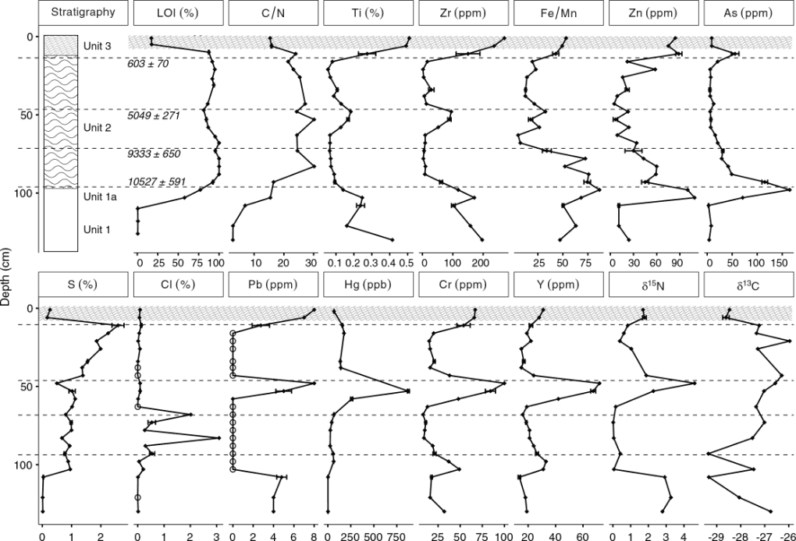

Almost six years ago, my honours thesis (<a href="https://scholar.acadiau.ca/islandora/object/theses:847">Using paleolimnological methods to track late holocene environmental change at Long Lake, New Brunswick – Nova Scotia border region, Canada</a>) and my friend Hilary's <a href="http://scholar.acadiau.ca/islandora/object/theses:247">master's thesis</a> were completed, but it was only this year that we finally got around to submitting the combined manuscript to <a href="http://facetsjournal.com/">FACETS</a>, a new (ish) open access journal from Canadian Science Publishing. Hilary's thesis describes (among other things) a peak in mercury deposition at Long Lake, near Amherst, Nova Scotia, approximately 5,000 years ago. These data were combined with the more recent record from my honours thesis, and we are proud to announce that the resulting paper (<a href="https://facetsjournal.com/article/facets-2017-0004/">A paleolimnological archive of metal sequestration and release in the Cumberland Basin Marshes, Atlantic Canada</a>) was published on Tuesday. Special thanks to co-authors Ian, Mark, and Nelson, all of whom had a key role in prodding us to complete the manuscript.

<figure><figcaption>This diagram was redone at least four times, and probably represents the last time I will attempt to create plot graphics outside of R.</figcaption></figure>
