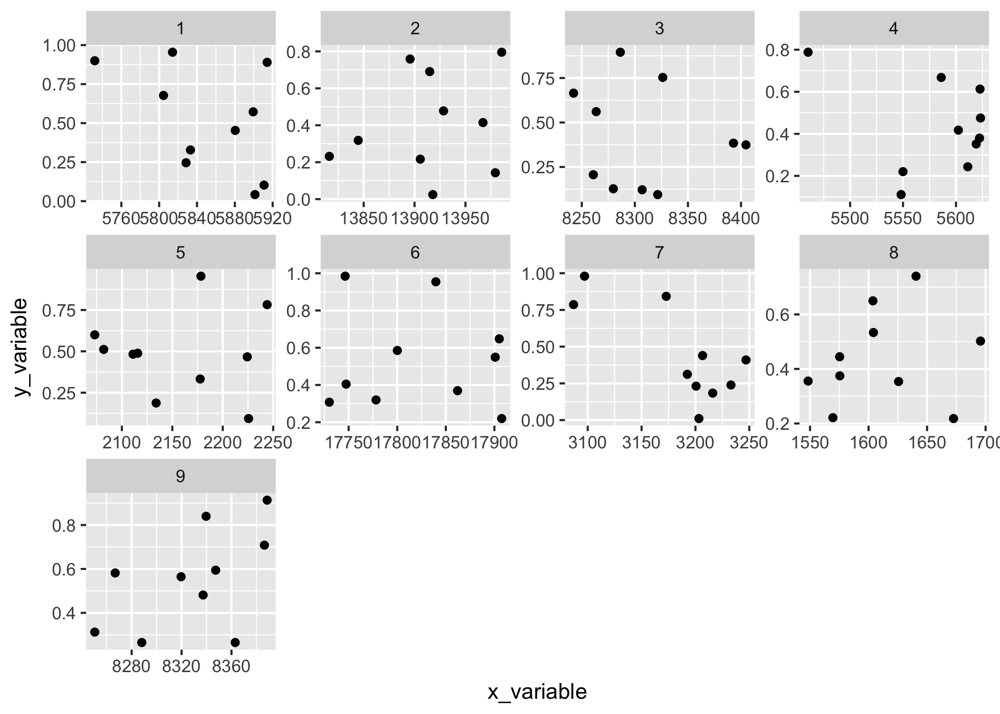
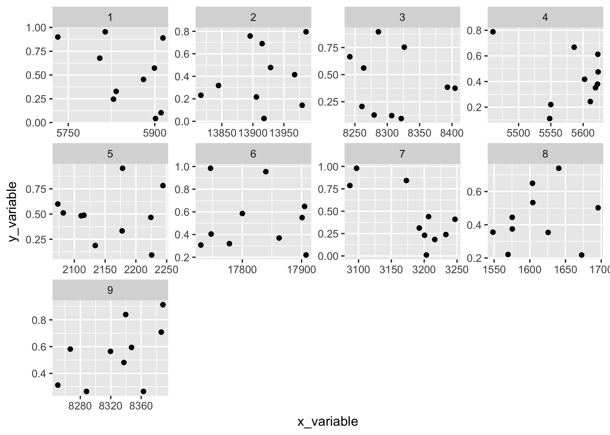

There is a <a href="https://github.com/tidyverse/ggplot2/issues/187">very old issue</a> in <strong>ggplot2</strong> about the ability to modify particular scales when using <code>facet_wrap()</code> or <code>facet_grid()</code>. I often have this problem when using lots of facets, as sometimes the labels overlap with eachother on some of the scales. Without a way to set the <code>breaks</code> on one particular scale, it's hard to fix this without exporting an SVG and modifying the result (it's usually possible to fix it by specifying an overall set of <code>breaks</code>, or by rotating the x labels using <code>theme(axis.text.x = element_text(angle = 90, vjust = 0.5))</code>, but sometimes it's just <em>so close</em> that it might be nice to set the breaks on just one of the panels...). A sort of contrived example:


``` r
set.seed(123)
test_large_values_data <- 1:9 %>%
  set_names() %>%
  map_dfr(~data.frame(
    x_variable = runif(1, 100, 20000) + runif(10, -100, 100),
    y_variable = runif(10, 0, 1)
  ), .id = "facet_name")

p_annoying_x_scale <- ggplot(test_large_values_data, aes(x_variable, y_variable)) +
  geom_point() +
  facet_wrap(~facet_name, scales = "free", ncol = 4)

p_annoying_x_scale
```



The second problem I have is when creating a "these values are equal to these values?" plot with lots of facets. Here I need the limits on the x and y axes to the the same, but I don't really need to modify any particular one of them. Ideally the plot below would show the dashed line directly through both corners of each plot. (Using `coord_equal()` can sometimes approximate this behaviour, but still isn't quite what I need.)

``` r
test_equal_values_data <- 1:9 %>%
  set_names() %>%
  map_dfr(~tibble(
    x_variable = runif(1, 100, 2000) + runif(10, -100, 100),
    y_variable = x_variable + runif(10, -100, 100)
  ), .id = "facet_name")

p_equal_plot <- ggplot(test_equal_values_data, aes(x_variable, y_variable)) +
  geom_abline(slope = 1, intercept = 0, alpha = 0.7, lty = 2) +
  geom_point() +
  facet_wrap(~facet_name, scales = "free")

p_equal_plot
```


Solutions to these problems are bound to be in a future version of **ggplot2**, but until then, here are a few (somewhat hack-y) solutions.

### Modifying specific scales

The problem of modifying specific scales has [long been a requested feature](https://github.com/tidyverse/ggplot2/issues/187) in **ggplot2**, but it's a bit tricky to implement and hard to think of exactly the syntax should go. The solution I use below is far from perfect but gets the job done, and probably will for a while. It hinges on modifying the `init_scales()` method of the underlying `Facet` class. From the[GitHub source](https://github.com/tidyverse/ggplot2/blob/master/R/facet-.r#L91):

``` r
Facet <- ggproto(
  ...               
  init_scales = function(layout, x_scale = NULL, y_scale = NULL, params) {
    scales <- list()
    if (!is.null(x_scale)) {
      scales$x <- plyr::rlply(max(layout$SCALE_X), x_scale$clone())
    }
    if (!is.null(y_scale)) {
      scales$y <- plyr::rlply(max(layout$SCALE_Y), y_scale$clone())
    }
    scales
  },
  ...
)
```

Essentially, when the plot is built, `init_scales()` copies whatever scale you've specified for the `x` and `y` aesthetics (or the default one if you haven't) over all the panels. As long as you know what panel you're looking to modify, you could create a specification that overrides an `x` or `y` scale at a particular panel. There's probably better ways to go about this, but one might be this:

``` r
scale_override <- function(which, scale) {
  if(!is.numeric(which) || (length(which) != 1) || (which %% 1 != 0)) {
    stop("which must be an integer of length 1")
  }
  
  if(is.null(scale$aesthetics) || !any(c("x", "y") %in% scale$aesthetics)) {
    stop("scale must be an x or y position scale")
  }
  
  structure(list(which = which, scale = scale), class = "scale_override")
}
```

Next, we need to implement a version of `init_scales()` that looks for scale overrides and replaces the default scale with the overridden one. It's a bit verbose, but because `init_scales()` isn't really well-documented it's hard to predict what gets called with what. I'm overriding `FacetWrap` here, but it could easily be `FacetGrid`.

``` r
CustomFacetWrap <- ggproto(
  "CustomFacetWrap", FacetWrap,
  init_scales = function(self, layout, x_scale = NULL, y_scale = NULL, params) {
    # make the initial x, y scales list
    scales <- ggproto_parent(FacetWrap, self)$init_scales(layout, x_scale, y_scale, params)
    
    if(is.null(params$scale_overrides)) return(scales)
    
    max_scale_x <- length(scales$x)
    max_scale_y <- length(scales$y)
    
    # ... do some modification of the scales$x and scales$y here based on params$scale_overrides
    for(scale_override in params$scale_overrides) {
      which <- scale_override$which
      scale <- scale_override$scale
      
      if("x" %in% scale$aesthetics) {
        if(!is.null(scales$x)) {
          if(which < 0 || which > max_scale_x) stop("Invalid index of x scale: ", which)
          scales$x[[which]] <- scale$clone()
        }
      } else if("y" %in% scale$aesthetics) {
        if(!is.null(scales$y)) {
          if(which < 0 || which > max_scale_y) stop("Invalid index of y scale: ", which)
          scales$y[[which]] <- scale$clone()
        }
      } else {
        stop("Invalid scale")
      }
    }
    
    # return scales
    scales
  }
)
```

Lastly, we need a constructor function. Unfortunately, `facet_wrap()` doesn't let you specify a `Facet` class, so we have to hack the result of `facet_wrap()` so we can use the syntax that we are used to with the function.

``` r
facet_wrap_custom <- function(..., scale_overrides = NULL) {
  # take advantage of the sanitizing that happens in facet_wrap
  facet_super <- facet_wrap(...)
  
  # sanitize scale overrides
  if(inherits(scale_overrides, "scale_override")) {
    scale_overrides <- list(scale_overrides)
  } else if(!is.list(scale_overrides) || 
            !all(vapply(scale_overrides, inherits, "scale_override", FUN.VALUE = logical(1)))) {
    stop("scale_overrides must be a scale_override object or a list of scale_override objects")
  }
  
  facet_super$params$scale_overrides <- scale_overrides
  
  ggproto(NULL, CustomFacetWrap,
    shrink = facet_super$shrink,
    params = facet_super$params
  )
}
```

Then we can nix some annoying breaks on the first and sixth panels:

``` r
p_annoying_x_scale +
  facet_wrap_custom(~facet_name, scales = "free", ncol = 4, scale_overrides = list(
    scale_override(1, scale_x_continuous(breaks = c(5750, 5900))),
    scale_override(6, scale_x_continuous(breaks = c(17800, 17900)))
  ))
```



### Equal X and Y scales

The other problem of making the x and y scales equal isn't a matter of modifying the initial scales, it's a matter of modifying the process by which they are **trained**, or fed the data to have their limits determined automatically. It might be possible to set all the limits by hand using the above method, but it would sure take a long time and would change with each new dataset. Just like there is a `init_scales()` method in the `Facet` class, there is also a `train_scales()` function that performs this very process.

``` r
Facet <- ggproto(
  ...,
  train_scales = function(x_scales, y_scales, layout, data, params) {
    # loop over each layer, training x and y scales in turn
    for (layer_data in data) {
      match_id <- match(layer_data$PANEL, layout$PANEL)

      if (!is.null(x_scales)) {
        x_vars <- intersect(x_scales[[1]]$aesthetics, names(layer_data))
        SCALE_X <- layout$SCALE_X[match_id]

        scale_apply(layer_data, x_vars, "train", SCALE_X, x_scales)
      }

      if (!is.null(y_scales)) {
        y_vars <- intersect(y_scales[[1]]$aesthetics, names(layer_data))
        SCALE_Y <- layout$SCALE_Y[match_id]

        scale_apply(layer_data, y_vars, "train", SCALE_Y, y_scales)
      }
    }
  },
  ...
)
```

Essentially, I need the x and y scales to be fed both the x and y data, so that the limits for both are based on the same points. The solution I found for overriding this method seems a bit more hack-y than the above solution, but seems to work when put to the test:

``` r
FacetEqualWrap <- ggproto(
  "FacetEqualWrap", FacetWrap,
  
  train_scales = function(self, x_scales, y_scales, layout, data, params) {
    
    # doesn't make sense if there is not an x *and* y scale
    if (is.null(x_scales) || is.null(x_scales)) {
        stop("X and Y scales required for facet_equal_wrap")
    }
    
    # regular training of scales
    ggproto_parent(FacetWrap, self)$train_scales(x_scales, y_scales, layout, data, params)
    
    # switched training of scales (x and y and y on x)
    for (layer_data in data) {
      match_id <- match(layer_data$PANEL, layout$PANEL)
      
      x_vars <- intersect(x_scales[[1]]$aesthetics, names(layer_data))
      y_vars <- intersect(y_scales[[1]]$aesthetics, names(layer_data))
      
      SCALE_X <- layout$SCALE_X[match_id]
      ggplot2:::scale_apply(layer_data, y_vars, "train", SCALE_X, x_scales)
      
      SCALE_Y <- layout$SCALE_Y[match_id]
      ggplot2:::scale_apply(layer_data, x_vars, "train", SCALE_Y, y_scales)
    }
    
  }
)
```

Similar to above, we need a constructor function to replicate the magic that happens in `facet_wrap()`.

``` r
facet_wrap_equal <- function(...) {
  # take advantage of the sanitizing that happens in facet_wrap
  facet_super <- facet_wrap(...)
  
  ggproto(NULL, FacetEqualWrap,
    shrink = facet_super$shrink,
    params = facet_super$params
  )
}
```

And voila! The scales are the same on the X and Y axes, and the dotted line is always across the middle of the plot...

``` r
p_equal_plot +
  facet_wrap_equal(~facet_name, scales = "free")
```


