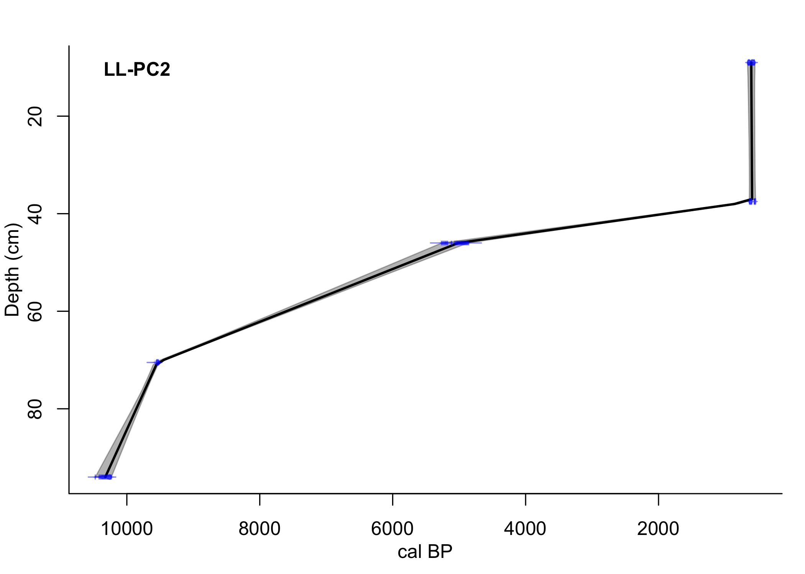
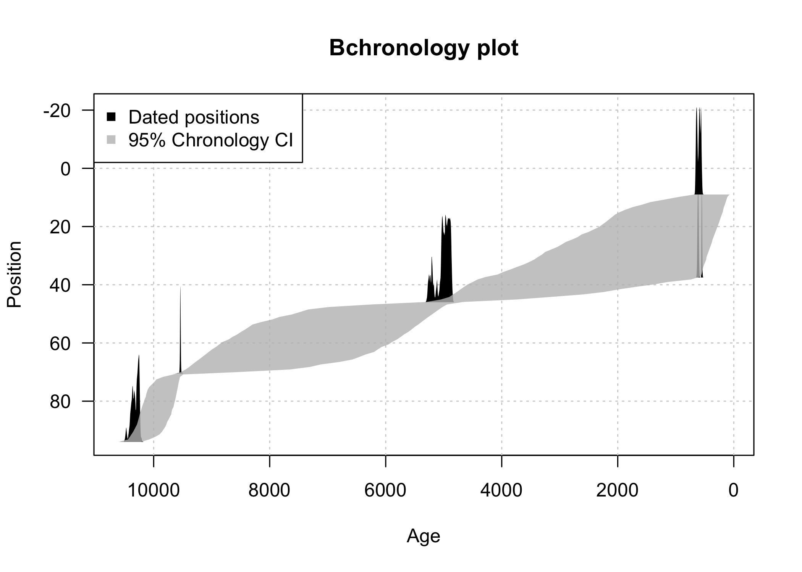
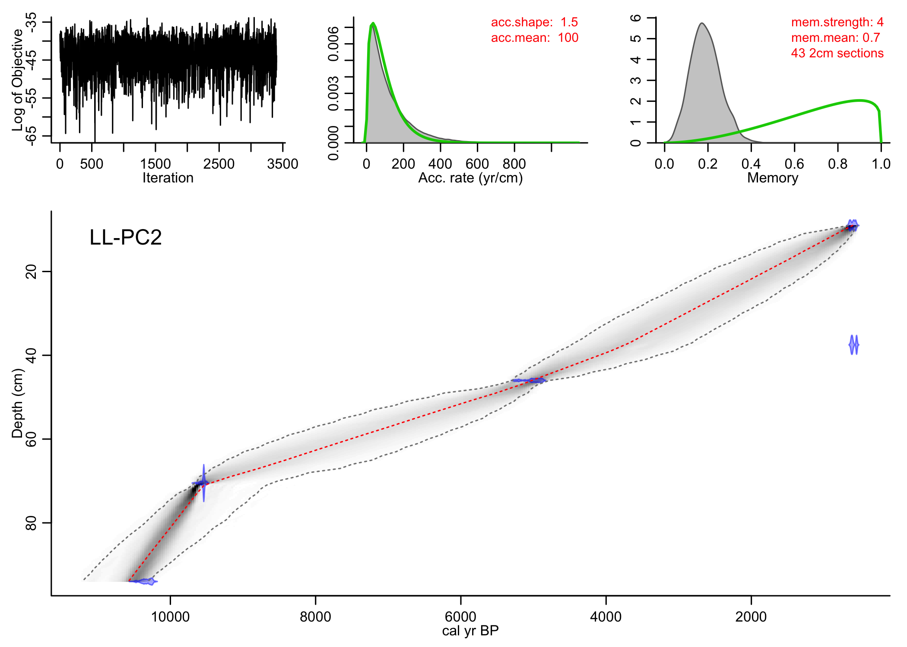
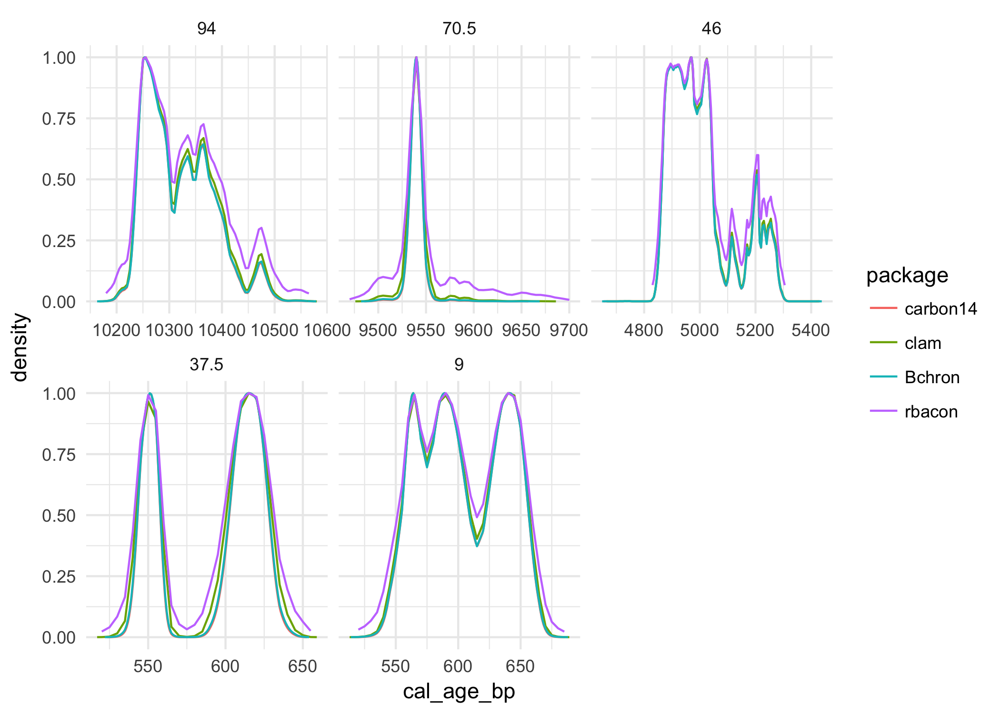
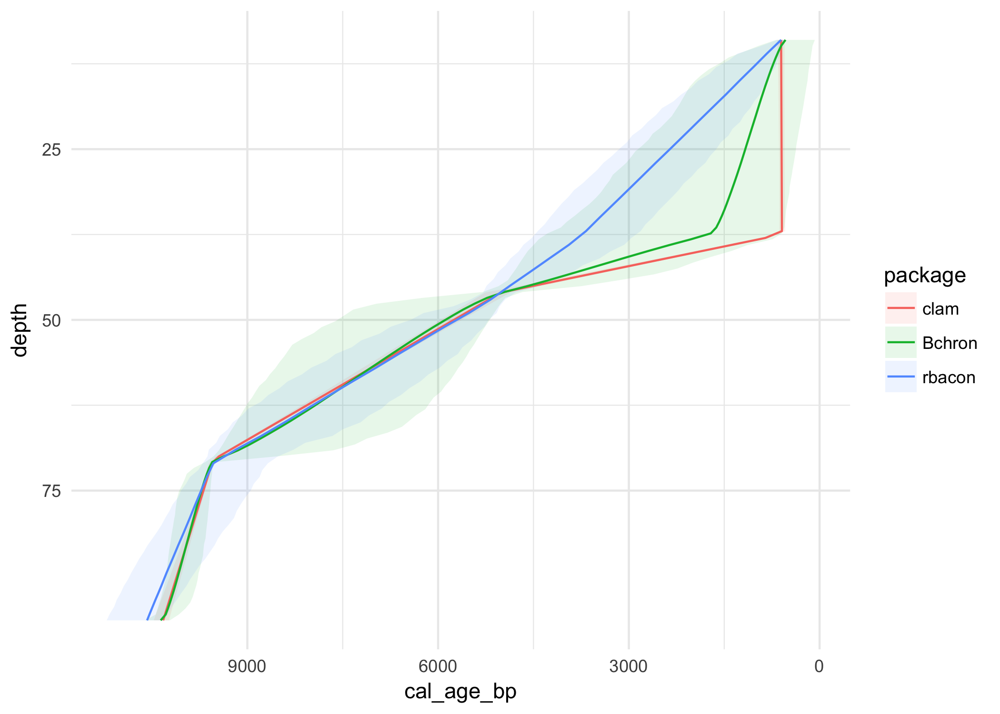

Working with radiocarbon dating in R has long been possible, especially since the <a href="http://www.radiocarbon.org/IntCal13.htm">Intcal dataset itself</a> contains R code in the supplement. Other tools like <a href="http://chrono.qub.ac.uk/blaauw/bacon.html">Bacon</a> (<a href="http://dx.doi.org/10.1214/11-BA618">Blauuw and Christen 2011</a>), the slightly simpler <a href="http://chrono.qub.ac.uk/blaauw/clam.html">Clam</a> (<a href="http://dx.doi.org/10.1016/j.quageo.2010.01.002">Blaauw 2010</a>), and <a href="https://github.com/andrewcparnell/Bchron">BChron</a> (<a href="http://onlinelibrary.wiley.com/doi/10.1111/j.1467-9876.2008.00623.x/abstract">Haslett and Parnell 2008</a>) have helped users calibrate radiocarbon dates and produce reproducible age models. A comprehensive analysis of the quality of these and other methods is available in an article by <a href="http://journals.sagepub.com/doi/abs/10.1177/0959683616675939">Trachsel and Telford (2016)</a>.

In a recent quest to learn how the calibration process happens, I <a href="https://github.com/paleolimbot/carbon14">wrote my own version of R radiocarbon calibration</a>. All of these methods are useful, so I thought I would compare and contrast the mechanics of getting data into and out of these methods using a few published radiocarbon dates from <a href="http://www.facetsjournal.com/doi/10.1139/facets-2017-0004">Long Lake, Nova Scotia, Canada</a>. There is a spurious date at 35 cm, which makes it an interesting test case to see how the different methods handle the dates. These are in the <code>dates</code> variable, which I'll use throughout this post (note also that I'm using <code>library(tidyverse)</code>).


``` r
library(tidyverse)

dates <- tribble(
  ~sample_id, ~depth, ~age_14C, ~age_error,
  "LL082011-C2-39", 94, 9148, 49,
  "UOC-0844", 70.5, 8582, 28,
  "LL082011-C2-87", 46, 4396, 55,
  "UOC-0845", 37.5, 575, 18,
  "LL082011-C2-124", 9, 623, 34
)

dates
```

| sample\_id      |  depth|  age\_14C|  age\_error|
|:----------------|------:|---------:|-----------:|
| LL082011-C2-39  |   94.0|      9148|          49|
| UOC-0844        |   70.5|      8582|          28|
| LL082011-C2-87  |   46.0|      4396|          55|
| UOC-0845        |   37.5|       575|          18|
| LL082011-C2-124 |    9.0|       623|          34|

### carbon14

Using the [carbon14](https://github.com/paleolimbot/carbon14) package (still in draft form), it is possible to calibrate radiocarbon dates, although it doesn't construct an age-depth model. The syntax is a little like `mutate()`, and the result is a data frame-ish object.

``` r
# install.packages("devtools")
# devtools::install_github("paleolimbot/carbon14")
library(carbon14)

carbon14_result <- dates %>%
  calibrate(
    measured_age = age_14C, 
    measured_age_error = age_error,
    name = sample_id
  )

plot(carbon14_result)
```


Extracting the distribution data isn't straightforward, but it's definitely possible.

``` r
calib_carbon14 <- map2_dfr(
  dates$depth, 
  carbon14_result$cal_age, 
  function(depth, cal_age_item) {
    df <- cal_age_item$data %>%
      select(cal_age_bp = values, density = densities)
    df$depth <- depth
    df
  }
) %>% select(depth, everything())

calib_carbon14 %>% head()
```

|  depth|  cal\_age\_bp|  density|
|------:|-------------:|--------:|
|     94|      9155.000|        0|
|     94|      9159.491|        0|
|     94|      9163.982|        0|
|     94|      9168.474|        0|
|     94|      9172.965|        0|
|     94|      9177.456|        0|

### clam

Clam (Classical Age-Depth Modelling of Cores from Deposits) used to come in collection of `.R` files, but now is [available from CRAN in package form](https://cran.r-project.org/package=clam). Clam takes a simpler approach than Bacon, more closely resembling the "draw a line between the things" method. The clam package highly dependent on the directory structure, and requires a similar structure as `Bacon()` with a different type of `.csv` file in the directory. With the `dates` data frame, this looks something like the following:

``` r
# install.packages("clam")
library(clam)
dir.create("cores_clam/LL-PC2", recursive = TRUE)

dates %>%
  mutate(reservoir = "", cal_BP = "") %>%
  select(ID = sample_id, C14_age = age_14C, cal_BP,
         error = age_error, reservoir, depth) %>%
  write_csv("cores_clam/LL-PC2/LL-PC2.csv")

clam(core = "LL-PC2", coredir = "cores_clam")
```



The dates from Long Lake have an age reversal, which `Bacon()` is not bothered by, since all the age models that pass through the weird age at 35 cm are highly unlikely under the assumptions of `Bacon()` (notably, that accumulation rates don't change quickly). To exclude the date, one can use the `outliers` argument. Calibration curves can be changed using combinations of the `cc` arguments.

Similar to `Bacon()`, `clam()` puts an object in the global environment that contains information about the last run. The object is called `dat`, and has a similar structure to Bacon's `info` object. In particular, the distribution of calibrated dates is included:

``` r
calib_clam <- map2_dfr(dat$depth, dat$calib, function(depth, prob_matrix) {
  colnames(prob_matrix) <- c("cal_age_bp", "density")
  df <- as_tibble(prob_matrix)
  df$depth <- depth
  df
}) %>%
  select(depth, cal_age_bp, density)

calib_clam %>% head()
```

|  depth|  cal\_age\_bp|  density|
|------:|-------------:|--------:|
|     94|         10167|  1.0e-06|
|     94|         10168|  1.1e-06|
|     94|         10169|  1.2e-06|
|     94|         10170|  1.3e-06|
|     94|         10171|  1.7e-06|
|     94|         10172|  2.2e-06|

The output of the model (the grey area) is placed in the global environment as the `calrange` object. This is probably more useful as a data frame, the columns of which I've renamed to match the output of `Bacon()`.

``` r
ages_clam <- as_tibble(calrange) %>%
  select(depth = Depth, min = starts_with("min"), 
         max = starts_with("max"), mean = "point")

ages_clam %>% head()
```

|  depth|       min|       max|      mean|
|------:|---------:|---------:|---------:|
|      9|  546.9500|  660.0000|  603.0831|
|     10|  548.3140|  657.3219|  602.7287|
|     11|  549.7009|  655.0114|  602.3743|
|     12|  551.9974|  653.2658|  602.0199|
|     13|  552.8456|  651.1649|  601.6655|
|     14|  554.0526|  649.3860|  601.3111|

The `clam()` approach has the same drawback of `Bacon()`, in that it does not work in reproducible documents (hopefully this will be fixed in future versions). It also places objects in the global environment, which makes it possible that name collisions will occur (I tend to run `rm(dat, calrange, dets, smp, chron)` to clean up the namespace after running `clam()`. While the design of the package seems more geared towards that of a script than a RMarkdown-like document, with some coaxing it can be done.

### Bchron

The Bchron package is based on a [paper from 2008](http://onlinelibrary.wiley.com/doi/10.1111/j.1467-9876.2008.00623.x/abstract), and will both calibrate radiocarbon dates and create age-depth models with uncertainty. Creating an age-depth model from the `dates` data frame looks something like this:

``` r
library(Bchron)
result <- Bchronology(
  ages = dates$age_14C,
  ageSds = dates$age_error,
  positions = dates$depth,
  positionThicknesses = rep(1, nrow(dates))
)
```

``` r
plot(result)
```



Extracting the raw calibrated distributions looks something like this:

``` r
calib_bchron <- map_dfr(result$calAges, function(cal_age_item) {
  tibble(
    depth = cal_age_item$positions,
    cal_age_bp = cal_age_item$ageGrid,
    density = cal_age_item$densities
  )
})

calib_bchron %>%
  head()
```

|  depth|  cal\_age\_bp|  density|
|------:|-------------:|--------:|
|      9|             0|        0|
|      9|             1|        0|
|      9|             2|        0|
|      9|             3|        0|
|      9|             4|        0|
|      9|             5|        0|

...and extracting the minimum, mean, and maximum ages looks like this (at a 95% confidence interval).

``` r
ages_bchron <- tibble(
  depth = result$predictPositions,
  min = apply(result$thetaPredict, 2, "quantile", probs = (1 - 0.95)/2),
  median = apply(result$thetaPredict, 2, "quantile", probs = 0.5),
  mean = apply(result$thetaPredict, 2, mean),
  max = apply(result$thetaPredict, 2, "quantile", probs = 1 - (1 - 0.95)/2)
)
```

### rbacon

Bacon (Age-Depth Modelling using Bayesian Statistics) also used to come in a collection of `.R` files, but now is [available from CRAN in package form](https://cran.r-project.org/package=rbacon). Calibrating dates is the first step in the Bayesian age-depth modelling approach, which uses the full distribution of the calibrated radiocarbon date. It is probably because Bacon originated in the form of an R script that it requires a very specific directory structure...in particular, it needs a `.csv` file with the columns `labID`, `age`, `error`, `depth`, and `cc`, which contains a numbered calibration curve (there is documentation of which value of `cc` means what at `?Bacon`).

``` r
# install.packages("rbacon")
library(rbacon)
dir.create("cores_bacon/LL-PC2", recursive = TRUE)
dates %>%
  select(labID = sample_id, age = age_14C, error = age_error, depth) %>%
  arrange(depth) %>%
  write_csv("cores_bacon/LL-PC2/LL-PC2.csv")

Bacon(core = "LL-PC2", coredir = "cores_bacon", 
      ask = FALSE, plot.pdf = FALSE,
      thick = 2, acc.mean = 100)
```

I've hidden the output because it's quite extensive, but to reproduce a plot of the calibrated dates, one can use the `calib.plot()` function to plot the last run (I've aligned the axes like the Bchron plot):

``` r
calib.plot(rotate.axes = TRUE, rev.yr = TRUE)
```


...and to reproduce the modeled densities, one can use the `agedepth()` function.

``` r
agedepth(rotate.axes = TRUE, rev.yr = TRUE)
```



The `agedepth()` plot is the one most people use in publication (it contains the calibrated dates, the confidence of the modeled dates, and the diagnostic information needed to make sure that the model is reasonable), but sometimes it helps to get some of the raw information out of the model. Calibrated dates can be found in `info$calib`, although they are a bit nicer if they are converted into a data frame (the first six rows are shown below).

``` r
calib_bacon <- map2_dfr(
  info$calib$d, 
  info$calib$probs, 
  function(depth, prob_matrix) {
    colnames(prob_matrix) <- c("cal_age_bp", "density")
    df <- as_tibble(prob_matrix)
    df$depth <- depth
    df
}) %>%
  select(depth, cal_age_bp, density)

calib_bacon %>% head()
```

|  depth|  cal\_age\_bp|    density|
|------:|-------------:|----------:|
|      9|           520|  0.0015886|
|      9|           525|  0.0022892|
|      9|           530|  0.0034534|
|      9|           535|  0.0052350|
|      9|           540|  0.0096007|
|      9|           545|  0.0163060|

As a summary of the model, `info$ranges` is probably the most useful. This information is also written to the `cores_bacon/LL-PC1` folder as a text file.

``` r
ages_bacon <- as_tibble(info$ranges)
ages_bacon %>% head()
```

|  depth|  min|   max|  median|  mean|
|------:|----:|-----:|-------:|-----:|
|      9|  542|   666|     602|   604|
|     10|  582|   968|     701|   720|
|     11|  599|  1311|     793|   836|
|     12|  655|  1436|     909|   943|
|     13|  684|  1612|    1013|  1050|
|     14|  757|  1741|    1128|  1159|

Note that I've found that when `Bacon()` experiences an error, it is usually helpful to restart R, which sometimes fixes the error for an unknown reason. `Bacon()` also has problems when used inside a reproducible document (like this one), which will hopefully be fixed in future versions. While it is a little hard to use in a reproducible document context, it is excellent, well-documented software, and once the file with the dates is in place, it is quite approachable.

### Comparing approaches

All four packages allow calibrating of radiocarbon dates, and three of the packages create age-depth models. Throughout this post I've gone to a bit of trouble to extract the raw information out of the output so that it can be compared with the output from the other packages. Note that I used the default for most of the options, which represents a common use case, especially for beginners (and when it comes to Bayesian age-depth modelling, I will probably always consider myself a beginner).



There is a slight difference in the probability distributions of the calibrated dates, notably that rbacon distributions have more tail than the other packages. The default option for `Bacon()` is a t distribution with low degrees of freedom, which means that the original radiocarbon date is given a distribution with more prominent tails. The overall shape is similar, which means that each package probably implements the IntCal13 calibration curve the same, with some slight differences in computations. For example, the rbacon package calculates density on a 5-year scale and a cutoff of 0.001 (higher than the other packages), which means that some of the tails are lost.

The set of 5 ages from Long Lake contain a spurious date at 35 cm, which is handled differently by each of the packages when creating an age-depth model. Clam takes the "straight line" approach, Bchron appears to have the widest predicted error range, while Bacon predicts a much narrower age range for most depths. In addition, Bacon doesn't try to accommodate the spurious date.



