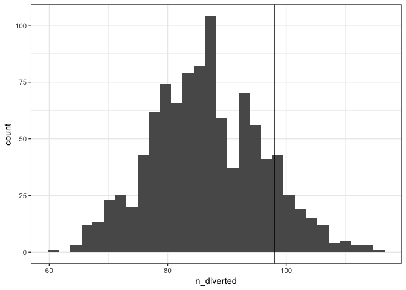

The recent grounding of almost all <a href="https://en.wikipedia.org/wiki/Boeing_737_MAX">Boeing 737 MAX-series aircraft</a> in the world is, according to a recent CBC commentator, unprecedented. I’m not an aircraft expert (or even a hobbyist), but I do love data and mining publicly-available datasets. Inspired by the <a href="https://github.com/hadley/nycflights13">nycflights13 R package</a> (a dataset of all the flights in and out of New York City in 2013) and the <a href="https://www.flightradar24.com/blog/flightradar24-data-regarding-lion-air-flight-jt610/">FlightRadar24 blog post regarding Lion Air flight JT610</a>, I thought I would see what information is accessible to the public about flights that used the 737 MAX-series aircraft.


The [nycflights13 R package](https://github.com/hadley/nycflights13) uses the [Bureau of Transportation Statistics Reporting Carrier On-Time Performance](https://www.transtats.bts.gov/DL_SelectFields.asp?Table_ID=236) and the [FAA Releasable Aircraft](http://www.faa.gov/licenses_certificates/aircraft_certification/aircraft_registry/releasable_aircraft_download/) datasets, both of which are downloadable for free. As per my usual MO, I'll be using the [tidyverse](http://tidyverse.org) to script up the analysis. Because I'll be reading in a lot of foreign CSVs with weird names, I'll also make myself a name cleaner-upper to make `nice_columns` from `BADLY FORMATTED-COLUMNS`.

``` r
library(tidyverse)
nice_names <- . %>%
  str_to_lower() %>%
  str_replace_all("[- ]", "_")
```

I opted to get the plane information first. This code was heavily inspired by the scripts in the `data-raw/` folder of the [nycflights13 R package](https://github.com/hadley/nycflights13).

``` r
planes_src <- "http://registry.faa.gov/database/yearly/ReleasableAircraft.2018.zip"
planes_tmp <- tempfile(fileext = ".zip")
curl::curl_download(planes_src, planes_tmp)
dir.create("planes")
unzip(planes_tmp, exdir = "planes")
```

The "planes" folder now contains several oddly named files, of which we are interested in two: "ACFTREF.txt" (airplane model information), and "planes/MASTER.txt" (all registered planes in the US). According to the [emergency order by the FAA](https://www.faa.gov/news/updates/media/Emergency_Order.pdf), the models that were grounded were the Boeing 737-8 and 737-9, although for this analysis I'll include all 737s for comparison. To do this, I'll need to build a clean table of plane model info for the planes we're interested in.

``` r
planes_models <- read_csv(
  "planes/ACFTREF.txt",
  col_types = cols(
    .default = col_character(),
    X12 = col_skip()
  ),
  # there are quotation marks as parts of values in this table
  quote = ''
) %>%
  rename_all(nice_names)

planes_models_keep <- planes_models %>%
  filter(mfr == "BOEING", str_detect(model, "^737")) %>%
  mutate(model_label = if_else(str_detect(model, "^737-[89]$"), "737 MAX", "737")) %>%
  select(mfr_mdl_code = code, model_label, model_mfr = mfr, model)

planes_models_keep
```

    ## # A tibble: 606 x 4
    ##    mfr_mdl_code model_label model_mfr model  
    ##    <chr>        <chr>       <chr>     <chr>  
    ##  1 1382526      737         BOEING    737-66N
    ##  2 1382527      737         BOEING    737-7K2
    ##  3 1382528      737         BOEING    737-9K2
    ##  4 1382529      737         BOEING    737-8DR
    ##  5 1382530      737         BOEING    737-8DV
    ##  6 1382531      737         BOEING    737-7HF
    ##  7 1382532      737         BOEING    737-46J
    ##  8 1382540      737         BOEING    737-6Q8
    ##  9 1383333      737         BOEING    737-2E7
    ## 10 1384400      737         BOEING    737-7FB
    ## # … with 596 more rows

Next, I'll use this to create a table of planes that we're interested in. I modify the `n_number` to `paste0("N", n_number)` here because the `tail_num` variable in the flights dataset below has the tail number in that form.

``` r
planes_master <- read_csv(
  "planes/MASTER.txt",
  col_types = cols(
    .default = col_character(),
    `YEAR MFR` = col_integer(),
    X35 = col_skip()
  )
) %>%
  rename_all(nice_names)

planes_keep <- planes_master %>%
  inner_join(planes_models_keep, by = "mfr_mdl_code") %>%
  mutate(tail_num = paste0("N", n_number)) %>%
  select(tail_num, model_label, model_mfr, model, model_year = year_mfr)

planes_keep
```

    ## # A tibble: 2,197 x 5
    ##    tail_num model_label model_mfr model   model_year
    ##    <chr>    <chr>       <chr>     <chr>        <int>
    ##  1 N103WT   737         BOEING    737-700         NA
    ##  2 N108MS   737         BOEING    737-7BC       2002
    ##  3 N108WT   737         BOEING    737-700         NA
    ##  4 N11206   737         BOEING    737-824       2000
    ##  5 N114JF   737         BOEING    737-4H6       1993
    ##  6 N12216   737         BOEING    737-824       1998
    ##  7 N12218   737         BOEING    737-824       1998
    ##  8 N12221   737         BOEING    737-824       1998
    ##  9 N12225   737         BOEING    737-824       1998
    ## 10 N12238   737         BOEING    737-824       1999
    ## # … with 2,187 more rows

Interestingly, you can use the `tail_num` to look up flight data from [FlightRadar24](https://flightradar24.com) like this `https://www.flightradar24.com/data/aircraft/<TAIL NUMBER>`. You can see an example for [one 737 MAX-8 here](https://www.flightradar24.com/data/aircraft/n27503) (note that there aren't any flights after March 13, when the ban went into effect).

Unfortunately, the pre-zipped option for the on-time performance data was not working at the time of this writing, so I had to download that data by hand (this amounts to one click per month...not too bad for just 2018, but still annoying). I downloaded these files to "flight\_zips/2018-{month}.zip". The code to clean this up was also inspired by the [nycflights13 R package](https://github.com/hadley/nycflights13) cleaning scripts. Note that this is about 300 MB of compressed data and 2.5 GB of uncompressed data before filtering.

``` r
extract_month <- function(year = 2018, month) {
  zipfile <- sprintf("flight_zips/%s_%s.zip", year, month)

  files <- unzip(zipfile, list = TRUE)
  # Only extract biggest file
  csv <- files$Name[order(files$Length, decreasing = TRUE)[1]]

  unzip(zipfile, exdir = "flights", junkpaths = TRUE, files = csv)

  src <- paste0("flights/", csv)
  dst <- paste0("flights/", year, "-", month, ".csv")
  file.rename(src, dst)
  dst
}

flight_raw_csvs <- tibble(
  year = 2018,
  month = 1:12,
  csv_file = map2_chr(year, month, extract_month)
)

flight_data <- flight_raw_csvs$csv_file %>%
  map(read_csv, col_types = cols(
    .default = col_character(),
    OP_CARRIER_FL_NUM = col_integer(),
    FL_DATE = col_date(),
    DIVERTED = col_double(),
    AIR_TIME = col_double(),
    CRS_ELAPSED_TIME = col_double(),
    ACTUAL_ELAPSED_TIME = col_double()
  )) %>%
  bind_rows() %>%
  rename_all(nice_names)

flights_keep <- flight_data %>%
  mutate(
    fl_num = paste0(op_unique_carrier, op_carrier_fl_num),
    diverted = if_else(diverted == 1, TRUE, FALSE)
  ) %>%
  select(
    fl_date, fl_num,
    tail_num, origin, dest, diverted,
    schedule_elapsed = crs_elapsed_time,
    actual_elapsed = actual_elapsed_time,
    air_time
  ) %>%
  inner_join(planes_keep, by = "tail_num")

flights_keep
```

Now that we have a big ol' data frame of all the flights that took place on a 737 in the US during 2018, we can answer at least one question: were more 737-MAX flights diverted than flights on other 737 aircraft?

``` r
flights_keep %>%
  group_by(model_label) %>%
  summarise(
    n = n(),
    n_diverted = sum(diverted),
    pct_diverted = mean(diverted) * 100
  )
```

    ## # A tibble: 2 x 4
    ##   model_label       n n_diverted pct_diverted
    ##   <chr>         <int>      <int>        <dbl>
    ## 1 737         2378407       5322        0.224
    ## 2 737 MAX       38472         98        0.255

The answer appears to be yes, but not by much: 0.25% of 737 MAX flights were diverted, whereas on other 737 flights, 0.22% of flights were diverted. I'm not much of a statistician, but I believe this is a classic case for a Chi-square test, although I think I remember that Chi-squared tests don't perform well with respect to rare events (flight diversions are definitely rare events). Still, according to this test, even though there were slightly more diverted 737 MAX flights, it is reasonably likely that we would observe this by chance (1 in 5).

``` r
observed_diverted <- 98
(observed_not_diverted <- 38472 - 98)
```

    ## [1] 38374

``` r
(expected_diverted <- 0.2237632 / 100 * 38472)
```

    ## [1] 86.08618

``` r
(expected_not_diverted <- 38472 - expected_diverted)
```

    ## [1] 38385.91

``` r
(chi_sq <- sum(
  (observed_diverted - expected_diverted)^2 / expected_diverted,
  (observed_not_diverted - expected_not_diverted)^2 / expected_not_diverted
))
```

    ## [1] 1.652501

``` r
(p_value <- 1 - pchisq(chi_sq, df = 1))
```

    ## [1] 0.1986189

In the off chance this is an artifact of diverted flights being rare, we could also randomly sample the non-MAX flights to see how likely it is that 98 flights of 38472 would be diverted.

``` r
non_max_flights <- flights_keep %>%
  filter(model_label == "737") %>%
  select(fl_date, fl_num, diverted)

set.seed(4937)
non_max_flights_boot <- tibble(
  sample_number = 1:1000,
  sample = map(sample_number, ~sample_n(non_max_flights, 38472))
) %>%
  unnest() %>%
  group_by(sample_number) %>%
  summarise(n_diverted = sum(diverted))

ggplot(non_max_flights_boot, aes(n_diverted)) +
  geom_histogram(bins = 30) +
  geom_vline(xintercept = 98) +
  theme_bw()
```



This is a confirmation of our earlier calculation: it is fairly reasonable that 98 flights of 38472 could be diverted, assuming the two datasets are comparable.

It would be interesting to see similar data as that used by the [FlightRadar24 blog post regarding Lion Air flight JT610](https://www.flightradar24.com/blog/flightradar24-data-regarding-lion-air-flight-jt610/) (elevation trajectory of the plane during the first 20 minutes of flight) but for all 737 MAX flights. Were there other flights that looked like pilots were fighting with the automatic control system? This data exists at 5-second resolution from FlightRadar24, although even the highest of the paid data plans only lets you download 100 or so of these per day (and there are 2.5 million rows in our `flights_keep` dataset to examine).
