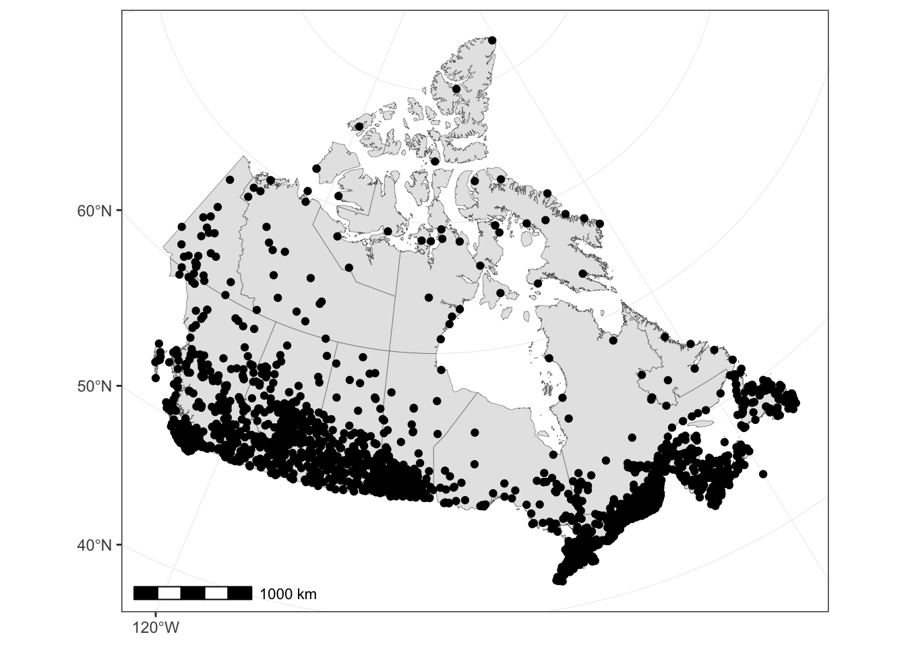
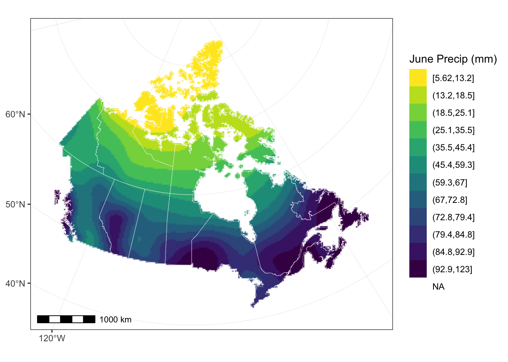
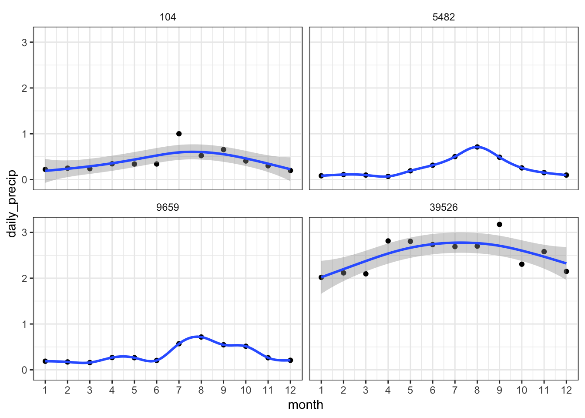

I’m an avid Twitter follower of <a href="https://twitter.com/simongerman600">Simon Kuestenmacher</a> (<span class="citation">@simongerman600</span>), who is a prolific tweeter of maps (all sorts). The other day I saw this tweet, which links to a <a href="https://www.reddit.com/r/MapPorn/comments/b4lmg4/the_march_of_the_seasons_normal_average_daily/">reddit thread</a> that used the <a href="http://prism.oregonstate.edu/projects/public/alaska/grids/">PRISM dataset</a> to make an animated map of precipitation in the US. A few weeks ago I had a colleague email me asking for the <a href="http://climate.weather.gc.ca/climate_normals/results_1981_2010_e.html">Canadian climate normals</a> raw data (which can be found <a href="ftp://ftp.tor.ec.gc.ca/Pub/Normals/ENGLISH/">here</a>), and having made an <a href="https://twitter.com/paleolimbot/status/1031704526036729856">animated map of Earth’s paleogeography</a>, I decided to give it a go for Canada.

<blockquote class="twitter-tweet" data-lang="en">
<p lang="en" dir="ltr">
Average (1981-2010) daily precipitation for the contiguous USA. Precipitation is "any product of the condensation of atmospheric water vapor that falls under gravity". Essentially drizzle, rain, sleet, snow, graupel and hail. Source: <a href="https://t.co/5UV3nEpj7m">https://t.co/5UV3nEpj7m</a> <a href="https://t.co/eKYPksjxnq">pic.twitter.com/eKYPksjxnq</a>
</p>
— Simon Kuestenmacher (@simongerman600) <a href="https://twitter.com/simongerman600/status/1109924176222187520?ref_src=twsrc%5Etfw">March 24, 2019</a>
</blockquote>
<script async src="https://platform.twitter.com/widgets.js" charset="utf-8"></script>


The first hurdle is getting the data. The data is currently on an FTP server, split into many different folders (one per province) and files (my guess would be to get around Excel's historic limit of 65,000 (ish) rows). Rather than copy-and-paste the links to all 30 files, I thought I would see what the **curl** package did with FTP directory listings. With HTTP listings, you can use **rvest** to scrape the links (`html_nodes("a") %>% html_attr("href")`), but with FTP, **curl** returns something like a whitespace-separated list. I'm sure this is documented somewhere, but I used the following code to parse the directory listing. Note that you can't separate purely on whitespace, because filenames can contain whitespace. Thus, here I used `tidyr::separate()` with `extra = "merge"`, since this limits the number of splits that occur.

``` r
list_ftp <- function(dir_url) {
  dir_url %>%
    curl::curl_fetch_memory() %>%
    .$content %>%
    read_lines() %>%
    tibble(txt = .) %>%
    separate(
      txt, 
      into = c("perms", "user_n", "user", "group", "size", "month", "day", "time", "name"),
      sep = "\\s+",
      extra = "merge"
    ) %>%
    mutate(
      dir_url = dir_url, 
      is_dir = str_detect(perms, "^d"),
      size = if_else(is_dir, NA_real_, as.numeric(size))
    ) %>%
    select(dir_url, name, is_dir, size)
}

list_ftp("ftp://ftp.tor.ec.gc.ca/Pub/Normals/ENGLISH/")
```

    ## # A tibble: 15 x 4
    ##    dir_url                                     name  is_dir  size
    ##    <chr>                                       <chr> <lgl>  <dbl>
    ##  1 ftp://ftp.tor.ec.gc.ca/Pub/Normals/ENGLISH/ .     TRUE      NA
    ##  2 ftp://ftp.tor.ec.gc.ca/Pub/Normals/ENGLISH/ ..    TRUE      NA
    ##  3 ftp://ftp.tor.ec.gc.ca/Pub/Normals/ENGLISH/ ALTA  TRUE      NA
    ##  4 ftp://ftp.tor.ec.gc.ca/Pub/Normals/ENGLISH/ BC    TRUE      NA
    ##  5 ftp://ftp.tor.ec.gc.ca/Pub/Normals/ENGLISH/ MAN   TRUE      NA
    ##  6 ftp://ftp.tor.ec.gc.ca/Pub/Normals/ENGLISH/ NB    TRUE      NA
    ##  7 ftp://ftp.tor.ec.gc.ca/Pub/Normals/ENGLISH/ NFLD  TRUE      NA
    ##  8 ftp://ftp.tor.ec.gc.ca/Pub/Normals/ENGLISH/ NS    TRUE      NA
    ##  9 ftp://ftp.tor.ec.gc.ca/Pub/Normals/ENGLISH/ NU    TRUE      NA
    ## 10 ftp://ftp.tor.ec.gc.ca/Pub/Normals/ENGLISH/ NWT   TRUE      NA
    ## 11 ftp://ftp.tor.ec.gc.ca/Pub/Normals/ENGLISH/ ONT   TRUE      NA
    ## 12 ftp://ftp.tor.ec.gc.ca/Pub/Normals/ENGLISH/ PEI   TRUE      NA
    ## 13 ftp://ftp.tor.ec.gc.ca/Pub/Normals/ENGLISH/ QUE   TRUE      NA
    ## 14 ftp://ftp.tor.ec.gc.ca/Pub/Normals/ENGLISH/ SASK  TRUE      NA
    ## 15 ftp://ftp.tor.ec.gc.ca/Pub/Normals/ENGLISH/ YT    TRUE      NA

``` r
list_ftp("ftp://ftp.tor.ec.gc.ca/Pub/Normals/ENGLISH/QUE/")
```

    ## # A tibble: 6 x 4
    ##   dir_url                                  name              is_dir    size
    ##   <chr>                                    <chr>             <lgl>    <dbl>
    ## 1 ftp://ftp.tor.ec.gc.ca/Pub/Normals/ENGL… .                 TRUE        NA
    ## 2 ftp://ftp.tor.ec.gc.ca/Pub/Normals/ENGL… ..                TRUE        NA
    ## 3 ftp://ftp.tor.ec.gc.ca/Pub/Normals/ENGL… QUE_ALBA-KUUJ_EN… FALSE  8344164
    ## 4 ftp://ftp.tor.ec.gc.ca/Pub/Normals/ENGL… QUE_L'AL-QUEB_EN… FALSE  8493881
    ## 5 ftp://ftp.tor.ec.gc.ca/Pub/Normals/ENGL… QUE_RAPI-ST P_EN… FALSE  8375096
    ## 6 ftp://ftp.tor.ec.gc.ca/Pub/Normals/ENGL… QUE_ST R-WRIG_EN… FALSE  5387169

The second challenge is to pull a list of files recursively (much like `list.files(..., recursive = TRUE)`). There's a few ways to go about this, but my solution is below:

``` r
list_ftp_recursive <- function(dir_url) {
  listing <- list_ftp(dir_url) %>%
    mutate(url = paste0(dir_url, name, if_else(is_dir, "/", ""))) %>%
    filter(!(name %in% c(".", "..")))
  files <- listing %>% filter(!is_dir)
  dirs <- listing %>% filter(is_dir) %>% pull(url)
  
  bind_rows(
    files,
    map_dfr(dirs, list_ftp_recursive)
  )
}

normals_files <- list_ftp_recursive("ftp://ftp.tor.ec.gc.ca/Pub/Normals/ENGLISH/")
normals_files %>%
  select(name, url)
```

    ## # A tibble: 30 x 2
    ##    name               url                                                  
    ##    <chr>              <chr>                                                
    ##  1 ALTA_ACAD-FIVE_EN… ftp://ftp.tor.ec.gc.ca/Pub/Normals/ENGLISH/ALTA/ALTA…
    ##  2 ALTA_FORE-ROCK_EN… ftp://ftp.tor.ec.gc.ca/Pub/Normals/ENGLISH/ALTA/ALTA…
    ##  3 ALTA_RONA-WORS_EN… ftp://ftp.tor.ec.gc.ca/Pub/Normals/ENGLISH/ALTA/ALTA…
    ##  4 BC_100-COWI_ENG.c… ftp://ftp.tor.ec.gc.ca/Pub/Normals/ENGLISH/BC/BC_100…
    ##  5 BC_CRAN-JOE_ENG.c… ftp://ftp.tor.ec.gc.ca/Pub/Normals/ENGLISH/BC/BC_CRA…
    ##  6 BC_KAML-NORT_ENG.… ftp://ftp.tor.ec.gc.ca/Pub/Normals/ENGLISH/BC/BC_KAM…
    ##  7 BC_OCHI-SILV_ENG.… ftp://ftp.tor.ec.gc.ca/Pub/Normals/ENGLISH/BC/BC_OCH…
    ##  8 BC_SIMI-WOOD_ENG.… ftp://ftp.tor.ec.gc.ca/Pub/Normals/ENGLISH/BC/BC_SIM…
    ##  9 BC_YOHO-YOHO_ENG.… ftp://ftp.tor.ec.gc.ca/Pub/Normals/ENGLISH/BC/BC_YOH…
    ## 10 MAN_ALEX-OCHR_ENG… ftp://ftp.tor.ec.gc.ca/Pub/Normals/ENGLISH/MAN/MAN_A…
    ## # … with 20 more rows

Now that we have a list of files (and filenames that are unique), we can download them! It's about 191 MB of CSV files, which took about 30 mins on my computer (probably a limitation of Service Canada's computers rather than my internet connection). Note the use of `purrr::walk2()` instead of `purrr::map2()`, since we don't care about the output.

``` r
walk2(normals_files$url, normals_files$name, curl::curl_download)
```

Finally, it would be nice to have some context on which to plot the data, namely the provincial borders. A while ago I made a [GitHub repo of the 1:1,000,000 Atlas of Canada data as a QGIS project](https://github.com/paleolimbot/canadamap_template) (I would link directly to the data but I can't find it anymore). In this case, 1:1M is a bit overkill, so I went looking for a smaller filesize version with less detail. The [Open Government Canada dataset](https://open.canada.ca/data/en/dataset/f77c2027-ed4a-5f6e-9395-067af3e9fc1e) has a broken link, but from fishing around on the FTP site, I was able to [find a copy](http://ftp.geogratis.gc.ca/pub/nrcan_rncan/vector/atlas/75m_prod/geog/shape). The data are in a format I have never before seen, which is *individually zipped shapefile components*! The code below downloads the components and unzips them in a new "aoc\_75M" directory.

``` r
dir.create("aoc_75M")
aoc_url <- "http://ftp.geogratis.gc.ca/pub/nrcan_rncan/vector/atlas/75m_prod/geog/shape"
aoc_layers <- list(
  layer = "pvp", 
  ext = c(".dbf", ".shp", ".shx")
) %>% 
  cross_df() %>%
  mutate(
    url = paste0(aoc_url, "/", layer, ext, ".zip"),
    zip_name = map2_chr(url, file.path("aoc_75M", basename(url)), curl::curl_download)
  )

walk(aoc_layers$zip_name, unzip, exdir = "aoc_75M")
```

Finally, we can read in the data. For this post (and for all good maps of Canada), I use the Atlas of Canada projection (EPSG:3978). I'll start with the spatial data (I filter out `REG_CODE == 0`, which are polygons that are not land, found by trial and error).

``` r
provinces <- read_sf("aoc_75M/pvp.shp") %>%
  filter(REG_CODE != 0) %>%
  st_set_crs(4326) %>%
  st_transform(3978)
```

Next, I'll read in the climate data. It should be said that I started this post with a single file, and then scaled it up to all 30 (I commonly do this...see if it works with a small batch, then scale up).

``` r
climate_normals_raw <- list.files(pattern = ".csv") %>%
  map_dfr(
    read_csv,
    col_types = cols(
      CLIMATE_ID = col_character(),
      STATION_NAME = col_character(),
      PROVINCE = col_character(),
      LATITUDE_DECIMAL_DEGREES = col_double(),
      LONGITUDE_DECIMAL_DEGREES = col_double(),
      ELEVATION = col_double(),
      NORMAL_ID = col_double(),
      NORMAL_ELEMENT_NAME = col_character(),
      MONTH = col_double(),
      VALUE = col_double(),
      MONTHLY_NORMAL_CODE = col_character(),
      ANNUAL_NORMAL_CODE = col_character(),
      STATION_NORMAL_CODE = col_character(),
      FIRST_OCCURRENCE_DATE = col_character(),
      FIRST_YEAR = col_double(),
      LAST_YEAR = col_double()
    )
) %>%
  rename_all(nice_names)

climate_normals_raw
```

    ## # A tibble: 1,359,781 x 16
    ##    climate_id station_name province latitude_decima… longitude_decim…
    ##    <chr>      <chr>        <chr>               <dbl>            <dbl>
    ##  1 3020025    ACADIA VALL… ALTA                 51.2            -110.
    ##  2 3020025    ACADIA VALL… ALTA                 51.2            -110.
    ##  3 3020025    ACADIA VALL… ALTA                 51.2            -110.
    ##  4 3020025    ACADIA VALL… ALTA                 51.2            -110.
    ##  5 3020025    ACADIA VALL… ALTA                 51.2            -110.
    ##  6 3020025    ACADIA VALL… ALTA                 51.2            -110.
    ##  7 3020025    ACADIA VALL… ALTA                 51.2            -110.
    ##  8 3020025    ACADIA VALL… ALTA                 51.2            -110.
    ##  9 3020025    ACADIA VALL… ALTA                 51.2            -110.
    ## 10 3020025    ACADIA VALL… ALTA                 51.2            -110.
    ## # … with 1,359,771 more rows, and 11 more variables: elevation <dbl>,
    ## #   normal_id <dbl>, normal_element_name <chr>, month <dbl>, value <dbl>,
    ## #   monthly_normal_code <chr>, annual_normal_code <chr>,
    ## #   station_normal_code <chr>, first_occurrence_date <chr>,
    ## #   first_year <dbl>, last_year <dbl>

We can see from the file that it is in parameter-long form (one row per measurement), and contains repeated location and parameter metadata (for a discussion of this topic, you should check out the [mudata2 package](https://cran.r-project.org/package=mudata2) and the [paper I wrote describing it](https://doi.org/10.1139/facets-2017-0026)). I'll pull out the location data first using `dplyr::distinct()` (renaming the lat and lon variables to something more type-able).

``` r
climate_stations <- climate_normals_raw %>%
  rename(latitude = latitude_decimal_degrees, longitude = longitude_decimal_degrees) %>%
  distinct(climate_id, station_name, province, longitude, latitude, elevation) %>%
  mutate(elevation = elevation / 1000) %>%
  st_as_sf(coords = c("longitude", "latitude"), crs = 4326) %>%
  st_transform(3978)
```

Let's have a look! Do they all plot within Canada? (You would be surprised how many stations in the full Environment Canada climate dataset have erroneous lat/lons that make them plot outside Canada). All of these look to be in the right place.

``` r
ggplot() + 
  layer_spatial(provinces, size = 0.1) +
  layer_spatial(climate_stations) +
  annotation_scale()
```



Next I'll pull out the parameter metadata, contained in the `normal_id` and `normal_element_name` column. I'll also give them a column name, since in the next chunk I'm going to make one column for each. There are upwards of 50 variables to choose from, although not every variable is available for every station.

``` r
climate_params <- climate_normals_raw %>%
  distinct(normal_id, normal_element_name) %>%
  filter(normal_element_name %in% c("Mean daily temperature deg C", "Total precipitation mm")) %>%
  mutate(col_name = fct_recode(
    normal_element_name,
    "mean_temp" = "Mean daily temperature deg C",
    "total_precip" = "Total precipitation mm"
  ))

climate_params
```

    ## # A tibble: 2 x 3
    ##   normal_id normal_element_name          col_name    
    ##       <dbl> <chr>                        <fct>       
    ## 1         1 Mean daily temperature deg C mean_temp   
    ## 2        56 Total precipitation mm       total_precip

Finally, I'll recombine the data using `inner_join()`s. I do this because I've filtered out some `climate_params` that I didn't want to use, and I could have filtered out some locations (I mean, I didn't, but I *could* have, and would want that reflected in my final dataset). I have to use `st_as_sf()` at the end, because doing a join with an **sf** object keeps the geometry column, but strips the table class (and it's helpful for R to know it's a spatial object later on).

``` r
climate_normals <- climate_normals_raw %>%
  filter(month %in% 1:12) %>%
  select(climate_id, normal_id, month, value) %>%
  inner_join(climate_params, by = "normal_id") %>%
  select(-normal_element_name, -normal_id) %>%
  spread(col_name, value) %>%
  inner_join(climate_stations, by = "climate_id") %>%
  st_as_sf()

climate_normals
```

    ## Simple feature collection with 21240 features and 7 fields
    ## geometry type:  POINT
    ## dimension:      XY
    ## bbox:           xmin: -2325537 ymin: -691201.7 xmax: 3003840 ymax: 3810547
    ## epsg (SRID):    3978
    ## proj4string:    +proj=lcc +lat_1=49 +lat_2=77 +lat_0=49 +lon_0=-95 +x_0=0 +y_0=0 +ellps=GRS80 +towgs84=0,0,0,0,0,0,0 +units=m +no_defs
    ## # A tibble: 21,240 x 8
    ##    climate_id month mean_temp total_precip station_name province elevation
    ##    <chr>      <dbl>     <dbl>        <dbl> <chr>        <chr>        <dbl>
    ##  1 1011467        1        NA        139   CENTRAL SAA… BC            53.3
    ##  2 1011467        2        NA         97.5 CENTRAL SAA… BC            53.3
    ##  3 1011467        3        NA         71.5 CENTRAL SAA… BC            53.3
    ##  4 1011467        4        NA         61.0 CENTRAL SAA… BC            53.3
    ##  5 1011467        5        NA         44.5 CENTRAL SAA… BC            53.3
    ##  6 1011467        6        NA         33.6 CENTRAL SAA… BC            53.3
    ##  7 1011467        7        NA         21.8 CENTRAL SAA… BC            53.3
    ##  8 1011467        8        NA         24.0 CENTRAL SAA… BC            53.3
    ##  9 1011467        9        NA         24.0 CENTRAL SAA… BC            53.3
    ## 10 1011467       10        NA         73.0 CENTRAL SAA… BC            53.3
    ## # … with 21,230 more rows, and 1 more variable: geometry <POINT [m]>

Given this, we can plot total monthly precipitation for (say) June:

``` r
climate_normals_june <- climate_normals %>% 
  filter(month == 6)

ggplot() + 
  layer_spatial(provinces, size = 0.1) +
  layer_spatial(climate_normals_june, aes(col = total_precip)) +
  labs(col = "June Precip (mm)") +
  scale_color_viridis_c() +
  annotation_scale()
```


A nice feature of the U.S. map that inspired this post was that you could see areas of high and low precipitation move in space, which requires interpolating between stations. Canada is massive, and interpolating gets hard to justify when the nearest station is 500 km away (like in eastern Northwest Territories). Justifying spatial 2D smoothing is beyond my area of expertise, but there's a great [tutorial on it here](https://rspatial.org/analysis/4-interpolation.html). I opted for a thin-plate regression spline smooth from the **fields** package, which I would say is good enough for a blog post but maybe you should contact an expert before using it in a paper. The **raster** package provides a nice helper to get these smooth objects into a plottable `Raster` object (note that I'm using the `provinces` object to create a `Raster` template from its bounding box, and again to make sure all the values outside Canada are assigned a no-data value). I picked 200x200 because it renders in a reasonable amount of time (I started with 10x10 when I was still getting the model code right).

``` r
june_precip_model <- fields::Tps(
  st_coordinates(climate_normals_june$geometry), 
  climate_normals_june$total_precip
)
june_precip_raster <- raster::raster(provinces, nrows = 200, ncol = 200) %>%
  raster::interpolate(june_precip_model) %>%
  raster::mask(provinces)
```

Now we can see how it looks! I'm using `cut_number()` here on the values because there are some very high precipitation values (I'm looking at you, west coast of British Columbia) that obscure variation in the drier parts. In QGIS you can do this using "quantile breaks". I picked 12 values because there's still enough difference between the colours that you can see the line move, which for me was the coolest part of the U.S. map that inspired this post.

``` r
ggplot() + 
  layer_spatial(june_precip_raster, aes(fill = cut_number(stat(band1), 12)), hjust = 1, vjust = 1) +
  layer_spatial(provinces, size = 0.1, fill = NA, col = "white") +
  labs(fill = "June Precip (mm)") +
  scale_fill_viridis_d(na.value = NA, direction = -1) +
  annotation_scale()
```



Now we need to scale this up to all 12 months. It's always a bit awkward to do this, but I'm going to do a the `group_by()`, `nest()`, then `mutate()` approach, utilizing the fact that we can refer to previous things we created in `mutate()`. This takes about 2 minutes on my computer (I tested it out by sticking a `slice(1)` right after `group_by(month)`, which makes sure that everything works at least once).

``` r
precip_raster <- climate_normals %>%
  as_tibble() %>%
  group_by(month) %>%
  nest() %>% 
  mutate(
    precip_model = map(data, ~fields::Tps(st_coordinates(.x$geometry), .x$total_precip)),
    precip_raster = map(
      precip_model,
      ~raster::raster(provinces, nrows = 200, ncols = 200) %>%
        raster::interpolate(.x) %>%
        raster::mask(provinces)
    ),
    precip_raster_df = map(precip_raster, df_spatial)
  ) %>%
  unnest(precip_raster_df) %>%
  rename(total_precip = band1) %>%
  filter(!is.na(total_precip))
```

We're getting closer! The problem is, we only have one data point per month, and the U.S. map had one per day. This form of interpolation I'm more familiar with (time series), and the reddit post gives some clues as to how they did it (using a 3rd-order cubic spline polynomial). Let's see if we can make that happen using a some stations I'm familiar with. I'm pretty sure that one can fit a cubic spline using **mgcv** (they are in the family of GAM), although I'm not up on the details. [Gavin Simpson](https://www.fromthebottomoftheheap.net/) has a [great paper](https://doi.org/10.3389/fevo.2018.00149) on GAMs for paleolimnology, and even if you can't pronounce paleolimnology, the paper is the most readable explanation of GAMs that I've come across to date. In **ggplot2**, we don't even have to leave `stat_smooth()` to get a sense of what `mgcv::gam()` will give us. I opted for using 12 knots (the places where each cubic joins the next) here, or one per month, at four cells in the raster we just created.

``` r
climate_normals_selected <- precip_raster %>%
  filter(feature_id %in% c("104", "5482", "9659", "39526")) %>%
  mutate(daily_precip = total_precip / lubridate::days_in_month(month))

ggplot(climate_normals_selected, aes(x = month, y = daily_precip)) +
  geom_point() +
  stat_smooth(method = "gam", formula = y ~ s(x, k = 12)) +
  scale_x_continuous(breaks = 1:12) +
  facet_wrap(vars(feature_id))
```



It looks here like some smooths are better than others due to the fact that the climate in some places is pretty volatile! I'm not going to get into the various options for smoothing here, mostly because I don't know them. However, the mechanics of scaling up our smooth to all 15,000 (give or take) cells within Canada is similar for any smoother. I'm using `k = 14` here because we've added two points (one to the beginning, one to the end), and since we're allowed any `k` up to the number of data points, I decided to max it out to help the smoother take into account the volatility of some of the cells. There's also some code in here about the Julian Day, which is a number from 1 to 365 that more accurately describes the "middle of the month", and allows us to pull out a day (January 29th, for example) from the interpolation more readily.

``` r
month_info <- tibble(
  month = 1:12,
  days_in_month = lubridate::days_in_month(month),
  julian_day_start = lag(cumsum(lubridate::days_in_month(month)), default = 0) + 1,
  julian_day = julian_day_start + days_in_month / 2
)

precip_daily_raster <- rbind(
  precip_raster %>% filter(month == 12) %>% mutate(julian_day = 350.5 - 365),
  precip_raster %>% left_join(month_info %>% select(month, julian_day), by = "month"),
  precip_raster %>% filter(month == 1) %>% mutate(julian_day = 365 + 16.5)
) %>%
  mutate(daily_precip = total_precip / lubridate::days_in_month(month)) %>%
  group_by(x, y) %>%
  nest() %>%
  mutate(
    fit = map(data, ~mgcv::gam(daily_precip ~ s(julian_day, k = 14), data = .x)),
    new_data = list(tibble(julian_day = 1:365)),
    daily_precip = map2(fit, new_data, predict)
  ) %>%
  unnest(new_data, daily_precip)
```

Finally, we're ready for animation. I've made a function to label the Julian Day with a calendar date, and used `transition_time()` to continuously loop through the days (one frame per day). This type of animation takes a long time to render (although improvements are coming in ggplot2 and gganimate soon!). I left the final version to render overnight (my guess is that it took an hour or two), but to get the plot right I started off with the data filtered to `julian_day == 1`, then `julian_day %in% c(1, 100, 200)` with the animation code, then finally the whole dataset. Early versions also used a smaller raster (10 x 10, then 100 x 100, then the final 200 x 200), which also improves rendering time while tweaking the code.

``` r
label_time <- function(julian_day) {
  date <- as.Date("2019-01-01") + julian_day - 1
  strftime(date, "%B %d")
}

raster_anim <- ggplot(precip_daily_raster) +
  geom_raster(aes(x, y, fill = cut_number(daily_precip, 9), group = paste(x, y)), hjust = 1, vjust = 1) +
  layer_spatial(provinces, size = 0.1, fill = NA, col = "white") +
  labs(
    fill = "Daily Precip (mm)",
    title = "{label_time(frame_time)}", 
    x = NULL, y = NULL,
    caption = "Source: Canadian Climate Normals, 1981-2010 (ECCC)"
  ) +
  scale_fill_viridis_d(direction = -1) +
  annotation_scale() +
  transition_time(julian_day)

animate(raster_anim, nframes = 365, width = 500, height = 400, res = 96)
```


I'm not good enough at smoothing to know if there are any obvious artifacts of smoothing in this diagram, but I do know that it accurately reflects my experience living in Alberta for a few years (there really is a wet season and a dry season). Whereas living in Nova Scotia, things are quite rainy, much of the time (but definitely not as rainy as British Columbia, even though that doesn't come through in the animation).

