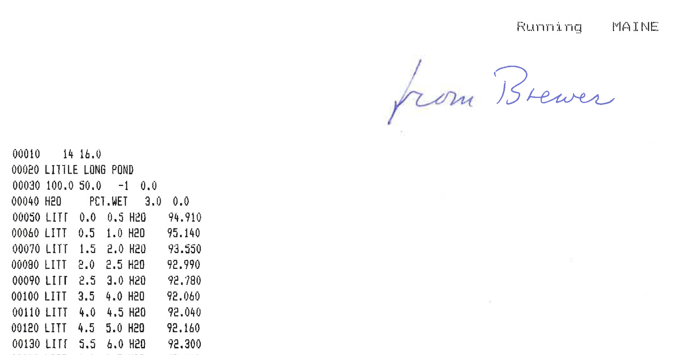

```{r, include=FALSE}
library(ggspatial)
library(tidyverse)
library(gganimate)
library(leaflet)
locs <- readxl::read_excel("dunnington_etal2020.xlsx", sheet = "locations")
data <- readxl::read_excel("dunnington_etal2020.xlsx", sheet = "data", guess_max = 10000)
knitr::opts_chunk$set(fig.path = "", echo = FALSE)
```

Today the pivotal and final chapter of my Ph.D. thesis was [published in Science of the Total Environment](https://doi.org/10.1016/j.scitotenv.2020.140212)! I've been excited about Pb deposition ever since my [honours thesis](http://scholar.acadiau.ca/islandora/object/theses:847), when I measured Pb (and other elements) in two lakes near the Nova Scotia-New Brunswick border. When I returned to Nova Scotia in 2015 for my M.Sc. at Acadia, I started collecting records of Pb deposition in  dated lake sediment cores from Nova Scotia (and a few from New Brunswick, although these didn't make it in to the publication). Through collaborations with [Ian Spooner](https://ees.acadiau.ca/Ian_Spooner.html), the [ECAB lab at Mt. Allison](https://www.ecablab.com/), [Halifax Water](https://www.halifaxwater.ca/), [NSERC](https://www.nserc-crsng.gc.ca/), [CBRM Water Utility](http://www.cbrm.ns.ca/water-utility), and the [Centre for Water Resources Studies](http://waterstudies.ca/), I managed to collect about a dozen cores from Nova Scotia that were reliably dated and from which we'd measured Pb.

As I was collecting these cores, I was also writing the literature review for my thesis proposal, and I noticed that [Stephen Norton](https://umaine.edu/earthclimate/people/stephen-norton/) at the University of Maine at Orono was the PI behind dozens of records from the Adirondacks, Vermont, New Hampshire, and Maine, most of which were collected as part of the [PIRLA project](https://doi.org/10.1007/BF00219458) to evaluate the acidification of lakes using paleolimnological methods. These records had been published a few times but had never been analyzed collectively. Steve is an impeccable scientist, writer, and archivist, and was able to dig up the raw data for dozens of records, including a few that had never made it to publication. All of them were printed out, which meant I had to digitize them (at final count I typed and verified over 25,000 numbers!).



Around this time, Sarah Roberts, Jane Kirk, and Derek Muir published an [excellent paper on Hg deposition in southwest Nova Scotia](https://doi.org/10.1016/j.scitotenv.2019.04.167) and were more than happy to donate their data and expertise to the cause. After quality-checking the records, we ended up with 47 lakes along a west-east transect that we could use to evaluate the distribution and transport of Pb over more than a thousand kilometers!

```{r}
locs_summary <- locs %>%
  arrange(lake_lon) %>% 
  transmute(
    Region = as_factor(region),
    Lake = short_name,
    Longitude = lake_lon,
    Latitude = lake_lat,
    `Lake area (ha)` = surface_area_ha,
    `Catchment area (ha)` = watershed_area_ha,
    `CA/LA` = catchment_surface_area_ratio,
    `z<sub>max</sub> (m)` = max_depth_m,
    `Elevation (m)` = elevation_m,
    `Annual precip (mm)` = annual_precip,
    `Climate station (distance)` = annual_precip_station,
    `Collection Date` = case_when(
      year_max %% 1 == 0 ~ as.character(round(year_max)),
      TRUE ~ strftime(
        lubridate::make_date(floor(year_max)) + 365 * (year_max - floor(year_max)),
        "%b %Y"
      )
    ),
    `Collection method` = case_when(
      region %in% c("ADIR", "VT-NH-ME") ~ "Piston core",
      TRUE ~ "Gravity core"
    )
  ) %>%
  mutate_at(vars(`Lake area (ha)`:`Elevation (m)`), map_chr, format, digits = 3)

# locs_summary %>% 
#   mutate_at(vars(-c(1:4)), as.character) %>% 
#   pivot_longer(-c(1:4)) %>% 
#   group_by(Region, Lake, Longitude, Latitude) %>% 
#   mutate(
#     blurb = paste0("<strong>", name, ":</strong> ", value, collapse = "<br/>")
#   ) %>% 
#   leaflet() %>% 
#   addTiles() %>% 
#   addMarkers(lng =  ~Longitude, lat = ~Latitude, label = ~Lake, popup = ~blurb, )

ggplot(locs_summary, aes(Longitude, Latitude, col = Region)) +
  annotation_map_tile(zoom = 6, progress = "none") +
  geom_spatial_point(crs = 4326) +
  scale_colour_brewer(type = "qual", palette = 2) +
  theme_void() +
  scale_y_continuous(expand = c(0.4,0))
```

With the data entered, we did some substantial number crunching to make sure that dates were assigned to all sediment intervals consistently using Monte Carlo error estimation with the [pb210 package for R](https://paleolimbot.github.io/pb210). This gave us Pb concentration profiles for all 47 lakes, the peak concentrations of which decreased from west to east.

```{r, eval=FALSE}
locs_plot <- locs %>% 
  arrange(lake_lon) %>% 
  mutate(
    label = as_factor(sprintf("%s (%s)", short_name, region)), 
    region_label = as_factor(region)
  )

anim <- data %>%
  filter(param == "Pb", !is.na(value)) %>% 
  mutate(depth = (depth_start + depth_end) / 2) %>%
  left_join(locs_plot, by  = "location") %>%
  ggplot(aes(x = value, y = depth)) +
  tidypaleo::geom_lineh() +
  scale_y_reverse() +
  # facet_wrap(vars(label)) +
  transition_states(label, transition_length = 0.25) +
  view_follow(fixed_x = TRUE) +
  labs(y = "Depth (cm)", x = "Total Pb (mg/kg)", title = "{closest_state}") +
  theme_bw()

animate(
  anim, 
  renderer = ffmpeg_renderer(format = "mp4"), 
  nframes = 500, fps = 10, 
  height = 400, width = 300, res = 96
)
anim_save("anim-pb-conc.mp4")
```

<video width="300" height="400" controls>
  <source src="anim-pb-conc.mp4" type="video/mp4">
  Your browser does not support the video tag.
</video> 

Concentrations are closest to what we actually measured, but many factors (e.g., sedimentation rate, focusing) affect their values. So we asked a slightly different question: *how much*, in total, (corrected for sediment focusing), was deposited at each lake, and are there any lake and/or catchment parameters that can explain this variability? To do this, we subtracted the "background" (median Pb concentration in intervals deposited prior to 1850) from each measurement and multiplied it by the mass of the sample to obtain the "anthropogenic" mass of Pb for each sample. Adding those masses up for samples deposited between 1850 and 1978 (the date of the earliest core in the study), and we obtained the cumulative anthropogenic deposition at each lake. Regressing this against the catchment parameters painted a clear picture: moving eastward, less and less Pb was deposited at each lake.

```{r, eval=FALSE}
anim <- locs %>% 
  arrange(lake_lon) %>% 
  mutate(region = as_factor(region)) %>% 
  select(
    region,
    location,
    starts_with("inventory_Pb"),
    `Longitude (degree)` = lake_lon,
    `Lake area (ha)` = surface_area_ha,
    `Catchment area (ha)` = watershed_area_ha,
    `CA/LA` = catchment_surface_area_ratio,
    `Max depth (m)` = max_depth_m,
    `Elevation (m)` = elevation_m,
    `Annual precipitation (mm)` = annual_precip
  ) %>% 
  pivot_longer(-c(region, location, starts_with("inventory"))) %>% 
  filter(!is.na(value)) %>% 
  ggplot(aes(value, inventory_Pb_mg_m2, col = region, group = location)) +
  geom_point() +
  # facet_wrap(vars(as_factor(name)), scales = "free") +
  transition_states(as_factor(name), transition_length = 0.25) +
  view_follow(fixed_y = TRUE) +
  scale_colour_brewer(type = "qual", palette = 2) +
  theme_bw() +
  labs(
    x = NULL, 
    y = expression(Cumulative~anthropogenic~Pb~(mg/m^2)),
    col = "Region",
    title = "{closest_state}"
  ) +
  theme(legend.position = "bottom")

animate(
  anim, 
  renderer = ffmpeg_renderer(format = "mp4"), 
  nframes = 300, fps = 10, 
  height = 400, width = 400, res = 96
)
anim_save("anim-pb-inventory.mp4")
```

<video width="400" height="400" controls>
  <source src="anim-pb-inventory.mp4" type="video/mp4">
  Your browser does not support the video tag.
</video> 

Finally, we evaluated the timing of Pb increase. This is particularly hard to do, since the accuracy of <sup>210</sup>Pb dating around the time this happened (late 1800s-early 1900s) is medium at best. We took the approach of (1) computing 1,000 equally plausible age-depth models based on <sup>210</sup>Pb error and (2) choosing a random age-depth model 1,000 times, do a breakpoint analysis on rescaled Pb concentrations between 1850 and 1978 for each region. We used the variability of the breakpoints to calculate the uncertainty of "when Pb concentrations started increasing" in each region. Basically, something like this (only showing 10 age-depth models here to demonstrate):

```{r eval = FALSE}
library(pb210)
cores <- locs
pb210_samples <- data %>%
  
  # generate a wide table with columns pb210, pb210_sd, ra226, ra226_sd, dry_density,
  # and is_background for every sample in every core.
  distinct(location, depth_start, depth_end) %>% 
  left_join(
    data %>% 
      filter(param == "pb210") %>% 
      select(location, depth_start, depth_end, pb210 = value, pb210_sd = error),
    by = c("location", "depth_start", "depth_end")
  ) %>% 
  left_join(
    data %>% 
      filter(param == "ra226") %>% 
      select(location, depth_start, depth_end, ra226 = value, ra226_sd = error),
    by = c("location", "depth_start", "depth_end")
  ) %>% 
  left_join(
    data %>% 
      filter(param == "dry_density") %>% 
      select(location, depth_start, depth_end, dry_density = value),
    by = c("location", "depth_start", "depth_end")
  ) %>% 
  left_join(
    data %>% 
      filter(param == "is_background") %>% 
      select(location, depth_start, depth_end, is_background = value),
    by = c("location", "depth_start", "depth_end")
  ) %>% 
  
  # for each core, calculate dry mass of each slice and cumulative dry mass
  # at midpoint
  arrange(location, depth_start) %>% 
  group_by(location) %>% 
  mutate(
    # depths are in cm
    dry_mass_slice_kg_m2 = dry_density * (depth_end - depth_start) / 100,
    cumulative_dry_mass_kg_m2 = pb210_cumulative_mass(dry_mass_slice_kg_m2, position = 0.5)
  ) %>% 
  ungroup()

pb210_cores <- pb210_samples %>% 
  group_by(location) %>%
  
  # calculate background and background error all possible ways
  summarise(
    has_ra226 = any(!is.na(ra226)),
    background_ra226 = mean(ra226, na.rm = TRUE),
    background_ra226_sd = sd(ra226, na.rm = TRUE),
    
    n_background = sum(!is.na(pb210) & is_background),
    background_values = paste(pb210[!is.na(pb210) & is_background], collapse = ","),
    
    # if there is more than one background value, use mean() and sd()
    # else, use value and sd
    has_more_than_one_background_pb210 = n_background > 1,
    background_pb210 = if_else(
      has_more_than_one_background_pb210,
      mean(pb210[!is.na(pb210) & is_background], na.rm = TRUE),
      first(pb210[!is.na(pb210) & is_background])
    ),
    background_pb210_sd = if_else(
      has_more_than_one_background_pb210,
      sd(pb210[!is.na(pb210) & is_background], na.rm = TRUE),
      first(pb210_sd[!is.na(pb210) & is_background])
    )
  ) %>% 
  ungroup() %>% 
  
  # prefer ra226, use pb210 as fallback
  mutate(
    background = coalesce(background_ra226, background_pb210),
    background_sd = coalesce(background_ra226_sd, background_pb210_sd)
  ) %>%
  
  # add random seed used in paper
  left_join(
    cores %>% select(location, crs_seed, year_max),
    by = "location"
  ) %>% 
  
  # put most useful columns first
  select(location, background, background_sd, crs_seed, year_max, everything())

compute_age_depth <- function(samples, background, background_sd, seed, n = 10) {
  withr::with_seed(seed, {
    pb210_crs_monte_carlo(
      samples$cumulative_dry_mass_kg_m2, 
      set_errors(samples$pb210, samples$pb210_sd), 
      set_errors(background, background_sd),
      inventory = pb210_inventory_calculator(
        model_bottom = ~pb210_fit_loglinear(
          ..1, ..2, 
          subset = ~finite_tail(..1, ..2, 4)
        )
      ),
      n = n
    )
  })
}

n_perms <- 10

pb210_fits <- pb210_samples %>% 
  select(location, depth_start, depth_end, cumulative_dry_mass_kg_m2, pb210, pb210_sd) %>%
  group_by(location) %>% 
  nest() %>% 
  ungroup() %>% 
  left_join(pb210_cores, by = "location") %>% 
  mutate(
    permutation = list(1:n_perms),
    fit = pmap(list(data, background, background_sd, crs_seed, n = n_perms), compute_age_depth),
    predicted = map(fit, predict)
  ) %>% 
  select(location, permutation, fit, predicted, everything())

pb210_permutations <- pb210_fits %>% 
  # unnest samples for each core
  select(location, permutation, data, predicted, year_max) %>% 
  
  unnest(c(data, predicted)) %>% 
  
  # unnest permutations for each age-depth model
  select(
    location, permutation, depth_start, depth_end, 
    cumulative_dry_mass_kg_m2, year_max,
    ends_with("values")
  ) %>% 
  unnest(c(permutation, ends_with("values"))) %>% 
  rename_all(str_remove, "_values") %>% 
  
  # compute year CE and sort
  mutate(year = year_max - age) %>% 
  arrange(location, permutation, depth_start) %>% 
  select(location, permutation, depth_start, depth_end, year, everything())

pb210_sample_results <- pb210_permutations %>% 
  group_by(location, depth_start, depth_end, cumulative_dry_mass_kg_m2) %>% 
  summarise_at(
    vars(year, age, mar, inventory, excess, activity),
    list(
      value = ~median(., na.rm = TRUE),
      min = ~quantile(., 0.05, na.rm = TRUE),
      max = ~quantile(., 0.95, na.rm = TRUE)
    )
  ) %>% 
  ungroup()

pb210_core_results_permutations <- pb210_permutations %>% 
  group_by(location, permutation) %>%
  summarise(
    # there are some age-depth model calculations that failed and have
    # no surface inventory...these are more correctly NA than -Inf
    surface_inventory = suppressWarnings(na_if(max(inventory, na.rm = TRUE), -Inf)),
    focusing_factor = surface_inventory / 4440.0
  ) %>% 
  ungroup()

pb210_core_results <- pb210_core_results_permutations %>% 
  group_by(location) %>% 
  summarise_at(
    vars(surface_inventory, focusing_factor),
    list(
      value = ~median(., na.rm = TRUE),
      min = ~quantile(., 0.05, na.rm = TRUE),
      max = ~quantile(., 0.95, na.rm = TRUE)
    )
  )

pb_samples <- pb210_samples %>% 
  select(location, depth_start, depth_end, cumulative_dry_mass_kg_m2, dry_mass_slice_kg_m2) %>% 
  left_join(
    data %>% 
      filter(param == "Pb") %>% 
      select(location, depth_start, depth_end, Pb = value),
    by = c("location", "depth_start", "depth_end")
  ) %>% 
  
  # need to interpolate Pb concentration for cumulative mass
  group_by(location) %>% 
  mutate(
    Pb_interp = approx(
      cumulative_dry_mass_kg_m2[!is.na(Pb)], 
      Pb[!is.na(Pb)], 
      xout = cumulative_dry_mass_kg_m2
    )$y
  ) %>% 
  fill(Pb_interp, .direction = "downup") %>% 
  ungroup()

pb_sample_results_permutations <- pb_samples %>% 
  select(location, depth_start, depth_end, Pb, Pb_interp, dry_mass_slice_kg_m2) %>% 
  left_join(
    pb210_permutations %>% select(location, depth_start, depth_end, permutation, year),
    by = c("location", "depth_start", "depth_end")
  ) %>% 
  group_by(location, permutation) %>% 
  mutate(
    Pb_background = coalesce(
      median(Pb_interp[year < 1850], na.rm = TRUE),
      # need a fallback for the few age depth models permutations where there are
      # no samples with a year prior to 1850
      min(Pb_interp, na.rm = TRUE)
    ),
    
    # these are the calculated values that depend on the background
    Pb_anthropogenic = Pb - Pb_background,
    Pb_interp_anthropogenic = Pb_interp - Pb_background,
    Pb_relative_anthropogenic = scales::rescale(
      Pb, 
      from = c(Pb_background[1], max(Pb, na.rm = TRUE)),
      to = c(0, 1)
    )
  ) %>% 
  ungroup() %>% 
  arrange(location, permutation, depth_start)

pb_core_results_permutations <- pb_sample_results_permutations %>% 
  # only use 1850-1978
  filter(year >= 1850, year <= 1978) %>%
  
  # calculate the mass of Pb in each slice
  mutate(
    # mg / kg * kg / m2 = mg / m2
    Pb_mass_mg_m2 = Pb_interp_anthropogenic * dry_mass_slice_kg_m2
  ) %>% 
  
  # calculate the total mass of Pb in each core, for each permutation
  group_by(location, permutation) %>% 
  summarise(
    Pb_inventory_raw_mg_m2 = sum(Pb_mass_mg_m2),
    Pb_background = unique(Pb_background)
  ) %>% 
  ungroup() %>% 
  
  # focus-correct inventory
  left_join(pb210_core_results_permutations, by = c("location", "permutation")) %>% 
  mutate(Pb_inventory_mg_m2 = Pb_inventory_raw_mg_m2 / focusing_factor)

pb_core_results <- pb_core_results_permutations %>% 
  group_by(location) %>% 
  summarise_at(
    vars(Pb_inventory_mg_m2, Pb_inventory_raw_mg_m2, Pb_background),
    list(
      value = ~median(., na.rm = TRUE),
      min = ~quantile(., 0.05, na.rm = TRUE),
      max = ~quantile(., 0.95, na.rm = TRUE)
    )
  )

do_breakpoint <- function(formula, data, psi = 1900, ...) {
  segmented::segmented(lm(formula, data = data), psi = 1900)
}

exclude_from_timing_component <- c(
  "CARR PD.", "MUD POND", "LITTLE LONG POND", "BEN15-2",
  "Cobri", "Hilch", "Big Dam"
)
```

```{r, eval = FALSE}
anim <- pb_sample_results_permutations %>%
  filter(!(location %in% exclude_from_timing_component)) %>% 
  left_join(locs_plot, by = "location") %>% 
  filter(year < 1978) %>% 
  ggplot(
    aes(
      year, 
      Pb_relative_anthropogenic, 
      col = region_label, 
      group = interaction(location, depth_start, drop = T)
    )
  ) +
  geom_point(na.rm = TRUE) +
  geom_smooth(aes(group = region_label), formula = y ~ x, method = do_breakpoint, se = FALSE, na.rm = TRUE) +
  scale_color_brewer(type = "qual", palette = 2, guide = FALSE) +
  facet_grid(rows = vars(region_label)) +
  transition_states(factor(permutation), transition_length = 0.25) +
  labs(y = "Relative anthropogenic Pb", x = "CRS Modelled Age (Year CE)") +
  coord_cartesian(xlim = c(1850, 1980), expand = FALSE) +
  theme_bw()

animate(
  anim, 
  renderer = ffmpeg_renderer(format = "mp4"), 
  nframes = 300, fps = 10, 
  height = 400, width = 400, res = 96
)
anim_save("anim-pb-timing.mp4")
```

<video width="400" height="400" controls>
  <source src="anim-pb-timing.mp4" type="video/mp4">
  Your browser does not support the video tag.
</video> 

While there is considerable uncertainty for the ADIR and VT-NH-ME regions, relative anthropogenic Pb increased later in the NS region in almost all of the simulations, and the median breakpoint age was 1917: very close to the introduction of Pb in gasoline (1923), suggesting that this source may have been the most important driver of Pb deposition in Nova Scotia. We didn't measure lead isotopes, which can help fingerprint sources of Pb, but others have done so and suggest that a mix of U.S. and Canadian sources contributed to Pb deposition from gasoline in Nova Scotia and elsewhere in Canada. If you are interested in more details and more implications, [read the article](https://doi.org/10.1016/j.scitotenv.2020.140212)!
