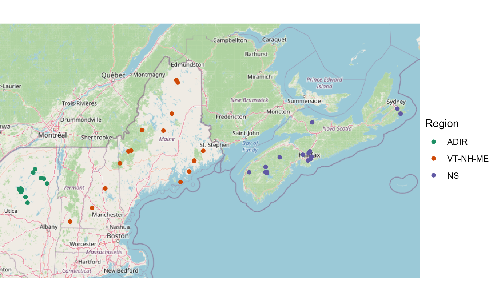

Today the pivotal and final chapter of my Ph.D. thesis was [published in Science of the Total Environment](https://doi.org/10.1016/j.scitotenv.2020.140212)! I've been excited about Pb deposition ever since my [honours thesis](http://scholar.acadiau.ca/islandora/object/theses:847), when I measured Pb (and other elements) in two lakes near the Nova Scotia-New Brunswick border. When I returned to Nova Scotia in 2015 for my M.Sc. at Acadia, I started collecting records of Pb deposition in dated lake sediment cores from Nova Scotia (and a few from New Brunswick, although these didn't make it in to the publication). Through collaborations with [Ian Spooner](https://ees.acadiau.ca/Ian_Spooner.html), the [ECAB lab at Mt. Allison](https://www.ecablab.com/), [Halifax Water](https://www.halifaxwater.ca/), [NSERC](https://www.nserc-crsng.gc.ca/), [CBRM Water Utility](http://www.cbrm.ns.ca/water-utility), and the [Centre for Water Resources Studies](http://waterstudies.ca/), I managed to collect about a dozen cores from Nova Scotia that were reliably dated and from which we'd measured Pb.

As I was collecting these cores, I was also writing the literature review for my thesis proposal, and I noticed that [Stephen Norton](https://umaine.edu/earthclimate/people/stephen-norton/) at the University of Maine at Orono was the PI behind dozens of records from the Adirondacks, Vermont, New Hampshire, and Maine, most of which were collected as part of the [PIRLA project](https://doi.org/10.1007/BF00219458) to evaluate the acidification of lakes using paleolimnological methods. These records had been published a few times but had never been analyzed collectively. Steve is an impeccable scientist, writer, and archivist, and was able to dig up the raw data for dozens of records, including a few that had never made it to publication. All of them were printed out, which meant I had to digitize them (at final count I typed and verified over 25,000 numbers!).

Around this time, Sarah Roberts, Jane Kirk, and Derek Muir published an [excellent paper on Hg deposition in southwest Nova Scotia](https://doi.org/10.1016/j.scitotenv.2019.04.167) and were more than happy to donate their data and expertise to the cause. After quality-checking the records, we ended up with 47 lakes along a west-east transect that we could use to evaluate the distribution and transport of Pb over more than a thousand kilometers!

With the data entered, we did some substantial number crunching to make sure that dates were assigned to all sediment intervals consistently using Monte Carlo error estimation with the [pb210 package for R](https://paleolimbot.github.io/pb210). This gave us Pb concentration profiles for all 47 lakes, the peak concentrations of which decreased from west to east.

<video width="300" height="400" controls>
<source src="anim-pb-conc.mp4" type="video/mp4">

Your browser does not support the video tag. </video>

Concentrations are closest to what we actually measured, but many factors (e.g., sedimentation rate, focusing) affect their values. So we asked a slightly different question: *how much*, in total, (corrected for sediment focusing), was deposited at each lake, and are there any lake and/or catchment parameters that can explain this variability? To do this, we subtracted the "background" (median Pb concentration in intervals deposited prior to 1850) from each measurement and multiplied it by the mass of the sample to obtain the "anthropogenic" mass of Pb for each sample. Adding those masses up for samples deposited between 1850 and 1978 (the date of the earliest core in the study), and we obtained the cumulative anthropogenic deposition at each lake. Regressing this against the catchment parameters painted a clear picture: moving eastward, less and less Pb was deposited at each lake.

<video width="400" height="400" controls>
<source src="anim-pb-inventory.mp4" type="video/mp4">

Your browser does not support the video tag. </video>

Finally, we evaluated the timing of Pb increase. This is particularly hard to do, since the accuracy of 210Pb dating around the time this happened (late 1800s-early 1900s) is medium at best. We took the approach of (1) computing 1,000 equally plausible age-depth models based on 210Pb error and (2) choosing a random age-depth model 1,000 times, do a breakpoint analysis on rescaled Pb concentrations between 1850 and 1978 for each region. We used the variability of the breakpoints to calculate the uncertainty of "when Pb concentrations started increasing" in each region. Basically, something like this (only showing 10 age-depth models here to demonstrate):

<video width="400" height="400" controls>
<source src="anim-pb-timing.mp4" type="video/mp4">

Your browser does not support the video tag. </video>

While there is considerable uncertainty for the ADIR and VT-NH-ME regions, relative anthropogenic Pb increased later in the NS region in almost all of the simulations, and the median breakpoint age was 1917: very close to the introduction of Pb in gasoline (1923), suggesting that this source may have been the most important driver of Pb deposition in Nova Scotia. We didn't measure lead isotopes, which can help fingerprint sources of Pb, but others have done so and suggest that a mix of U.S. and Canadian sources contributed to Pb deposition from gasoline in Nova Scotia and elsewhere in Canada. If you are interested in more details and more implications, [read the article](https://doi.org/10.1016/j.scitotenv.2020.140212)!

