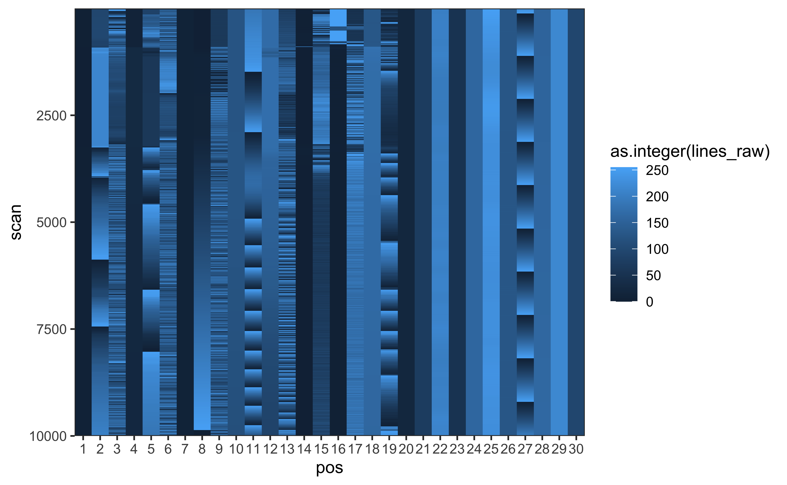
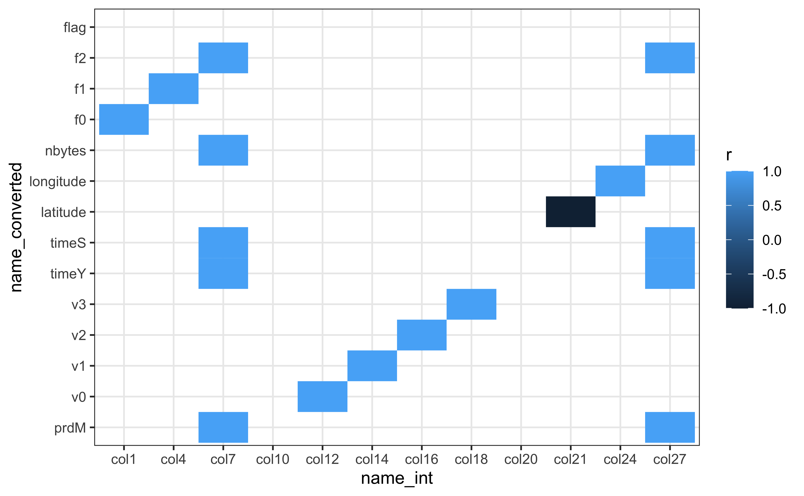

Avid readers of this blog, if there are any, would have figured out that I really love [low-level data IO](/post/2016/raspberry-pi-pure-python-infrared-remote-control) and [hacking proprietary file formats](post/2016/processing-sub-bottom-profiling-data-in-python) so that I can use the data in the open-source (mostly) software that I know and love. At my new position I was assigned to attend [Seabird University](https://www.seabird.com/training-videos), an excellent six-session training course on how to acquire and process oceanographic data using Seabird instruments and software. My brain went straight for one thing: can I do this in R?

The SeaSoft family of software for Seabird instruments is professionally built and uses high-quality published data proessing methods. SeaSoft only run on Windows, however, and many of these methods can also be applied using open-source oceanographic software such as the [oce package for R](https://dankelley.github.io/oce/). There is one step, however, whose low-level details are poorly documented: the converting of .hex files read from an instrument to .cnv files with human-readable outputs.

I'll use the data provided for the homework assignment ("cast1.hex") to take a stab at it along with the trusty [tidyverse](https://tidyverse.org) family of R packages.

<pre class='chroma'><code class='language-r' data-lang='r'><a href='https://rdrr.io/r/base/library.html'>library</a>(<a href='http://tidyverse.tidyverse.org'>tidyverse</a>)
read_lines("cast1.hex")[1:20]
#&gt;  [1] "* Sea-Bird SBE 19plus V2 Data File:"                         
#&gt;  [2] "* FileName = Cast1.hex"                                      
#&gt;  [3] "* Software Version Seasave V 7.26.7.121"                     
#&gt;  [4] "* Temperature SN = 0001"                                     
#&gt;  [5] "* Conductivity SN = 0001"                                    
#&gt;  [6] "* Append System Time to Every Scan"                          
#&gt;  [7] "* System UpLoad Time = Jun 04 2020 06:51:13"                 
#&gt;  [8] "* NMEA Latitude = 66 37.82718 S"                             
#&gt;  [9] "* NMEA Longitude = 063 19.93296 E"                           
#&gt; [10] "* NMEA UTC (Time) = Jun 04 2020 06:50:05"                    
#&gt; [11] "* Store Lat/Lon Data = Append to Every Scan"                 
#&gt; [12] "** Ship: SBS University"                                     
#&gt; [13] "** Station: Unit 1"                                          
#&gt; [14] "** Operator: Somebody"                                       
#&gt; [15] "* Real-Time Sample Interval = 0.2500 seconds"                
#&gt; [16] "* System UTC = Jun 04 2020 06:51:13"                         
#&gt; [17] "*END*"                                                       
#&gt; [18] "045ECA0B581F0803427BBDA9430501FF2C813F1448CC339FFE80E199D85E"
#&gt; [19] "045ECA0B581D0803427BBCA94E0502FF2B813B1448CC339FFE80E199D85E"
#&gt; [20] "045ECA0B58190803417BBDA94A0509FF2E81371448CC339FFE81E199D85E"</code></pre>

The first things to notice are (1) this is a text file, (2) there's some header information that might be useful, and (3) the rest of the file is made up of lines exactly 60 characters long. As the file extension indicates, these are hexadecimal representations of bytes sent by the unit. R has a vector type for bytes ([`raw()`](https://rdrr.io/r/base/raw.html)), so a good first step might be to parse the file into an object that looks like [`list(raw(), raw(), raw(), ...)`](https://rdrr.io/r/base/list.html) so that we can inspect the values for what they are (strings of bytes). There are more efficient hex parsers out there, but for now we just need something that works:

<pre class='chroma'><code class='language-r' data-lang='r'>line_to_raw &lt;- function(line) {
  line_raw &lt;- str_sub(
    line,
    <a href='https://rdrr.io/r/base/seq.html'>seq</a>(1, <a href='https://rdrr.io/r/base/nchar.html'>nchar</a>(line) - 1, 2),
    <a href='https://rdrr.io/r/base/seq.html'>seq</a>(2, <a href='https://rdrr.io/r/base/nchar.html'>nchar</a>(line), 2)
  )
  <a href='https://rdrr.io/r/base/raw.html'>as.raw</a>(<a href='https://rdrr.io/r/base/paste.html'>paste0</a>("0x", line_raw))
}

lines_hex &lt;- read_lines("cast1.hex", skip = 17)
lines_raw &lt;- map(lines_hex, line_to_raw)

<a href='https://rdrr.io/r/utils/head.html'>head</a>(lines_raw, 3)
#&gt; [[1]]
#&gt;  [1] 04 5e ca 0b 58 1f 08 03 42 7b bd a9 43 05 01 ff 2c 81 3f 14 48 cc 33 9f fe
#&gt; [26] 80 e1 99 d8 5e
#&gt; 
#&gt; [[2]]
#&gt;  [1] 04 5e ca 0b 58 1d 08 03 42 7b bc a9 4e 05 02 ff 2b 81 3b 14 48 cc 33 9f fe
#&gt; [26] 80 e1 99 d8 5e
#&gt; 
#&gt; [[3]]
#&gt;  [1] 04 5e ca 0b 58 19 08 03 41 7b bd a9 4a 05 09 ff 2e 81 37 14 48 cc 33 9f fe
#&gt; [26] 81 e1 99 d8 5e</code></pre>

The second thing I noticed was that some of the bytes stay the same for every scan. This isn't limited to just one value, but shows up many times over the course of the file. To find out how prevalent this was, I did what everybody should do with raw data the first time they open it: plot! For strings of bytes this is a bit non-standard, but after reading David Robinson's [excelent post about plotting the structure of the Enron Excel attachments](https://rpubs.com/dgrtwo/tidying-enron), I decided on a similar approach.

<pre class='chroma'><code class='language-r' data-lang='r'>lines_tbl &lt;- tibble(
  lines_hex = lines_hex,
  lines_raw = lines_raw,
  scan = <a href='https://rdrr.io/r/base/seq.html'>seq_along</a>(lines_raw),
  pos = <a href='https://rdrr.io/r/base/lapply.html'>lapply</a>(lines_raw, seq_along)
)

lines_tbl %&gt;%
  select(scan, pos, lines_raw) %&gt;% 
  unnest(<a href='https://rdrr.io/r/base/c.html'>c</a>(lines_raw, pos)) %&gt;%
  ggplot(aes(x = pos, y = scan, fill = <a href='https://rdrr.io/r/base/integer.html'>as.integer</a>(lines_raw))) +
  geom_raster() +
  scale_y_reverse() +
  scale_x_continuous(breaks = 1:30) +
  coord_cartesian(expand = FALSE)
</code></pre>

It looks like there are many columns of bytes in this category (changing infrequently), but others change rapidly.

At this point, we need some information about what's in the file. This is a cast of a sensor array that was lowered into the ocean, probably soaked at the surface for some amount of time, and was then lowered and possibly retrieved at some point. The point is, the values represented by scans next to each other are probably representative of similar if not identical values (seawater properties are unlikely to change that quickly). Another thing we know is that the values that are output here are uncalibrated measurements. That is, they don't represent temperature or conductivity, they represent the voltages and/or frequencies measured by the sensor.

From hacking previous file formats, I already guessed that each line was probably a bunch of unsigned integers glued together somehow. When searching the hex file format, I came across [this Matlab script](http://mooring.ucsd.edu/software/matlab/doc/toolbox/data/sbe/read_hex.html) which gave some clues as to how these fields are represented on a different Seabird sensor. Basically, it looks like each collection of 2, 3, or 4 bytes is representing an unsigned integer that is then multiplied by some number to get the voltage.

Putting both of these together, we can figure out where the groups of bytes are: as integer values change slowly, the most significant digit is likely to change the slowest, whereas the least significant digit (the ones place) is likely to change the fastest:

(animation)

Guessing the most significant digit of everything up to byte position 19 is reasonably straightforward: there is clearly a most and least significant pattern of change in the columns. After that I did some guessing: byte 20 has the same value (14) for almost every scan, and the last four positions seemed to represent something whose least significant byte was on the left (i.e., little endian rather than big endian). In the middle were six columns that didn't change much at all. Six bytes can represent a really really big integer which seemed unlikely when so much effort appears to be made to minimize the number of bytes in the scan, so I split it into two and assumed big endian (I have the benefit of hindsight here...in practice I experimented with a few combinations).

<pre class='chroma'><code class='language-r' data-lang='r'>cols &lt;- tibble(
  start = <a href='https://rdrr.io/r/base/c.html'>c</a>(1, 4, 7, 10, 12, 14, 16, 18, 20, 21, 24, 27),
  size = <a href='https://rdrr.io/r/base/diff.html'>diff</a>(<a href='https://rdrr.io/r/base/c.html'>c</a>(start, 31)),
  big_endian = <a href='https://rdrr.io/r/base/c.html'>c</a>(<a href='https://rdrr.io/r/base/rep.html'>rep</a>(TRUE, 11), FALSE),
  name = <a href='https://rdrr.io/r/base/paste.html'>paste0</a>("col", start)
)

cols
#&gt; # A tibble: 12 x 4
#&gt;    start  size big_endian name 
#&gt;    &lt;dbl&gt; &lt;dbl&gt; &lt;lgl&gt;      &lt;chr&gt;
#&gt;  1     1     3 TRUE       col1 
#&gt;  2     4     3 TRUE       col4 
#&gt;  3     7     3 TRUE       col7 
#&gt;  4    10     2 TRUE       col10
#&gt;  5    12     2 TRUE       col12
#&gt;  6    14     2 TRUE       col14
#&gt;  7    16     2 TRUE       col16
#&gt;  8    18     2 TRUE       col18
#&gt;  9    20     1 TRUE       col20
#&gt; 10    21     3 TRUE       col21
#&gt; 11    24     3 TRUE       col24
#&gt; 12    27     4 FALSE      col27</code></pre>

Now the problem of how to make these integers that we can work with! Again, there are faster solutions, but for now we just need something that works. The key hurdle here is that pretty much nothing can read a 3-byte long integer, so we have to pad it with a fourth byte on the right or left depending on which endian we're dealing with. I chose to use base R's [`readBin()`](https://rdrr.io/r/base/readBin.html) here with a [`rawConnection()`](https://rdrr.io/r/base/rawConnection.html) rather than drop into compiled code just yet. Note also `scale` and `offset` as a foreshadowing of transformations to come.

<pre class='chroma'><code class='language-r' data-lang='r'>extract_raw_uint &lt;- function(x, start, size, big_endian, scale = 1, offset = 0, ...) {
  x &lt;- x[start:(start + size - 1)]
  
  # need to pad size 3 bytes to 4 for R to read
  if (size == 3 &amp;&amp; big_endian) {
    x &lt;- <a href='https://rdrr.io/r/base/c.html'>c</a>(<a href='https://rdrr.io/r/base/raw.html'>as.raw</a>(0x00), x)
    size &lt;- 4
  } else if (size == 3 &amp;&amp; !big_endian) {
    x &lt;- <a href='https://rdrr.io/r/base/c.html'>c</a>(x, <a href='https://rdrr.io/r/base/raw.html'>as.raw</a>(0x00))
    size &lt;- 4
  }
  
  con &lt;- <a href='https://rdrr.io/r/base/rawConnection.html'>rawConnection</a>(x)
  <a href='https://rdrr.io/r/base/on.exit.html'>on.exit</a>(<a href='https://rdrr.io/r/base/connections.html'>close</a>(con))
  # R can't read a four-byte unsigned integer...approximate with signed for now
  value &lt;- <a href='https://rdrr.io/r/base/readBin.html'>readBin</a>(
    con, 
    "integer", n = 1,
    size = size, 
    endian = if (big_endian) "big" else "little", 
    signed = size &gt;= 4
  )
  value / scale + offset
}</code></pre>

I strategically named the columns of `cols` and arguments of `extract_raw_uint()` the same so that we can use `pmap()` to iterate over and extract the integer values. The syntax is a little awkward here...below is as clean as I could get this.

<pre class='chroma'><code class='language-r' data-lang='r'>extract_raw_uint_tbl &lt;- function(x, cols) {
  values &lt;- pmap(cols, extract_raw_uint, x = x)
  <a href='https://rdrr.io/r/base/names.html'>names</a>(values) &lt;- cols$name
  as_tibble(values)
}

values_int &lt;- lines_tbl %&gt;%
  select(scan, lines_raw) %&gt;% 
  unnest(lines_raw) %&gt;% 
  group_by(scan) %&gt;% 
  summarise(extract_raw_uint_tbl(lines_raw, cols = cols))
#&gt; `summarise()` ungrouping output (override with `.groups` argument)

values_int
#&gt; # A tibble: 10,000 x 13
#&gt;     scan   col1   col4   col7 col10 col12 col14 col16 col18 col20  col21  col24
#&gt;    &lt;int&gt;  &lt;dbl&gt;  &lt;dbl&gt;  &lt;dbl&gt; &lt;dbl&gt; &lt;dbl&gt; &lt;dbl&gt; &lt;dbl&gt; &lt;dbl&gt; &lt;dbl&gt;  &lt;dbl&gt;  &lt;dbl&gt;
#&gt;  1     1 286410 743455 525122 31677 43331  1281 65324 33087    20 4.77e6 1.05e7
#&gt;  2     2 286410 743453 525122 31676 43342  1282 65323 33083    20 4.77e6 1.05e7
#&gt;  3     3 286410 743449 525121 31677 43338  1289 65326 33079    20 4.77e6 1.05e7
#&gt;  4     4 286413 743451 525121 31676 43336  1283 65323 33085    20 4.77e6 1.05e7
#&gt;  5     5 286413 743443 525121 31676 43347  1300 65330 33082    20 4.77e6 1.05e7
#&gt;  6     6 286413 743412 525120 31676 43337  1299 65324 33087    20 4.77e6 1.05e7
#&gt;  7     7 286415 743365 525120 31676 43342  1299 65322 33083    20 4.77e6 1.05e7
#&gt;  8     8 286416 743320 525120 31677 43342  1298 65327 33078    20 4.77e6 1.05e7
#&gt;  9     9 286416 743240 525122 31676 43339  1259 65331 33071    20 4.77e6 1.05e7
#&gt; 10    10 286416 743169 525123 31675 43339  1262 65324 33082    20 4.77e6 1.05e7
#&gt; # … with 9,990 more rows, and 1 more variable: col27 &lt;dbl&gt;</code></pre>

Cool! We indeed have a data frame of values that don't change very much between scans, which was what we optimized for when picking the byte positions. I've been a bit cagey about what we know about the file so far - in this case we do have some information about which values should be present. Usually you will have a .xmlcon file with this information or a .cnv file that contains some output that might give you a clue. In my case, I had the .xmlcon file and access to a Windows computer, so I ran "Data conversion" extracting the voltage and frequency channels as well as the latitude, longitude, and time variables since the .xmlcon file indicated that these variables were present for each scan.

<pre class='chroma'><code class='language-r' data-lang='r'>converted &lt;- read_fwf(
  "cast1.cnv",
  col_positions = fwf_widths(
    widths = <a href='https://rdrr.io/r/base/rep.html'>rep</a>(11, 15), 
    col_names = <a href='https://rdrr.io/r/base/c.html'>c</a>(
      "prdM", "v0", "v1", "v2", "v3", "timeY", "timeS", "scan", "latitude", 
      "longitude", "nbytes", "f0", "f1", "f2", "flag"
    )
  ),
  col_types = cols(.default = col_double()),
  skip = 189
)

converted
#&gt; # A tibble: 10,000 x 15
#&gt;     prdM    v0     v1    v2    v3  timeY timeS  scan latitude longitude nbytes
#&gt;    &lt;dbl&gt; &lt;dbl&gt;  &lt;dbl&gt; &lt;dbl&gt; &lt;dbl&gt;  &lt;dbl&gt; &lt;dbl&gt; &lt;dbl&gt;    &lt;dbl&gt;     &lt;dbl&gt;  &lt;dbl&gt;
#&gt;  1 0.85   3.31 0.0977  4.98  2.52 1.59e9  0        1    -26.6      67.7     60
#&gt;  2 0.85   3.31 0.0978  4.98  2.52 1.59e9  0.25     2    -26.6      67.7    120
#&gt;  3 0.829  3.31 0.0983  4.98  2.52 1.59e9  0.5      3    -26.6      67.7    180
#&gt;  4 0.828  3.31 0.0979  4.98  2.52 1.59e9  0.75     4    -26.6      67.7    240
#&gt;  5 0.828  3.31 0.0992  4.98  2.52 1.59e9  1        5    -26.6      67.7    300
#&gt;  6 0.807  3.31 0.0991  4.98  2.52 1.59e9  1.25     6    -26.6      67.7    360
#&gt;  7 0.807  3.31 0.0991  4.98  2.52 1.59e9  1.5      7    -26.6      67.7    420
#&gt;  8 0.807  3.31 0.099   4.98  2.52 1.59e9  1.75     8    -26.6      67.7    480
#&gt;  9 0.85   3.31 0.0961  4.98  2.52 1.59e9  2        9    -26.6      67.7    540
#&gt; 10 0.871  3.31 0.0963  4.98  2.52 1.59e9  2.25    10    -26.6      67.7    600
#&gt; # … with 9,990 more rows, and 4 more variables: f0 &lt;dbl&gt;, f1 &lt;dbl&gt;, f2 &lt;dbl&gt;,
#&gt; #   flag &lt;dbl&gt;</code></pre>

With the "answers", we can compare with our integer values to see which integers extracted from the scan correspond to values generated by SeaSoft. I'm using Spearman's here because whatever the calibration functions are, they have to be one-to-one relationships along the reported range of values. This let us figure out the relationships without knowing anything about the calibration functions themselves!

<pre class='chroma'><code class='language-r' data-lang='r'>combinations &lt;- inner_join(
  values_int %&gt;% pivot_longer(-scan),
  converted %&gt;% pivot_longer(-scan),
  by = "scan",
  suffix = <a href='https://rdrr.io/r/base/c.html'>c</a>("_int", "_converted")
) %&gt;% 
  mutate(
    name_int = as_factor(name_int), 
    name_converted = as_factor(name_converted)
  )

combinations_perfect &lt;- combinations %&gt;% 
  group_by(name_int, name_converted) %&gt;% 
  summarise(r = <a href='https://rdrr.io/r/stats/cor.html'>cor</a>(value_int, value_converted, method = "spearman")) %&gt;% 
  <a href='https://rdrr.io/r/stats/filter.html'>filter</a>(<a href='https://rdrr.io/r/base/MathFun.html'>abs</a>(r) &gt; 0.996)

combinations_perfect %&gt;% 
  ggplot(aes(name_int, name_converted, fill = r)) +
  geom_tile() +
  scale_y_discrete(drop = FALSE) +
  scale_x_discrete(drop = FALSE)
</code></pre>

Using this, we have a match for most of the columns and integer values with the exception of the column at byte position 10. At byte position 20, this is a value that never changes and likely corresponds to flag, which also never changes (there are no scans flagged as bad in the subset we're looking at). Column 27 looks like it has a few matches but this is because `timeY`, `timeS` and `nbytes` are also correlated (bytes because the instrument was writing at at a constant baud rate over a serial port). This plot also gives us the relationships between the raw frequency/voltage channels and the parameters themselves, which we can use to apply the calibration functions later on!

We're almost done hacking the binary part of the format. What remains is to figure out which `scale` and `offset` to apply to each integer value to generate the frequency and/or voltage associated with each integer value. The [Matlab script](http://mooring.ucsd.edu/software/matlab/doc/toolbox/data/sbe/read_hex.html) mentioned above was really useful as well...the values "13.107" and "256" come up a lot in that script and do here as well. I print out the scale and its inverse here because the inverse is usually a prettier number (this is how I parameterized the integer read function).

<pre class='chroma'><code class='language-r' data-lang='r'>combinations_perfect %&gt;% 
  left_join(combinations, by = <a href='https://rdrr.io/r/base/c.html'>c</a>("name_int", "name_converted")) %&gt;% 
  group_by(name_int, name_converted) %&gt;%
  summarise(
    broom::<a href='https://rdrr.io/pkg/generics/man/tidy.html'>tidy</a>(<a href='https://rdrr.io/r/stats/lm.html'>lm</a>(value_converted ~ value_int))
  ) %&gt;% 
  select(name_int, name_converted, term, estimate) %&gt;% 
  pivot_wider(names_from = term, values_from = estimate) %&gt;% 
  mutate(inverse_scale = 1 / value_int) %&gt;% 
  mutate_all(~map_chr(., format))
#&gt; # A tibble: 18 x 5
#&gt; # Groups:   name_int, name_converted [18]
#&gt;    name_int name_converted `(Intercept)` value_int    inverse_scale
#&gt;    &lt;fct&gt;    &lt;fct&gt;          &lt;chr&gt;         &lt;chr&gt;        &lt;chr&gt;        
#&gt;  1 col1     f0             1.266599e-09  1            1            
#&gt;  2 col4     f1             -8.817092e-06 0.00390625   256          
#&gt;  3 col7     prdM           -11191.77     0.02131351   46.9186      
#&gt;  4 col7     timeY          1591236507    0.03319315   30.12669     
#&gt;  5 col7     timeS          -16760.23     0.03277659   30.50958     
#&gt;  6 col7     nbytes         -4022396      7.866382     0.1271232    
#&gt;  7 col7     f2             -3.20375e-09  1            1            
#&gt;  8 col12    v0             3.946036e-06  7.6295e-05   13107.02     
#&gt;  9 col14    v1             3.828182e-06  7.629482e-05 13107.05     
#&gt; 10 col16    v2             -1.737767e-06 7.62951e-05  13107        
#&gt; 11 col18    v3             -6.53366e-06  7.629525e-05 13106.98     
#&gt; 12 col21    latitude       -26.2144      -7.8125e-08  -12800000    
#&gt; 13 col24    longitude      66.84671      7.812493e-08 12800011     
#&gt; 14 col27    prdM           -975886284    0.6132813    1.630573     
#&gt; 15 col27    timeY          -1.617432e-05 1            1            
#&gt; 16 col27    timeS          -1570569041   0.9870012    1.01317      
#&gt; 17 col27    nbytes         -376936569722 236.8803     0.004221542  
#&gt; 18 col27    f2             -45792152310  28.77773     0.03474909</code></pre>

Usefully, there are a number of places where the scale is 1 (meaning that the integer values don't have to be transformed into frequencies or voltages). I'm dubious of the latitude/longitude regression because the spread of the values is so small, and I can't find any meaning in the numbers -26.2144 or 66.84671. Coming back to our `cols` specification, we can add in what we've figured out about the scale and offset for these columns.

<pre class='chroma'><code class='language-r' data-lang='r'>cols_final &lt;- tibble(
  start = <a href='https://rdrr.io/r/base/c.html'>c</a>(1, 4, 7, 10, 12, 14, 16, 18, 20, 21, 24, 27),
  size = <a href='https://rdrr.io/r/base/diff.html'>diff</a>(<a href='https://rdrr.io/r/base/c.html'>c</a>(start, 31)),
  big_endian = <a href='https://rdrr.io/r/base/c.html'>c</a>(<a href='https://rdrr.io/r/base/rep.html'>rep</a>(TRUE, 11), FALSE),
  name = <a href='https://rdrr.io/r/base/c.html'>c</a>("f0", "f1", "f2", "ukn", "v0", "v1", "v2", "v3", "flag", "latitude", "longitude", "timeY"),
  scale = <a href='https://rdrr.io/r/base/c.html'>c</a>( 1,  256,    1,     1, <a href='https://rdrr.io/r/base/rep.html'>rep</a>(13107, 4),               1,  -12800000,    12800000,       1),
  offset = <a href='https://rdrr.io/r/base/c.html'>c</a>(0,    0,    0,     0, <a href='https://rdrr.io/r/base/rep.html'>rep</a>(0, 4),                   0,   -26.2144,    66.84671,       0)
)

values &lt;- lines_tbl %&gt;%
  select(scan, lines_raw) %&gt;% 
  unnest(lines_raw) %&gt;% 
  group_by(scan) %&gt;% 
  summarise(extract_raw_uint_tbl(lines_raw, cols = cols_final))

values
#&gt; # A tibble: 10,000 x 13
#&gt;     scan     f0    f1     f2   ukn    v0     v1    v2    v3  flag latitude
#&gt;    &lt;int&gt;  &lt;dbl&gt; &lt;dbl&gt;  &lt;dbl&gt; &lt;dbl&gt; &lt;dbl&gt;  &lt;dbl&gt; &lt;dbl&gt; &lt;dbl&gt; &lt;dbl&gt;    &lt;dbl&gt;
#&gt;  1     1 286410 2904. 525122 31677  3.31 0.0977  4.98  2.52    20    -26.6
#&gt;  2     2 286410 2904. 525122 31676  3.31 0.0978  4.98  2.52    20    -26.6
#&gt;  3     3 286410 2904. 525121 31677  3.31 0.0983  4.98  2.52    20    -26.6
#&gt;  4     4 286413 2904. 525121 31676  3.31 0.0979  4.98  2.52    20    -26.6
#&gt;  5     5 286413 2904. 525121 31676  3.31 0.0992  4.98  2.52    20    -26.6
#&gt;  6     6 286413 2904. 525120 31676  3.31 0.0991  4.98  2.52    20    -26.6
#&gt;  7     7 286415 2904. 525120 31676  3.31 0.0991  4.98  2.52    20    -26.6
#&gt;  8     8 286416 2904. 525120 31677  3.31 0.0990  4.98  2.52    20    -26.6
#&gt;  9     9 286416 2903. 525122 31676  3.31 0.0961  4.98  2.52    20    -26.6
#&gt; 10    10 286416 2903. 525123 31675  3.31 0.0963  4.98  2.52    20    -26.6
#&gt; # … with 9,990 more rows, and 2 more variables: longitude &lt;dbl&gt;, timeY &lt;dbl&gt;</code></pre>

Compare with converted values:

<pre class='chroma'><code class='language-r' data-lang='r'>converted %&gt;% 
  select(any_of(<a href='https://rdrr.io/r/base/colnames.html'>colnames</a>(values)))
#&gt; # A tibble: 10,000 x 12
#&gt;     scan     f0    f1     f2    v0     v1    v2    v3  flag latitude longitude
#&gt;    &lt;dbl&gt;  &lt;dbl&gt; &lt;dbl&gt;  &lt;dbl&gt; &lt;dbl&gt;  &lt;dbl&gt; &lt;dbl&gt; &lt;dbl&gt; &lt;dbl&gt;    &lt;dbl&gt;     &lt;dbl&gt;
#&gt;  1     1 286410 2904. 525122  3.31 0.0977  4.98  2.52     0    -26.6      67.7
#&gt;  2     2 286410 2904. 525122  3.31 0.0978  4.98  2.52     0    -26.6      67.7
#&gt;  3     3 286410 2904. 525121  3.31 0.0983  4.98  2.52     0    -26.6      67.7
#&gt;  4     4 286413 2904. 525121  3.31 0.0979  4.98  2.52     0    -26.6      67.7
#&gt;  5     5 286413 2904. 525121  3.31 0.0992  4.98  2.52     0    -26.6      67.7
#&gt;  6     6 286413 2904. 525120  3.31 0.0991  4.98  2.52     0    -26.6      67.7
#&gt;  7     7 286415 2904. 525120  3.31 0.0991  4.98  2.52     0    -26.6      67.7
#&gt;  8     8 286416 2904. 525120  3.31 0.099   4.98  2.52     0    -26.6      67.7
#&gt;  9     9 286416 2903. 525122  3.31 0.0961  4.98  2.52     0    -26.6      67.7
#&gt; 10    10 286416 2903. 525123  3.31 0.0963  4.98  2.52     0    -26.6      67.7
#&gt; # … with 9,990 more rows, and 1 more variable: timeY &lt;dbl&gt;</code></pre>

Perhaps in a future post I'll be able to cover (1) making it pretty and (2) making it fast!

