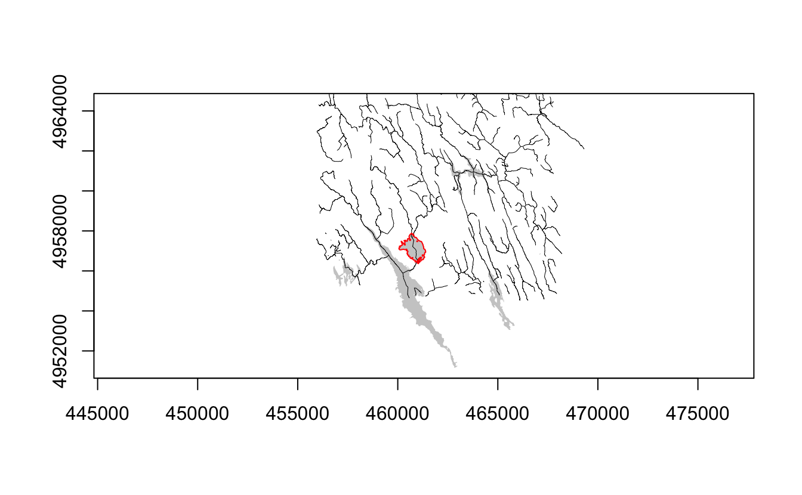
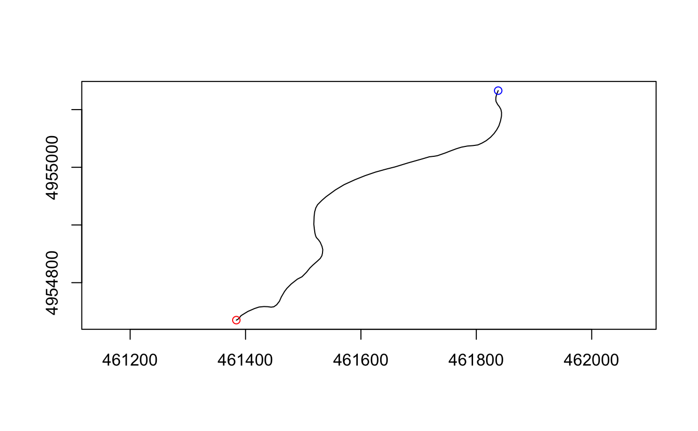
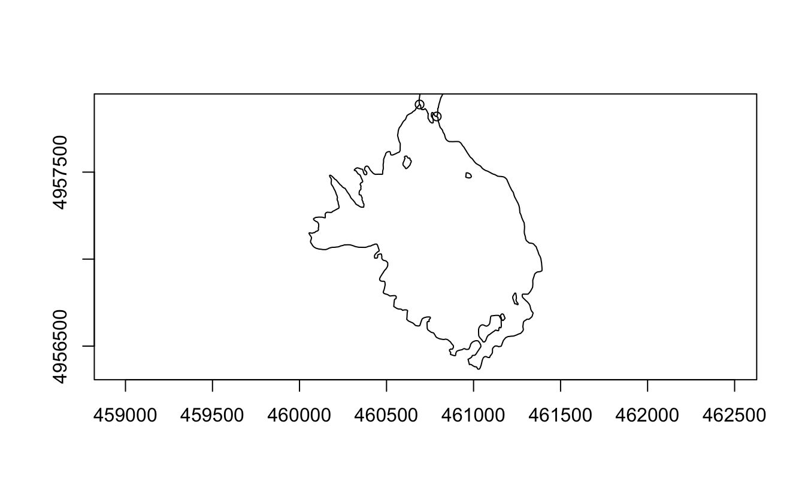
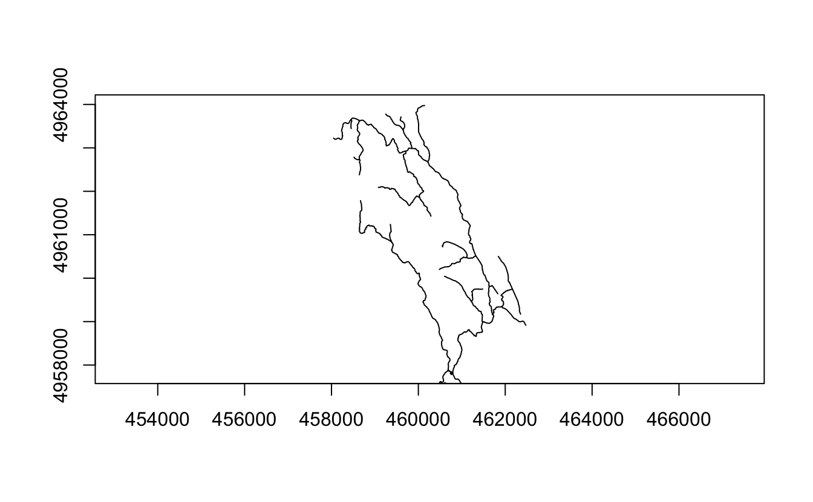
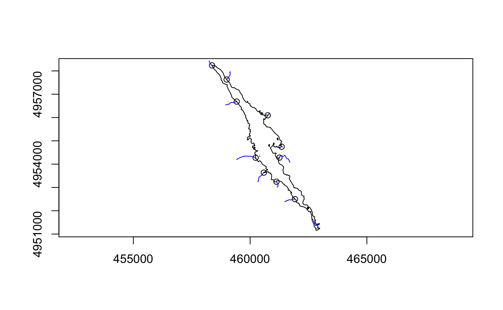
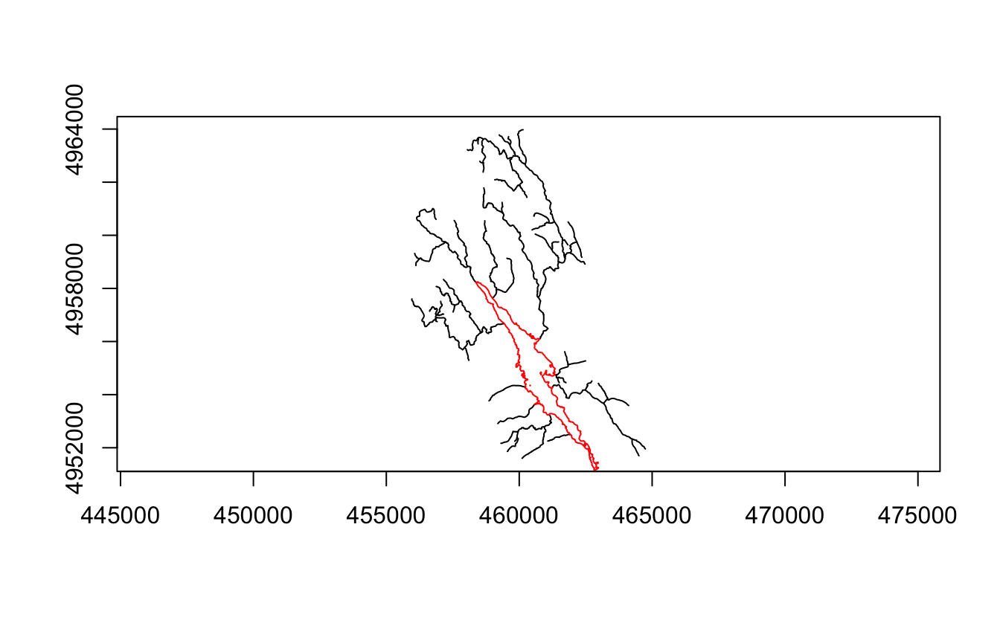
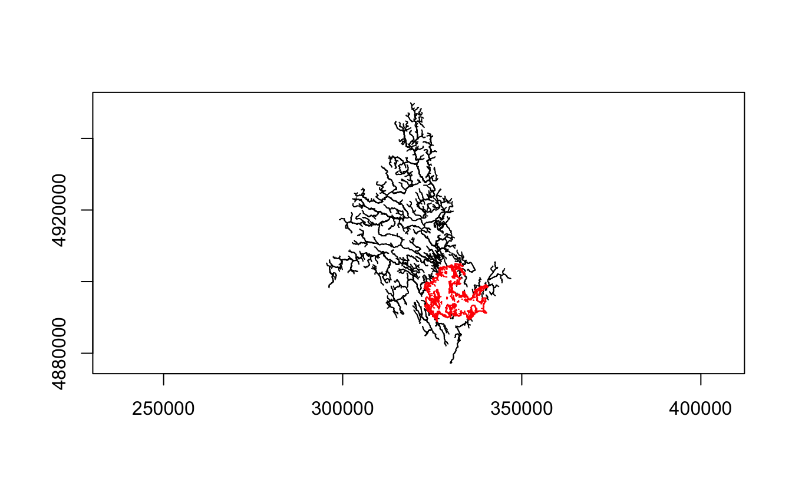
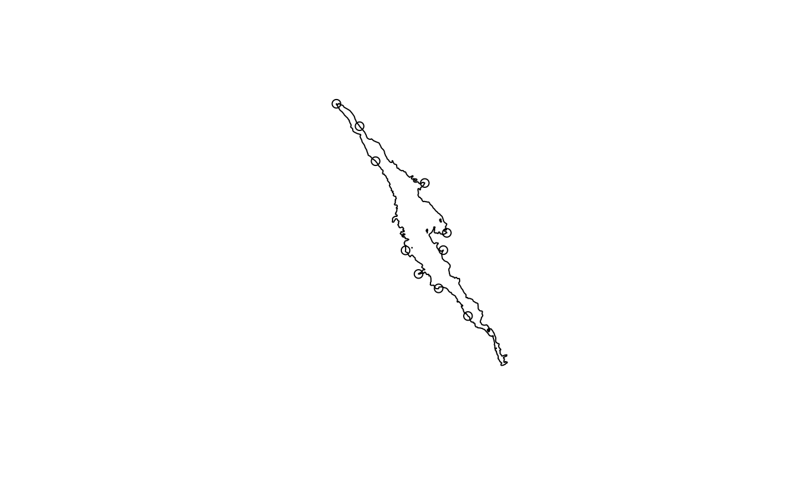
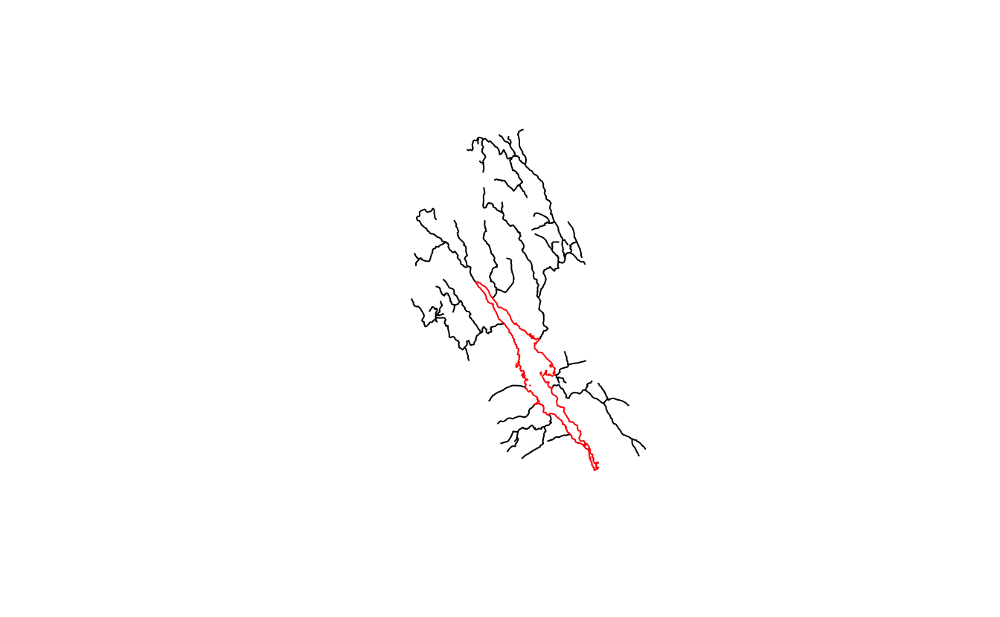
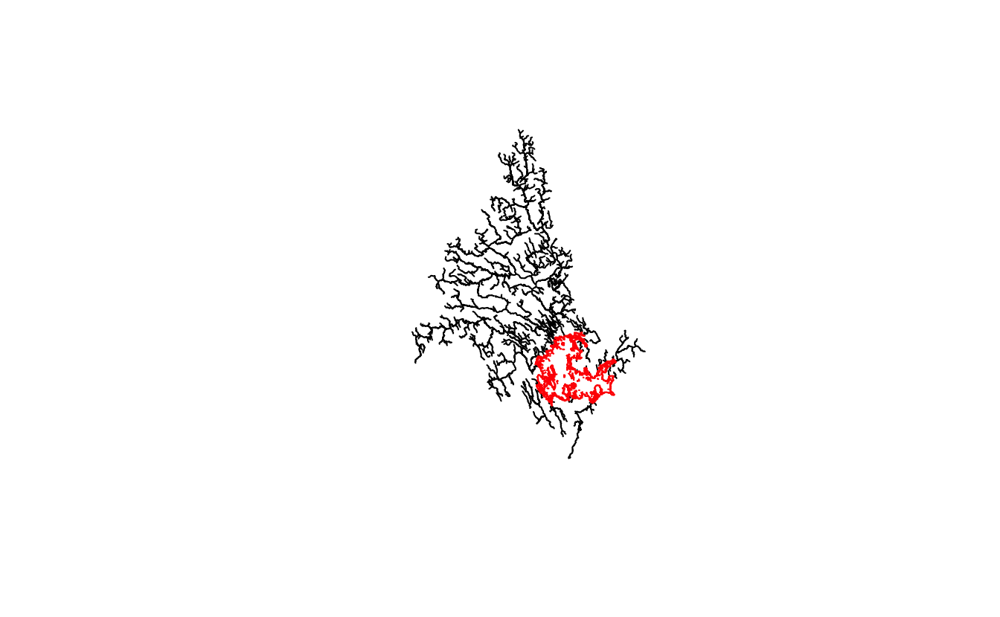

Almost exactly a year ago I wrote a [post on using R and sf to work with stream networks](/post/2020/stream-networks-using-r-and-sf/). The post was about low-level analysis with the [Nova Scotia stream network](https://nsgi.novascotia.ca/gdd/) to find upstream networks of various lakes so that I could approximate the catchments without a province-wide DEM analysis.

If you read the post, you'll realize that it's not just you, it's a tiny bit awkward to work with some of these low-level details. I wrote that post early pandemic and spent a good part of the next few months working on the [geos package](https://github.com/paleolimbot/geos/), which interacts with GEOS (which also powers much of sf) at a lower level and exposes some really nice functions for doing nuts-and-bolts geometry work. I'm in the process of preparing the [libgeos 3.9.1-1](https://github.com/paleolimbot/libgeos/issues/7) and [geos 0.1.0](https://github.com/paleolimbot/geos/issues/38) release, and thought I'd revisit the idea of stream network analysis to see if I can make the analysis a little less awkward.

I'll start with the same example data I used in the last post, loaded with the trusty [sf package](https://r-spatial.github.io/sf).

<pre class='chroma'><code class='language-r' data-lang='r'><a href='https://rdrr.io/r/base/library.html'>library</a>(<a href='https://r-spatial.github.io/sf'>sf</a>)
<a href='https://rdrr.io/r/base/library.html'>library</a>(<a href='https://paleolimbot.github.io/geos'>geos</a>)

lakes_sf &lt;- <a href='https://rdrr.io/pkg/sf/man/st_read.html'>read_sf</a>("lakes.shp")
rivers_sf &lt;- <a href='https://rdrr.io/pkg/sf/man/st_read.html'>read_sf</a>("rivers.shp")</code></pre>

## A pure geos approach

Because I'm testing the geos package, I'm going to convert the objects to [`geos_geometry()`](https://rdrr.io/pkg/geos/man/as_geos_geometry.html) right away (all `geos_*()` functions call [`as_geos_geometry()`](https://rdrr.io/pkg/geos/man/as_geos_geometry.html) internally, too, if you ever want to save a step in a one-off calculation). If you inspect the rivers geometry you'll notice that the rivers geometry is a `MULTILINESTRING`. For what we're about to do we need to use the fact that the start point of one river segment is the end point of another, and so we need to break the linestrings out of their containers. In sf you'd do [`st_cast(, "LINESTRING")`](https://rdrr.io/pkg/sf/man/st_cast.html). In geos you can use [`geos_unnest()`](https://rdrr.io/pkg/geos/man/geos_unnest.html), which has nothing to do with the sf spec but provides some options for dealing with (potentially nested) collections.

<pre class='chroma'><code class='language-r' data-lang='r'>lakes &lt;- <a href='https://rdrr.io/pkg/geos/man/as_geos_geometry.html'>as_geos_geometry</a>(lakes_sf)
rivers &lt;- <a href='https://rdrr.io/pkg/geos/man/as_geos_geometry.html'>as_geos_geometry</a>(rivers_sf) %&gt;% 
  <a href='https://rdrr.io/pkg/geos/man/geos_unnest.html'>geos_unnest</a>(keep_multi = FALSE)</code></pre>

The test lake I'll use is East Lake, near Dartmouth, Nova Scotia.

<pre class='chroma'><code class='language-r' data-lang='r'>east_lake &lt;- lakes[4]

<a href='https://rdrr.io/pkg/sf/man/plot.html'>plot</a>(lakes, col = "grey80", border = NA)
<a href='https://rdrr.io/pkg/sf/man/plot.html'>plot</a>(rivers, lwd = 0.5, add = T)
<a href='https://rdrr.io/pkg/sf/man/plot.html'>plot</a>(east_lake, col = NA, border = "red", add = T)
</code></pre>

The big difference between the sf approach I used in the previous post and the geos approach in this one is the use of [`geos_point_start()`](https://rdrr.io/pkg/geos/man/geos_centroid.html) and [`geos_point_end()`](https://rdrr.io/pkg/geos/man/geos_centroid.html) to extract the start and end points of each river segment. Along with [`geos_point_n()`](https://rdrr.io/pkg/geos/man/geos_centroid.html), [`geos_project()`](https://rdrr.io/pkg/geos/man/geos_project.html), and [`geos_interpolate()`](https://rdrr.io/pkg/geos/man/geos_project.html), there are some useful functions for dealing with lineal geometries. This stream network is defined such that the upstream segment can be found by looking for a segment where the end point is the start point of the one you're interested in. It seems tiny, but the [`geos_point_start()`](https://rdrr.io/pkg/geos/man/geos_centroid.html) and [`geos_point_end()`](https://rdrr.io/pkg/geos/man/geos_centroid.html) make the process much cleaner. We can cache these because we're going to refer to them frequently.

<pre class='chroma'><code class='language-r' data-lang='r'>river_start &lt;- <a href='https://rdrr.io/pkg/geos/man/geos_centroid.html'>geos_point_start</a>(rivers)
river_end &lt;- <a href='https://rdrr.io/pkg/geos/man/geos_centroid.html'>geos_point_end</a>(rivers)

<a href='https://rdrr.io/pkg/sf/man/plot.html'>plot</a>(rivers[1])
<a href='https://rdrr.io/pkg/sf/man/plot.html'>plot</a>(river_start[1], add = T, col = "blue")
<a href='https://rdrr.io/pkg/sf/man/plot.html'>plot</a>(river_end[1], add = T, col = "red")
</code></pre>

Because we're going to look up end points repeatedly (maybe millions of times), we're going to build an [R-tree index](https://en.wikipedia.org/wiki/R-tree) on the end points of all the segments and use the `*_matrix()` predicates to search.

<pre class='chroma'><code class='language-r' data-lang='r'>river_end_index &lt;- <a href='https://rdrr.io/pkg/geos/man/geos_strtree.html'>geos_strtree</a>(river_end)
river_start_index &lt;- <a href='https://rdrr.io/pkg/geos/man/geos_strtree.html'>geos_strtree</a>(river_start)</code></pre>

If you've spent time working with binary predicates like [`st_intersects()`](https://rdrr.io/pkg/sf/man/geos_binary_pred.html) in sf, you'll be familiar with the return type: a [`list()`](https://rdrr.io/r/base/list.html) where each item in the list refers to the query features and the indices in each item refer to position in index. For example, to find the positions of the river end points that intersect our sample lake, you could do the following:

<pre class='chroma'><code class='language-r' data-lang='r'><a href='https://rdrr.io/pkg/geos/man/geos_disjoint_matrix.html'>geos_intersects_matrix</a>(east_lake, river_end_index)
#&gt; [[1]]
#&gt;  [1] 146  66  67  78  86  88  87  89  92  38  58  62</code></pre>

To get the actual end points you'd need to do `river_end[c(146, 66, ...)]`, but in our case we don't really care about the end points, we're using the positions to identify `river_start`, `rivers`, or `river_end` depending on what we need to do next.

Identifying inlets and outlets is also slightly easier knowing the start and end points of a segment: if a segment has its start point inside the lake, it's an outlet. Nova Scotia is a great case to test edge cases here because many lakes have more than one outlet and the river network is a little screwy as a result (many lakes in the interior of the province flow more than one direction depending on where the power company wants to send it...try encoding *that* in a shapefile). Also complicating things is that the river and lake files are slightly misaligned (about 0.5 m difference depending on where you are in the province). For East Lake, the simple start/end segment thing works (we'll revisit how to get around the 0.5 m difference thing in a bit).

<pre class='chroma'><code class='language-r' data-lang='r'>east_lake_inlet_which &lt;- <a href='https://rdrr.io/r/base/sets.html'>setdiff</a>(
  <a href='https://rdrr.io/pkg/geos/man/geos_disjoint_matrix.html'>geos_touches_matrix</a>(east_lake, river_end_index)[[1]],
  <a href='https://rdrr.io/pkg/geos/man/geos_disjoint_matrix.html'>geos_contains_matrix</a>(east_lake, river_start_index)[[1]]
)

<a href='https://rdrr.io/pkg/sf/man/plot.html'>plot</a>(east_lake)
<a href='https://rdrr.io/pkg/sf/man/plot.html'>plot</a>(rivers[east_lake_inlet_which], add = T)
<a href='https://rdrr.io/pkg/sf/man/plot.html'>plot</a>(river_end[east_lake_inlet_which], add = T)
</code></pre>

A final detail is that we can cache the upstream segment lookup for every segment in the data set. This takes a barely noticeable amount of space and time even for the entire data set (250,000 segments). You can do this in sf ([`st_equals()`](https://rdrr.io/pkg/sf/man/geos_binary_pred.html)) and s2 (`s2_equals_matrix()`) as well; both use indexes to compute the result efficiently for large data sets.

<pre class='chroma'><code class='language-r' data-lang='r'>upstream_lookup &lt;- <a href='https://rdrr.io/pkg/geos/man/geos_disjoint_matrix.html'>geos_equals_matrix</a>(river_start, river_end_index)</code></pre>

(Note: I'm using the pre-computed index here but you can pass any object with an [`as_geos_geometry()`](https://rdrr.io/pkg/geos/man/as_geos_geometry.html) method as the index if you don't need to save it. Computing the index doesn't take very long even for big data sets, so unless you're running code in a loop this is probably what you want to do).

Finally, we can define our recursive upstream segment finder. Getting the recursion right took a few tries, but the main idea is that the upstream segment from the current segment is the one whose end point is the current segment's start point. Here `seg_which` is a vector of positions and upstream direct is a [`list()`](https://rdrr.io/r/base/list.html) (hence the [`unlist()`](https://rdrr.io/r/base/unlist.html) and [`lapply()`](https://rdrr.io/r/base/lapply.html)).

<pre class='chroma'><code class='language-r' data-lang='r'>upstream_segments &lt;- function(seg_which, lookup = upstream_lookup, recursive_limit = 100) {
  if (recursive_limit &lt;= 0) {
    <a href='https://rdrr.io/r/base/message.html'>message</a>("Recursion limit reached")
    <a href='https://rdrr.io/r/base/function.html'>return</a>(<a href='https://rdrr.io/r/base/numeric.html'>numeric</a>())
  }
  
  upstream_direct &lt;- lookup[seg_which]
  
  <a href='https://rdrr.io/r/base/c.html'>c</a>(
    <a href='https://rdrr.io/r/base/unlist.html'>unlist</a>(upstream_direct), 
    <a href='https://rdrr.io/r/base/unlist.html'>unlist</a>(
      <a href='https://rdrr.io/r/base/lapply.html'>lapply</a>(
        upstream_direct,
        upstream_segments,
        lookup = lookup,
        recursive_limit = recursive_limit - 1
      )
    )
  )
}</code></pre>

Let's look up the inlet network for East Lake!

<pre class='chroma'><code class='language-r' data-lang='r'>east_lake_inlet_network_which &lt;- <a href='https://rdrr.io/r/base/c.html'>c</a>(
  east_lake_inlet_which,
  upstream_segments(east_lake_inlet_which)
)

<a href='https://rdrr.io/pkg/sf/man/plot.html'>plot</a>(rivers[east_lake_inlet_network_which])
<a href='https://rdrr.io/pkg/sf/man/plot.html'>plot</a>(east_lake, add = T)
</code></pre>

Cool! With that under our belt, let's see if the approach scales to the whole network. Again, we'll use sf to read in our shapefiles.

<pre class='chroma'><code class='language-r' data-lang='r'>rivers_ns_sf &lt;- <a href='https://rdrr.io/pkg/sf/man/st_read.html'>read_sf</a>("~/Dropbox/delineatens/dem/streams.shp")
lakes_ns_sf &lt;- <a href='https://rdrr.io/pkg/sf/man/st_read.html'>read_sf</a>("~/Dropbox/delineatens/dem/lakes.shp") %&gt;% 
  <a href='https://rdrr.io/pkg/sf/man/st_transform.html'>st_transform</a>(<a href='https://rdrr.io/pkg/sf/man/st_crs.html'>st_crs</a>(rivers_ns_sf))</code></pre>

Like above, we'll compute the start and end points and the [`geos_geometry()`](https://rdrr.io/pkg/geos/man/as_geos_geometry.html) version of the lakes and rivers. Also we'll compute the indexes because we're going to compute some predicate values in a loop. Of this, [`geos_unnest()`](https://rdrr.io/pkg/geos/man/geos_unnest.html) is the only noticeable slowdown (as we'll see below, using [`st_cast("LINESTRING")`](https://rdrr.io/pkg/sf/man/st_cast.html) is much faster).

<pre class='chroma'><code class='language-r' data-lang='r'>lakes_ns &lt;- <a href='https://rdrr.io/pkg/geos/man/as_geos_geometry.html'>as_geos_geometry</a>(lakes_ns_sf)
rivers_ns &lt;- rivers_ns_sf %&gt;% 
  <a href='https://rdrr.io/pkg/geos/man/as_geos_geometry.html'>as_geos_geometry</a>() %&gt;% 
  <a href='https://rdrr.io/pkg/geos/man/geos_unnest.html'>geos_unnest</a>(keep_multi = FALSE, keep_empty = TRUE)

river_start_ns &lt;- <a href='https://rdrr.io/pkg/geos/man/geos_centroid.html'>geos_point_start</a>(rivers_ns)
river_end_ns &lt;- <a href='https://rdrr.io/pkg/geos/man/geos_centroid.html'>geos_point_end</a>(rivers_ns)

rivers_index_ns &lt;- <a href='https://rdrr.io/pkg/geos/man/geos_strtree.html'>geos_strtree</a>(rivers_ns)
river_start_index_ns &lt;- <a href='https://rdrr.io/pkg/geos/man/geos_strtree.html'>geos_strtree</a>(river_start_ns)
river_end_index_ns &lt;- <a href='https://rdrr.io/pkg/geos/man/geos_strtree.html'>geos_strtree</a>(river_end_ns)

upstream_lookup_ns &lt;- <a href='https://rdrr.io/pkg/geos/man/geos_disjoint_matrix.html'>geos_equals_matrix</a>(river_start_ns, river_end_index_ns)</code></pre>

I mentioned above that we need a slightly different approach to compute the inlets and outlets when the lakes and rivers layer aren't quite aligned (normally there is a segment start/end at the edge of the lake). The differernce in our case is about 0.5 m, which I suspect has to do with the NAD83/WGS84 projection difference with updated PROJ. In any case, the approach we used for East Lake doesn't scale to the whole data set. What we really need is [`st_is_within_distance()`](https://rdrr.io/pkg/sf/man/geos_binary_pred.html) or `s2_dwithin_matrix()` (which will probably be included in the upcoming or a future geos release). An important consideration is that buffering the lake is not an option: the biggest lake in the province takes 8 seconds to buffer (compared to 0.1 seconds to compute the entire upstream network!). My approach here is to find the places where the stream network intersects the boundary and then find the nearest segment end point to that. This fails where two streams enter a lake at the same point (which happens in this data set); I'll demo the combined sf-geos approach below that makes this more robust.

<pre class='chroma'><code class='language-r' data-lang='r'>lake &lt;- lakes_ns[399]
lake_boundary &lt;- <a href='https://rdrr.io/pkg/geos/man/geos_centroid.html'>geos_boundary</a>(lake)
lake_inlet_outlet_which &lt;- <a href='https://rdrr.io/pkg/geos/man/geos_disjoint_matrix.html'>geos_intersects_matrix</a>(lake_boundary, rivers_index_ns)[[1]]
lake_inlet_outlet_pt &lt;- <a href='https://rdrr.io/pkg/geos/man/geos_intersection.html'>geos_intersection</a>(rivers_ns[lake_inlet_outlet_which], lake_boundary)
lake_inlet_outlet_which &lt;- <a href='https://rdrr.io/pkg/geos/man/geos_nearest.html'>geos_nearest</a>(lake_inlet_outlet_pt, river_end_index_ns)

lake_inlet_which &lt;- <a href='https://rdrr.io/r/base/sets.html'>setdiff</a>(
  lake_inlet_outlet_which,
  <a href='https://rdrr.io/pkg/geos/man/geos_disjoint_matrix.html'>geos_contains_matrix</a>(lake, river_start_index_ns)[[1]]
)

<a href='https://rdrr.io/pkg/sf/man/plot.html'>plot</a>(lakes_ns[399])
<a href='https://rdrr.io/pkg/sf/man/plot.html'>plot</a>(river_end_ns[lake_inlet_which], add =  T)
<a href='https://rdrr.io/pkg/sf/man/plot.html'>plot</a>(rivers_ns[lake_inlet_outlet_which], col = "blue", add = T)
</code></pre>

We can functionify this so that we can [`lapply()`](https://rdrr.io/r/base/lapply.html) along the entire lakes data set using our `upstream_segments()` function with our much bigger upstream lookup table.

<pre class='chroma'><code class='language-r' data-lang='r'>lake_upstream_segments &lt;- function(lake) {
  lake_boundary &lt;- <a href='https://rdrr.io/pkg/geos/man/geos_centroid.html'>geos_boundary</a>(lake)
  lake_inlet_outlet_which &lt;- <a href='https://rdrr.io/pkg/geos/man/geos_disjoint_matrix.html'>geos_intersects_matrix</a>(lake_boundary, rivers_index_ns)[[1]]
  lake_inlet_outlet_pt &lt;- <a href='https://rdrr.io/pkg/geos/man/geos_intersection.html'>geos_intersection</a>(rivers_ns[lake_inlet_outlet_which], lake_boundary)
  lake_inlet_outlet_which &lt;- <a href='https://rdrr.io/pkg/geos/man/geos_nearest.html'>geos_nearest</a>(lake_inlet_outlet_pt, river_end_index_ns)
  
  lake_inlet_which &lt;- <a href='https://rdrr.io/r/base/sets.html'>setdiff</a>(
    lake_inlet_outlet_which,
    <a href='https://rdrr.io/pkg/geos/man/geos_disjoint_matrix.html'>geos_contains_matrix</a>(lake, river_start_index_ns)[[1]]
  )
  
  <a href='https://rdrr.io/r/base/c.html'>c</a>(
    lake_inlet_which,
    upstream_segments(
      lake_inlet_which,
      lookup = upstream_lookup_ns,
      recursive_limit = 5000
    )
  )
}

test_segments &lt;- <a href='https://rdrr.io/r/base/unique.html'>unique</a>(lake_upstream_segments(lakes_ns[399]))
<a href='https://rdrr.io/pkg/sf/man/plot.html'>plot</a>(rivers_ns[test_segments])
<a href='https://rdrr.io/pkg/sf/man/plot.html'>plot</a>(lakes_ns[399], col = NA, border = "red", add = T)
</code></pre>

I picked this lake because I happen to know a bit about the drainage network. But does it work for a bigger, more complicated lake? (Shown: Lake Rossignol, the biggest lake in the province).

<pre class='chroma'><code class='language-r' data-lang='r'>test_segments &lt;- <a href='https://rdrr.io/r/base/unique.html'>unique</a>(lake_upstream_segments(lakes_ns[226]))
<a href='https://rdrr.io/pkg/sf/man/plot.html'>plot</a>(rivers_ns[test_segments])
<a href='https://rdrr.io/pkg/sf/man/plot.html'>plot</a>(lakes_ns[226], col = NA, border = "red", add = T)
</code></pre>

In the earlier post I noted that the largest network in the province could be calculated in 10 seconds and that the whole province could be analyzed in under an hour. At the time I was pretty excited about this. The above code can compute the biggest network in the province in 0.1 seconds and can analyze my 650-lake data set in about 3 seconds:

<pre class='chroma'><code class='language-r' data-lang='r'><a href='https://rdrr.io/r/base/system.time.html'>system.time</a>(<a href='https://rdrr.io/r/base/lapply.html'>lapply</a>(lakes_ns, lake_upstream_segments))
#&gt;    user  system elapsed 
#&gt;   2.660   0.048   2.719</code></pre>

## A pure sf approach

The insane speed difference I just quoted has little to do with sf or geos and more to do with the fact that I didn't really know what I was doing when I wrote the last post. Knowing what I do now, let's see how fast I can make sf do the same thing. We've already read the data into sf form, but we need to break the stream segments out of their multi-geometry container. As I noted above, [`st_cast()`](https://rdrr.io/pkg/sf/man/st_cast.html) is usually much faster than [`geos_unnest()`](https://rdrr.io/pkg/geos/man/geos_unnest.html) (5 seconds vs. 20 seconds).

<pre class='chroma'><code class='language-r' data-lang='r'>rivers_ns_sf_line &lt;- <a href='https://rdrr.io/pkg/sf/man/st_cast.html'>st_cast</a>(rivers_ns_sf, "LINESTRING")
#&gt; Warning in st_cast.sf(rivers_ns_sf, "LINESTRING"): repeating attributes for all sub-geometries for which they may not be constant</code></pre>

The start/end point thing is a bit awkward. If I weren't trying to avoid the geos package on purpose here I'd just do `geos_point_(start|end)() %>% st_as_sf()`; however, for the purposes of this post, I'm going to stick to sf. In my previous post I used [`st_cast(, "POINT")`](https://rdrr.io/pkg/sf/man/st_cast.html), but this is really slow (3 minutes) for all of Nova Scotia. We only need to resolve two points from each segment, not all of them, so we can use the internal structure of the sf linestring (a matrix) to extract the first and last coordinate. All together this is about 20 seconds (it's about 0.2 seconds with [`geos_point_start()`](https://rdrr.io/pkg/geos/man/geos_centroid.html) + [`geos_point_end()`](https://rdrr.io/pkg/geos/man/geos_centroid.html)).

<pre class='chroma'><code class='language-r' data-lang='r'>rivers_ns_sf_start &lt;- <a href='https://rdrr.io/r/base/lapply.html'>lapply</a>(
  rivers_ns_sf_line$geometry, 
  function(x) <a href='https://rdrr.io/pkg/sf/man/st.html'>st_point</a>(x[1, , drop = FALSE])
) %&gt;% 
  <a href='https://rdrr.io/pkg/sf/man/st_as_sfc.html'>st_as_sfc</a>(crs = <a href='https://rdrr.io/pkg/sf/man/st_crs.html'>st_crs</a>(rivers_ns_sf_line))

rivers_ns_sf_end &lt;- <a href='https://rdrr.io/r/base/lapply.html'>lapply</a>(
  rivers_ns_sf_line$geometry, 
  function(x) <a href='https://rdrr.io/pkg/sf/man/st.html'>st_point</a>(x[<a href='https://rdrr.io/r/base/nrow.html'>nrow</a>(x), , drop = FALSE])
) %&gt;% 
  <a href='https://rdrr.io/pkg/sf/man/st_as_sfc.html'>st_as_sfc</a>(crs = <a href='https://rdrr.io/pkg/sf/man/st_crs.html'>st_crs</a>(rivers_ns_sf_line))</code></pre>

Creating the segment lookup table is similar in speed and syntax to [`geos_equals_matrix()`](https://rdrr.io/pkg/geos/man/geos_disjoint_matrix.html):

<pre class='chroma'><code class='language-r' data-lang='r'>upstream_lookup_sf &lt;- <a href='https://rdrr.io/pkg/sf/man/geos_binary_pred.html'>st_equals</a>(rivers_ns_sf_start, rivers_ns_sf_end)</code></pre>

I talked a big game earlier about how using [`st_is_within_distance()`](https://rdrr.io/pkg/sf/man/geos_binary_pred.html) would be nice for the purposes of solving the slight difference between the lake and river layers. It turns out that's pretty slow (for the big lake, Lake Rossignol, it took about 30 seconds) and so I didn't do it here as it would wreck the comparison. The only difference here is that I pre-compute the binary predicates because there is no index that we can query on repeat and rebuilding it for each lake takes about 5 seconds (for comparison, computing the network for Lake Major takes less than half a second).

<pre class='chroma'><code class='language-r' data-lang='r'>lake_boundary_sf &lt;- <a href='https://rdrr.io/pkg/sf/man/geos_unary.html'>st_boundary</a>(lakes_ns_sf$geometry)
lake_not_inlet_sf &lt;- <a href='https://rdrr.io/pkg/sf/man/geos_binary_pred.html'>st_intersects</a>(lakes_ns_sf$geometry, rivers_ns_sf_start)
lake_maybe_inlet &lt;- <a href='https://rdrr.io/pkg/sf/man/geos_binary_pred.html'>st_intersects</a>(lake_boundary_sf, rivers_ns_sf_line)

lake_inlet_outlet_pt &lt;- <a href='https://rdrr.io/pkg/sf/man/geos_binary_ops.html'>st_intersection</a>(
  rivers_ns_sf_line$geometry[lake_maybe_inlet[[399]]], 
  lake_boundary_sf[399]
)

lake_inlet_which &lt;- <a href='https://rdrr.io/r/base/sets.html'>setdiff</a>(
  <a href='https://rdrr.io/pkg/sf/man/st_nearest_feature.html'>st_nearest_feature</a>(lake_inlet_outlet_pt, rivers_ns_sf_end),
  lake_not_inlet_sf[[399]]
)

<a href='https://rdrr.io/pkg/sf/man/plot.html'>plot</a>(lakes_ns_sf$geometry[399])
<a href='https://rdrr.io/pkg/sf/man/plot.html'>plot</a>(rivers_ns_sf_end[lake_inlet_which], add = T)
</code></pre>

If you'll look at `upstream_segments()` you'll notice that it doesn't work with geometry at all (just the lookup table), so we can re-use it with the sf-derived lookups and our inlet/outlet code from above.

<pre class='chroma'><code class='language-r' data-lang='r'>lake_upstream_segments_sf &lt;- function(lake_id) {
  lake_inlet_outlet_pt &lt;- <a href='https://rdrr.io/pkg/sf/man/geos_binary_ops.html'>st_intersection</a>(
    rivers_ns_sf_line$geometry[lake_maybe_inlet[[lake_id]]], 
    lake_boundary_sf[lake_id]
  )
  
  lake_inlet_which &lt;- <a href='https://rdrr.io/r/base/sets.html'>setdiff</a>(
    <a href='https://rdrr.io/pkg/sf/man/st_nearest_feature.html'>st_nearest_feature</a>(lake_inlet_outlet_pt, rivers_ns_sf_end),
    lake_not_inlet_sf[[lake_id]]
  )
  
  <a href='https://rdrr.io/r/base/c.html'>c</a>(
    lake_inlet_which,
    upstream_segments(
      lake_inlet_which,
      lookup = upstream_lookup_sf,
      recursive_limit = 5000
    )
  )
}

test_segments &lt;- <a href='https://rdrr.io/r/base/unique.html'>unique</a>(lake_upstream_segments_sf(399))
<a href='https://rdrr.io/pkg/sf/man/plot.html'>plot</a>(rivers_ns_sf_line$geometry[test_segments])
<a href='https://rdrr.io/pkg/sf/man/plot.html'>plot</a>(lakes_ns_sf$geometry[399], col = NA, border = "red", add = T)
</code></pre>

On the big network we looked at earlier it generates the same network and takes \~1.7 seconds.

<pre class='chroma'><code class='language-r' data-lang='r'>test_segments &lt;- <a href='https://rdrr.io/r/base/unique.html'>unique</a>(lake_upstream_segments_sf(226))
<a href='https://rdrr.io/pkg/sf/man/plot.html'>plot</a>(rivers_ns_sf_line$geometry[test_segments])
<a href='https://rdrr.io/pkg/sf/man/plot.html'>plot</a>(lakes_ns_sf$geometry[226], col = NA, border = "red", add = T)
</code></pre>

I imagine there's some variability in the final timing, but I can get through all the lakes in about 6 minutes locally. Far better than my quote of an hour!

## How I'd actually do it

In both approaches I was being a purist to see if there was any point to using geos for something like this. It's the use case I imagined when I wrote it: where you want to do a lot of nuts-and-bolts calculations in a loop. If I were doing this in real life today I'd use a mix of sf, s2, and geos, since they're all really good at various parts of the calculation. As of this writing `s2_dwithin()` is a still too slow to be useful here and I haven't quite found the solution I'd like for the inlet/outlet thing (probably I'd use something like [`geos_set_precision()`](https://rdrr.io/pkg/geos/man/geos_centroid.html) to put all vertices on a common grid).

