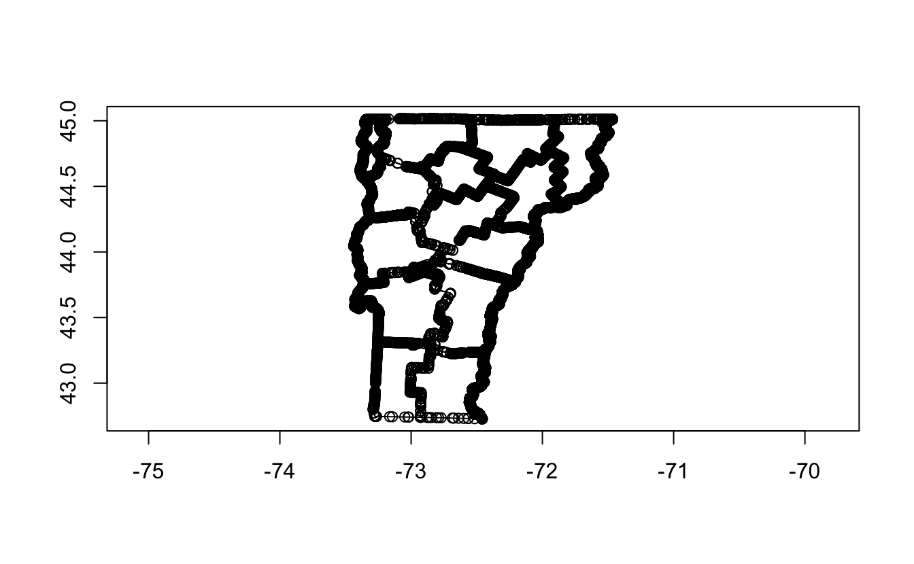

A new version of wk is fresh on CRAN! Version 0.5 introduces some new features to the framework, incorporates most of the functionality that was previously in the [wkutils](https://github.com/paleolimbot/wkutils) package, and fixes a number of bugs that popped up in the development of [s2](https://github.com/r-spatial/s2) and [geos](https://github.com/paleolimbot/geos). To showcase some of the new features I'll use the [Vermont counties data set from the VT Open Geodata Portal](https://geodata.vermont.gov/datasets/2f289dbae90347c58cd1765db84bd09e_29/explore).

<pre class='chroma'><code class='language-r' data-lang='r'><a href='https://rdrr.io/r/base/library.html'>library</a>(<a href='https://paleolimbot.github.io/wk/'>wk</a>)
<a href='https://rdrr.io/r/base/library.html'>library</a>(<a href='https://r-spatial.github.io/sf/'>sf</a>)
vt &lt;- <a href='https://r-spatial.github.io/sf/reference/st_read.html'>read_sf</a>("VT_Data_-_County_Boundaries.geojson")["CNTYNAME"]
vt
#&gt; Simple feature collection with 14 features and 1 field
#&gt; Geometry type: MULTIPOLYGON
#&gt; Dimension:     XY
#&gt; Bounding box:  xmin: -73.4379 ymin: 42.72697 xmax: -71.46539 ymax: 45.01667
#&gt; Geodetic CRS:  WGS 84
#&gt; # A tibble: 14 x 2
#&gt;    CNTYNAME                                                             geometry
#&gt;    &lt;chr&gt;                                                      &lt;MULTIPOLYGON [°]&gt;
#&gt;  1 ORLEANS    (((-71.92088 45.00785, -71.92933 45.00812, -71.94575 45.00838, -7…
#&gt;  2 GRAND ISLE (((-73.23344 44.66446, -73.23341 44.66632, -73.23355 44.66813, -7…
#&gt;  3 CHITTENDEN (((-73.10283 44.67616, -73.16068 44.69752, -73.16189 44.69799, -7…
#&gt;  4 WINDSOR    (((-72.77108 43.93907, -72.78996 43.94532, -72.78522 43.9522, -72…
#&gt;  5 WINDHAM    (((-72.70141 43.22634, -72.73021 43.2333, -72.75071 43.23825, -72…
#&gt;  6 BENNINGTON (((-73.0961 43.30715, -73.1146 43.30827, -73.12266 43.30869, -73.…
#&gt;  7 FRANKLIN   (((-72.99655 45.0148, -73.00945 45.01503, -73.01624 45.01516, -73…
#&gt;  8 ESSEX      (((-71.46539 45.01323, -71.4654 45.01338, -71.46541 45.01358, -71…
#&gt;  9 LAMOILLE   (((-72.60514 44.79044, -72.60572 44.79073, -72.60685 44.79128, -7…
#&gt; 10 CALEDONIA  (((-71.85297 44.70108, -71.84619 44.70755, -71.84129 44.7123, -71…
#&gt; 11 ORANGE     (((-72.31223 44.18541, -72.3206 44.18818, -72.32826 44.1907, -72.…
#&gt; 12 WASHINGTON (((-72.22314 44.42381, -72.22334 44.42408, -72.2235 44.42432, -72…
#&gt; 13 RUTLAND    (((-72.85266 43.8336, -72.86138 43.83624, -72.86845 43.83816, -72…
#&gt; 14 ADDISON    (((-72.97588 44.29505, -72.997 44.29923, -73.00585 44.30098, -73.…</code></pre>

### Breaking down features and building them back up again

The biggest feature in the new release is the ability to break down features to simpler components (at the simplest, a bunch of coordinates) and build them back up again into geometry that you can pass elsewhere. Some of this functionality previously lived in [wkutils](https://github.com/paleolimbot/wkutils) but it turns out this is really important: pretty much all geometry in base R is done with big long `x` and `y` vectors (e.g., [`xy.coords()`](https://rdrr.io/r/grDevices/xy.coords.html)). To make geometry that was previously locked away in WKB, WKT, or sf objects accessible, there needed to be a way out.

The first level of a geometry you might want to break down are collections: MULTIPOLYGON, MULTILINESTRING, MULTIPOINT, and GEOMETRYCOLLECTION. These types are useful when you have multiple things that represent one element in a vector, like multiple bits of land representing a county. In our case the features were saved as MULTIPOLYGON but there aren't actually any features with more than one. To simplify it, we can use [`wk_flatten()`](https://paleolimbot.github.io/wk/reference/wk_flatten.html):

<pre class='chroma'><code class='language-r' data-lang='r'>(vt_poly &lt;- <a href='https://paleolimbot.github.io/wk/reference/wk_flatten.html'>wk_flatten</a>(vt))
#&gt; Simple feature collection with 15 features and 1 field
#&gt; Geometry type: POLYGON
#&gt; Dimension:     XY
#&gt; Bounding box:  xmin: -73.4379 ymin: 42.72697 xmax: -71.46539 ymax: 45.01667
#&gt; Geodetic CRS:  WGS 84
#&gt; # A tibble: 15 x 2
#&gt;    CNTYNAME                                                             geometry
#&gt;  * &lt;chr&gt;                                                           &lt;POLYGON [°]&gt;
#&gt;  1 ORLEANS    ((-71.92088 45.00785, -71.92933 45.00812, -71.94575 45.00838, -71…
#&gt;  2 GRAND ISLE ((-73.23344 44.66446, -73.23341 44.66632, -73.23355 44.66813, -73…
#&gt;  3 CHITTENDEN ((-73.10283 44.67616, -73.16068 44.69752, -73.16189 44.69799, -73…
#&gt;  4 WINDSOR    ((-72.77108 43.93907, -72.78996 43.94532, -72.78522 43.9522, -72.…
#&gt;  5 WINDHAM    ((-72.70141 43.22634, -72.73021 43.2333, -72.75071 43.23825, -72.…
#&gt;  6 BENNINGTON ((-73.0961 43.30715, -73.1146 43.30827, -73.12266 43.30869, -73.1…
#&gt;  7 FRANKLIN   ((-72.99655 45.0148, -73.00945 45.01503, -73.01624 45.01516, -73.…
#&gt;  8 ESSEX      ((-71.46539 45.01323, -71.4654 45.01338, -71.46541 45.01358, -71.…
#&gt;  9 LAMOILLE   ((-72.60514 44.79044, -72.60572 44.79073, -72.60685 44.79128, -72…
#&gt; 10 CALEDONIA  ((-71.85297 44.70108, -71.84619 44.70755, -71.84129 44.7123, -71.…
#&gt; 11 CALEDONIA  ((-72.03989 44.15707, -72.03991 44.15719, -72.04024 44.15707, -72…
#&gt; 12 ORANGE     ((-72.31223 44.18541, -72.3206 44.18818, -72.32826 44.1907, -72.3…
#&gt; 13 WASHINGTON ((-72.22314 44.42381, -72.22334 44.42408, -72.2235 44.42432, -72.…
#&gt; 14 RUTLAND    ((-72.85266 43.8336, -72.86138 43.83624, -72.86845 43.83816, -72.…
#&gt; 15 ADDISON    ((-72.97588 44.29505, -72.997 44.29923, -73.00585 44.30098, -73.0…</code></pre>

By default [`wk_flatten()`](https://paleolimbot.github.io/wk/reference/wk_flatten.html) peels off one layer of collections, repeating rows where a feature has more than one element. This is a little like [`sf::st_cast()`](https://r-spatial.github.io/sf/reference/st_cast.html) but is defined in terms of what you have rather than what you want. For advanced users, the flattening functionality is also implemented as a [wk "filter"](https://paleolimbot.github.io/wk/dev/articles/articles/programming.html#filters), which means it can do most of what it does without allocating any extra memory and can stream input and output very efficiently.

I'm demonstrating all of this with sf because it's the most common use-case, but it works with any data frame/tibble with exactly one column implementing the [`wk_handle()`](https://paleolimbot.github.io/wk/reference/wk_handle.html) generic (including an [`st_sfc()`](https://r-spatial.github.io/sf/reference/sfc.html)!). In fact, pretty much anything you do with wk also "just works" with data frames.

<pre class='chroma'><code class='language-r' data-lang='r'>vt_tbl &lt;- tibble::<a href='https://tibble.tidyverse.org/reference/tibble.html'>tibble</a>(vt$CNTYNAME, geom = <a href='https://paleolimbot.github.io/wk/reference/wkb.html'>as_wkb</a>(vt))
<a href='https://paleolimbot.github.io/wk/reference/wk_flatten.html'>wk_flatten</a>(vt_tbl)
#&gt; # A tibble: 15 x 2
#&gt;    `vt$CNTYNAME` geom                                                           
#&gt;    &lt;chr&gt;         &lt;wk_wkb&gt;                                                       
#&gt;  1 ORLEANS       &lt;POLYGON ((-71.9209 45.0079, -71.9293 45.0081, -71.9458 45.008…
#&gt;  2 GRAND ISLE    &lt;POLYGON ((-73.2334 44.6645, -73.2334 44.6663, -73.2336 44.668…
#&gt;  3 CHITTENDEN    &lt;POLYGON ((-73.1028 44.6762, -73.1607 44.6975, -73.1619 44.698…
#&gt;  4 WINDSOR       &lt;POLYGON ((-72.7711 43.9391, -72.79 43.9453, -72.7852 43.9522.…
#&gt;  5 WINDHAM       &lt;POLYGON ((-72.7014 43.2263, -72.7302 43.2333, -72.7507 43.238…
#&gt;  6 BENNINGTON    &lt;POLYGON ((-73.0961 43.3072, -73.1146 43.3083, -73.1227 43.308…
#&gt;  7 FRANKLIN      &lt;POLYGON ((-72.9966 45.0148, -73.0094 45.015, -73.0162 45.0152…
#&gt;  8 ESSEX         &lt;POLYGON ((-71.4654 45.0132, -71.4654 45.0134, -71.4654 45.013…
#&gt;  9 LAMOILLE      &lt;POLYGON ((-72.6051 44.7904, -72.6057 44.7907, -72.6069 44.791…
#&gt; 10 CALEDONIA     &lt;POLYGON ((-71.853 44.7011, -71.8462 44.7076, -71.8413 44.7123…
#&gt; 11 CALEDONIA     &lt;POLYGON ((-72.0399 44.1571, -72.0399 44.1572, -72.0402 44.157…
#&gt; 12 ORANGE        &lt;POLYGON ((-72.3122 44.1854, -72.3206 44.1882, -72.3283 44.190…
#&gt; 13 WASHINGTON    &lt;POLYGON ((-72.2231 44.4238, -72.2233 44.4241, -72.2235 44.424…
#&gt; 14 RUTLAND       &lt;POLYGON ((-72.8527 43.8336, -72.8614 43.8362, -72.8685 43.838…
#&gt; 15 ADDISON       &lt;POLYGON ((-72.9759 44.295, -72.997 44.2992, -73.0058 44.301..…</code></pre>

The next level is vertices: one point feature for each vertex in the input.

<pre class='chroma'><code class='language-r' data-lang='r'>(vt_vertices &lt;- <a href='https://paleolimbot.github.io/wk/reference/wk_vertices.html'>wk_vertices</a>(vt))
#&gt; Simple feature collection with 18342 features and 1 field
#&gt; Geometry type: POINT
#&gt; Dimension:     XY
#&gt; Bounding box:  xmin: -73.4379 ymin: 42.72697 xmax: -71.46539 ymax: 45.01667
#&gt; Geodetic CRS:  WGS 84
#&gt; # A tibble: 18,342 x 2
#&gt;    CNTYNAME             geometry
#&gt;  * &lt;chr&gt;             &lt;POINT [°]&gt;
#&gt;  1 ORLEANS  (-71.92088 45.00785)
#&gt;  2 ORLEANS  (-71.92933 45.00812)
#&gt;  3 ORLEANS  (-71.94575 45.00838)
#&gt;  4 ORLEANS   (-71.95514 45.0082)
#&gt;  5 ORLEANS  (-71.96699 45.00797)
#&gt;  6 ORLEANS  (-72.00706 45.00717)
#&gt;  7 ORLEANS  (-72.00985 45.00712)
#&gt;  8 ORLEANS  (-72.01698 45.00697)
#&gt;  9 ORLEANS  (-72.02311 45.00681)
#&gt; 10 ORLEANS  (-72.02493 45.00677)
#&gt; # … with 18,332 more rows</code></pre>

Vertices are useful if you need to input something that requires points but you were handed a boundary or polygon layer (I use this kind of thing to set depth values at 0 along coastlines when calculating bathymetry, for example). This is good for GIS function stuff, but if you're doing any custom geometry processing or just need coordinates for ggplot2 or some base R function, you'll need straight up `x` and `y` vectors. If so, the new [`wk_coords()`](https://paleolimbot.github.io/wk/reference/wk_vertices.html) function is just for you!

<pre class='chroma'><code class='language-r' data-lang='r'>(vt_coords &lt;- tibble::<a href='https://tibble.tidyverse.org/reference/as_tibble.html'>as_tibble</a>(<a href='https://paleolimbot.github.io/wk/reference/wk_vertices.html'>wk_coords</a>(vt)))
#&gt; # A tibble: 18,342 x 5
#&gt;    feature_id part_id ring_id     x     y
#&gt;         &lt;int&gt;   &lt;int&gt;   &lt;int&gt; &lt;dbl&gt; &lt;dbl&gt;
#&gt;  1          1       2       1 -71.9  45.0
#&gt;  2          1       2       1 -71.9  45.0
#&gt;  3          1       2       1 -71.9  45.0
#&gt;  4          1       2       1 -72.0  45.0
#&gt;  5          1       2       1 -72.0  45.0
#&gt;  6          1       2       1 -72.0  45.0
#&gt;  7          1       2       1 -72.0  45.0
#&gt;  8          1       2       1 -72.0  45.0
#&gt;  9          1       2       1 -72.0  45.0
#&gt; 10          1       2       1 -72.0  45.0
#&gt; # … with 18,332 more rows</code></pre>

And, of course, sometimes you get handed a bunch of coordinates but you really want an sf object. For this case there is [`wk_linestring()`](https://paleolimbot.github.io/wk/reference/wk_linestring.html), [`wk_polygon()`](https://paleolimbot.github.io/wk/reference/wk_linestring.html), and [`wk_collection()`](https://paleolimbot.github.io/wk/reference/wk_linestring.html). For example, to reconstruct the original sf object starting with coordinates we could do:

<pre class='chroma'><code class='language-r' data-lang='r'>vt_poly_reconstructed &lt;- <a href='https://paleolimbot.github.io/wk/reference/wk_linestring.html'>wk_polygon</a>(
  <a href='https://paleolimbot.github.io/wk/reference/xy.html'>xy</a>(vt_coords$x, vt_coords$y, crs = "WGS84"),
  feature_id = vt_coords$feature_id,
  ring_id = vt_coords$ring_id
)

vt_multipoly_reconstructed &lt;- <a href='https://paleolimbot.github.io/wk/reference/wk_linestring.html'>wk_collection</a>(
  vt_poly_reconstructed,
  geometry_type = <a href='https://paleolimbot.github.io/wk/reference/wk_meta.html'>wk_geometry_type</a>("multipolygon"),
  feature_id = <a href='https://rdrr.io/r/base/seq.html'>seq_along</a>(vt_poly_reconstructed)
)

<a href='https://r-spatial.github.io/sf/reference/st_as_sfc.html'>st_as_sfc</a>(vt_multipoly_reconstructed)
#&gt; Geometry set for 14 features 
#&gt; Geometry type: MULTIPOLYGON
#&gt; Dimension:     XY
#&gt; Bounding box:  xmin: -73.4379 ymin: 42.72697 xmax: -71.46539 ymax: 45.01667
#&gt; Geodetic CRS:  WGS 84
#&gt; First 5 geometries:
#&gt; MULTIPOLYGON (((-71.92088 45.00785, -71.92933 4...
#&gt; MULTIPOLYGON (((-73.23344 44.66446, -73.23341 4...
#&gt; MULTIPOLYGON (((-73.10283 44.67616, -73.16068 4...
#&gt; MULTIPOLYGON (((-72.77108 43.93907, -72.78996 4...
#&gt; MULTIPOLYGON (((-72.70141 43.22634, -72.73021 4...</code></pre>

### dplyr integration

There's nothing new about dplyr's ability to work with vectors in wk 0.5, but the new functions are well-suited to dplyr's [`group_by()`](https://dplyr.tidyverse.org/reference/group_by.html) and [`summarise()`](https://dplyr.tidyverse.org/reference/summarise.html) as well as the newish auto-unpacking feature in [`mutate()`](https://dplyr.tidyverse.org/reference/mutate.html) and [`summarise()`](https://dplyr.tidyverse.org/reference/summarise.html). For example, to keep all the attributes when calling [`wk_coords()`](https://paleolimbot.github.io/wk/reference/wk_vertices.html) you can do:

<pre class='chroma'><code class='language-r' data-lang='r'><a href='https://rdrr.io/r/base/library.html'>library</a>(<a href='https://dplyr.tidyverse.org'>dplyr</a>)

vt <a href='https://magrittr.tidyverse.org/reference/pipe.html'>%&gt;%</a> 
  <a href='https://tibble.tidyverse.org/reference/as_tibble.html'>as_tibble</a>() <a href='https://magrittr.tidyverse.org/reference/pipe.html'>%&gt;%</a> 
  <a href='https://dplyr.tidyverse.org/reference/group_by.html'>group_by</a>(CNTYNAME) <a href='https://magrittr.tidyverse.org/reference/pipe.html'>%&gt;%</a> 
  <a href='https://dplyr.tidyverse.org/reference/summarise.html'>summarise</a>(<a href='https://paleolimbot.github.io/wk/reference/wk_vertices.html'>wk_coords</a>(geometry))
#&gt; `summarise()` has grouped output by 'CNTYNAME'. You can override using the `.groups` argument.
#&gt; # A tibble: 18,342 x 6
#&gt; # Groups:   CNTYNAME [14]
#&gt;    CNTYNAME feature_id part_id ring_id     x     y
#&gt;    &lt;chr&gt;         &lt;int&gt;   &lt;int&gt;   &lt;int&gt; &lt;dbl&gt; &lt;dbl&gt;
#&gt;  1 ADDISON           1       2       1 -73.0  44.3
#&gt;  2 ADDISON           1       2       1 -73.0  44.3
#&gt;  3 ADDISON           1       2       1 -73.0  44.3
#&gt;  4 ADDISON           1       2       1 -73.0  44.3
#&gt;  5 ADDISON           1       2       1 -73.0  44.3
#&gt;  6 ADDISON           1       2       1 -73.0  44.3
#&gt;  7 ADDISON           1       2       1 -73.0  44.3
#&gt;  8 ADDISON           1       2       1 -73.0  44.3
#&gt;  9 ADDISON           1       2       1 -73.0  44.3
#&gt; 10 ADDISON           1       2       1 -73.0  44.3
#&gt; # … with 18,332 more rows</code></pre>

To build back up a geometry you can also use [`group_by()`](https://dplyr.tidyverse.org/reference/group_by.html) and [`summarise()`](https://dplyr.tidyverse.org/reference/summarise.html) in their more traditional roles (returning one row per group). This is a tiny bit slower but *so* much easier to read.

<pre class='chroma'><code class='language-r' data-lang='r'>vt_coords <a href='https://magrittr.tidyverse.org/reference/pipe.html'>%&gt;%</a> 
  <a href='https://dplyr.tidyverse.org/reference/group_by.html'>group_by</a>(feature_id) <a href='https://magrittr.tidyverse.org/reference/pipe.html'>%&gt;%</a> 
  <a href='https://dplyr.tidyverse.org/reference/summarise.html'>summarise</a>(geom = <a href='https://paleolimbot.github.io/wk/reference/wk_linestring.html'>wk_polygon</a>(<a href='https://paleolimbot.github.io/wk/reference/xy.html'>xy</a>(x, y, crs = "WGS84")))
#&gt; # A tibble: 14 x 2
#&gt;    feature_id geom                                                              
#&gt;         &lt;int&gt; &lt;wk_wkb&gt;                                                          
#&gt;  1          1 &lt;POLYGON ((-71.9209 45.0079, -71.9293 45.0081, -71.9458 45.0084..…
#&gt;  2          2 &lt;POLYGON ((-73.2334 44.6645, -73.2334 44.6663, -73.2336 44.6681..…
#&gt;  3          3 &lt;POLYGON ((-73.1028 44.6762, -73.1607 44.6975, -73.1619 44.698...&gt;
#&gt;  4          4 &lt;POLYGON ((-72.7711 43.9391, -72.79 43.9453, -72.7852 43.9522...&gt; 
#&gt;  5          5 &lt;POLYGON ((-72.7014 43.2263, -72.7302 43.2333, -72.7507 43.2382..…
#&gt;  6          6 &lt;POLYGON ((-73.0961 43.3072, -73.1146 43.3083, -73.1227 43.3087..…
#&gt;  7          7 &lt;POLYGON ((-72.9966 45.0148, -73.0094 45.015, -73.0162 45.0152...&gt;
#&gt;  8          8 &lt;POLYGON ((-71.4654 45.0132, -71.4654 45.0134, -71.4654 45.0136..…
#&gt;  9          9 &lt;POLYGON ((-72.6051 44.7904, -72.6057 44.7907, -72.6069 44.7913..…
#&gt; 10         10 &lt;POLYGON ((-71.853 44.7011, -71.8462 44.7076, -71.8413 44.7123...&gt;
#&gt; 11         11 &lt;POLYGON ((-72.3122 44.1854, -72.3206 44.1882, -72.3283 44.1907..…
#&gt; 12         12 &lt;POLYGON ((-72.2231 44.4238, -72.2233 44.4241, -72.2235 44.4243..…
#&gt; 13         13 &lt;POLYGON ((-72.8527 43.8336, -72.8614 43.8362, -72.8685 43.8382..…
#&gt; 14         14 &lt;POLYGON ((-72.9759 44.295, -72.997 44.2992, -73.0058 44.301...&gt;</code></pre>

The new coordinate functions make dplyr more accessible for doing raw coordinate processing if you're into that kind of thing. If you'll recall the [short formula](https://en.wikipedia.org/wiki/Shoelace_formula) for the signed area of a polygon, you can check the winding direction of your polygons without leaving dplyr (the polygons here are wound correctly, hence the positive areas).

<pre class='chroma'><code class='language-r' data-lang='r'>vt <a href='https://magrittr.tidyverse.org/reference/pipe.html'>%&gt;%</a> 
  <a href='https://tibble.tidyverse.org/reference/as_tibble.html'>as_tibble</a>() <a href='https://magrittr.tidyverse.org/reference/pipe.html'>%&gt;%</a> 
  <a href='https://dplyr.tidyverse.org/reference/group_by.html'>group_by</a>(CNTYNAME) <a href='https://magrittr.tidyverse.org/reference/pipe.html'>%&gt;%</a> 
  <a href='https://dplyr.tidyverse.org/reference/summarise.html'>summarise</a>(<a href='https://paleolimbot.github.io/wk/reference/wk_vertices.html'>wk_coords</a>(geometry), .groups = "keep") <a href='https://magrittr.tidyverse.org/reference/pipe.html'>%&gt;%</a> 
  <a href='https://dplyr.tidyverse.org/reference/summarise.html'>summarise</a>(
    signed_area = 0.5 * <a href='https://rdrr.io/r/base/sum.html'>sum</a>(
      (<a href='https://dplyr.tidyverse.org/reference/lead-lag.html'>lag</a>(x, 1) - <a href='https://dplyr.tidyverse.org/reference/nth.html'>first</a>(x)) * (y - <a href='https://dplyr.tidyverse.org/reference/lead-lag.html'>lag</a>(y, 2)),
      na.rm = TRUE
    )
  )
#&gt; # A tibble: 14 x 2
#&gt;    CNTYNAME   signed_area
#&gt;    &lt;chr&gt;            &lt;dbl&gt;
#&gt;  1 ADDISON         0.235 
#&gt;  2 BENNINGTON      0.194 
#&gt;  3 CALEDONIA       0.243 
#&gt;  4 CHITTENDEN      0.182 
#&gt;  5 ESSEX           0.198 
#&gt;  6 FRANKLIN        0.203 
#&gt;  7 GRAND ISLE      0.0570
#&gt;  8 LAMOILLE        0.137 
#&gt;  9 ORANGE          0.201 
#&gt; 10 ORLEANS         0.213 
#&gt; 11 RUTLAND         0.273 
#&gt; 12 WASHINGTON      0.203 
#&gt; 13 WINDHAM         0.228 
#&gt; 14 WINDSOR         0.282</code></pre>

### First-class coordinate transforms

Some of the coolest new stuff in GIS is actually in JavaScript, like the [really awesome tools for animated projections](https://bost.ocks.org/mike/example/) in D3. The tools in D3 work on arbitrary coordinate transforms (read: PROJ), but the tools that work on the transforms don't have to know anything about datums or projections...they just care about a coordinate moving from one place to the next. This kind of thing is really common in GIS and visualization and deserved first-class support in wk. For those paying close attention to s2 development, I also need it to make geometry represented in Cartesian space valid on the sphere given an arbitrary projection (currently only [implemented](https://r-spatial.github.io/s2/reference/s2_unprojection_filter.html) for plate carree).

Starting small, though, wk just provides the framework so that other packages can do cool stuff that I don't need to maintain (maybe). I did put in enough transforms to make sure every thing was tested, which includes an affine transform and transforms that set/drop coordinate values (most usefully, Z and M).

<pre class='chroma'><code class='language-r' data-lang='r'><a href='https://paleolimbot.github.io/wk/reference/wk_transform.html'>wk_transform</a>(vt, <a href='https://paleolimbot.github.io/wk/reference/wk_trans_affine.html'>wk_affine_rescale</a>(vt, <a href='https://paleolimbot.github.io/wk/reference/rct.html'>rct</a>(0, 0, 1, 1)))
#&gt; Simple feature collection with 14 features and 1 field
#&gt; Geometry type: MULTIPOLYGON
#&gt; Dimension:     XY
#&gt; Bounding box:  xmin: 0 ymin: 0 xmax: 1 ymax: 1
#&gt; CRS:           NA
#&gt; # A tibble: 14 x 2
#&gt;    CNTYNAME                                                             geometry
#&gt;  * &lt;chr&gt;                                                          &lt;MULTIPOLYGON&gt;
#&gt;  1 ORLEANS    (((0.7690821 0.9961481, 0.7647967 0.9962621, 0.7564697 0.9963774,…
#&gt;  2 GRAND ISLE (((0.1036546 0.8461755, 0.1036727 0.846988, 0.103599 0.847776, 0.…
#&gt;  3 CHITTENDEN (((0.1698733 0.8512869, 0.1405409 0.8606129, 0.1399308 0.8608186,…
#&gt;  4 WINDSOR    (((0.338057 0.5293715, 0.3284853 0.5321012, 0.330888 0.5351043, 0…
#&gt;  5 WINDHAM    (((0.3733756 0.2180931, 0.3587752 0.2211338, 0.3483849 0.2232952,…
#&gt;  6 BENNINGTON (((0.1732828 0.2533885, 0.1639036 0.2538759, 0.1598167 0.254059, …
#&gt;  7 FRANKLIN   (((0.2237507 0.9991795, 0.2172121 0.9992838, 0.2137688 0.9993384,…
#&gt;  8 ESSEX      (((1 0.9984975, 0.9999926 0.998561, 0.9999861 0.9986474, 0.999955…
#&gt;  9 LAMOILLE   (((0.4221812 0.9011965, 0.4218882 0.9013238, 0.4213146 0.9015626,…
#&gt; 10 CALEDONIA  (((0.8035071 0.8621686, 0.8069441 0.8649961, 0.809428 0.867068, 0…
#&gt; 11 ORANGE     (((0.5706808 0.6369557, 0.5664359 0.6381655, 0.5625502 0.6392656,…
#&gt; 12 WASHINGTON (((0.6158429 0.741074, 0.6157443 0.7411901, 0.6156621 0.741298, 0…
#&gt; 13 RUTLAND    (((0.2967002 0.4833058, 0.2922765 0.484459, 0.2886918 0.4852998, …
#&gt; 14 ADDISON    (((0.2342294 0.6848386, 0.2235227 0.686667, 0.2190376 0.687431, 0…
<a href='https://paleolimbot.github.io/wk/reference/wk_set_z.html'>wk_set_z</a>(vt, 0)
#&gt; Simple feature collection with 14 features and 1 field
#&gt; Geometry type: MULTIPOLYGON
#&gt; Dimension:     XYZ
#&gt; Bounding box:  xmin: -73.4379 ymin: 42.72697 xmax: -71.46539 ymax: 45.01667
#&gt; z_range:       zmin: 0 zmax: 0
#&gt; Geodetic CRS:  WGS 84
#&gt; # A tibble: 14 x 2
#&gt;    CNTYNAME                                                             geometry
#&gt;  * &lt;chr&gt;                                                      &lt;MULTIPOLYGON [°]&gt;
#&gt;  1 ORLEANS    Z (((-71.92088 45.00785 0, -71.92933 45.00812 0, -71.94575 45.008…
#&gt;  2 GRAND ISLE Z (((-73.23344 44.66446 0, -73.23341 44.66632 0, -73.23355 44.668…
#&gt;  3 CHITTENDEN Z (((-73.10283 44.67616 0, -73.16068 44.69752 0, -73.16189 44.697…
#&gt;  4 WINDSOR    Z (((-72.77108 43.93907 0, -72.78996 43.94532 0, -72.78522 43.952…
#&gt;  5 WINDHAM    Z (((-72.70141 43.22634 0, -72.73021 43.2333 0, -72.75071 43.2382…
#&gt;  6 BENNINGTON Z (((-73.0961 43.30715 0, -73.1146 43.30827 0, -73.12266 43.30869…
#&gt;  7 FRANKLIN   Z (((-72.99655 45.0148 0, -73.00945 45.01503 0, -73.01624 45.0151…
#&gt;  8 ESSEX      Z (((-71.46539 45.01323 0, -71.4654 45.01338 0, -71.46541 45.0135…
#&gt;  9 LAMOILLE   Z (((-72.60514 44.79044 0, -72.60572 44.79073 0, -72.60685 44.791…
#&gt; 10 CALEDONIA  Z (((-71.85297 44.70108 0, -71.84619 44.70755 0, -71.84129 44.712…
#&gt; 11 ORANGE     Z (((-72.31223 44.18541 0, -72.3206 44.18818 0, -72.32826 44.1907…
#&gt; 12 WASHINGTON Z (((-72.22314 44.42381 0, -72.22334 44.42408 0, -72.2235 44.4243…
#&gt; 13 RUTLAND    Z (((-72.85266 43.8336 0, -72.86138 43.83624 0, -72.86845 43.8381…
#&gt; 14 ADDISON    Z (((-72.97588 44.29505 0, -72.997 44.29923 0, -73.00585 44.30098…</code></pre>

The point of this all, though, is that extension packages can make their own transforms. There's no C++ wrapper for this yet but the C is relatively minimal.

<pre class='chroma'><code class='language-r' data-lang='r'>#include "cpp11.hpp"
using namespace cpp11;
#include "wk-v1.h"
#include "wk-v1-impl.c"

typedef struct {
  double dx;
  double dy;
} bump_trans_t;

int bump_trans_trans(R_xlen_t feature_id, const double* xyzm_in, double* xyzm_out, void* trans_data) {
  bump_trans_t* data = (bump_trans_t*) trans_data;
  xyzm_out[0] = xyzm_in[0] + data->dx;
  xyzm_out[1] = xyzm_in[1] + data->dy;
  return WK_CONTINUE;
}

void bump_trans_finalizer(void* trans_data) {
  delete (bump_trans_t*) trans_data;
}

[[cpp11::linking_to(wk)]]
[[cpp11::register]]
sexp bump_trans_new(double dx, double dy) {
  wk_trans_t* trans = wk_trans_create();
  trans->trans = &bump_trans_trans;
  trans->finalizer = &bump_trans_finalizer;
  trans->trans_data = new bump_trans_t {dx, dy};
  return wk_trans_create_xptr(trans, R_NilValue, R_NilValue);
}</code></pre>

You do need a tiny bit of R infrastructure to make this work smoothly:

<pre class='chroma'><code class='language-r' data-lang='r'>bump_trans &lt;- function(dx = 0, dy = 0) &#123;
  <a href='https://paleolimbot.github.io/wk/reference/wk_trans_inverse.html'>new_wk_trans</a>(bump_trans_new(dx, dy), "bump_trans")
&#125;</code></pre>

Then your transform is accessible for anything that needs it! Most algorithms will probably also need an implementation of [`wk_trans_inverse()`](https://paleolimbot.github.io/wk/reference/wk_trans_inverse.html) to return the inverse operation.

<pre class='chroma'><code class='language-r' data-lang='r'><a href='https://paleolimbot.github.io/wk/reference/wk_transform.html'>wk_transform</a>(<a href='https://paleolimbot.github.io/wk/reference/wkt.html'>wkt</a>("POINT (0 0)"), bump_trans(12, 13))
#&gt; &lt;wk_wkt[1]&gt;
#&gt; [1] POINT (12 13)</code></pre>

### Plotting

As a side effect of some of this, plotting now "just works" without the wkutils package for the built-in vector types. It isn't particularly fast or glamourous, but it's good enough for a basic "get this geometry on my screen". Previously this was done using a confusing circular dependency on wkutils. It's used for [`plot()`](https://r-spatial.github.io/sf/reference/plot.html) for [`wkb()`](https://paleolimbot.github.io/wk/reference/wkb.html) and [`wkt()`](https://paleolimbot.github.io/wk/reference/wkt.html), but also works for arbitrary data types with a [`wk_handle()`](https://paleolimbot.github.io/wk/reference/wk_handle.html) method via [`wk_plot()`](https://paleolimbot.github.io/wk/reference/wk_plot.html).

<pre class='chroma'><code class='language-r' data-lang='r'><a href='https://paleolimbot.github.io/wk/reference/wk_plot.html'>wk_plot</a>(vt)
<a href='https://paleolimbot.github.io/wk/reference/wk_plot.html'>wk_plot</a>(vt_vertices, add = T)
</code></pre>

### What's next?

So far wk development has focused on getting all the nuts and bolts in place so that extensions can do really awesome stuff with few dependencies. Now is that time! I'm hoping to get transforms working for PROJ so that s2 can do a better job creating valid spherical geometry from projected coordinates. Finally, I'm hoping to get some file readers working so that the lazy nature of the handler/filter system can really shine.

